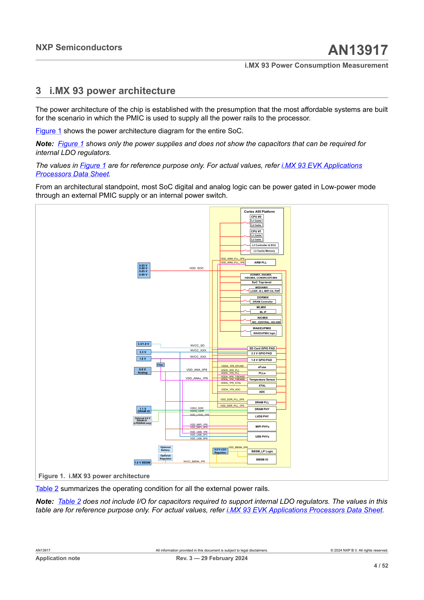

# 3 i.MX 93 power architecture

The power architecture of the chip is established with the presumption that the most affordable systems are built for the scenario in which the PMIC is used to supply all the power rails to the processor.

Figure 1 shows the power architecture diagram for the entire SoC.

**Note:** Figure 1 shows only the power supplies and does not show the capacitors that can be required for internal LDO regulators.

The values in Figure 1 are for reference purpose only. For actual values, refer i.MX 93 EVK Applications Processors Data Sheet.

From an architectural standpoint, most SoC digital and analog logic can be power gated in Low-power mode through an external PMIC supply or an internal power switch.

### Figure 1 Description: i.MX 93 Power Architecture Block Diagram

This comprehensive power architecture diagram illustrates the power distribution for the i.MX 93 SoC, showing:

**Main Power Domains (left side):**
- **0.65 V, 0.80 V, 0.85 V, 0.90 V** - Core voltage rails feeding VDD_SOC
- **3.3/1.8 V** - NVCC_SD for SD Card interface
- **3.3 V** - NVCC_XXX for 3.3V GPIO PADs
- **1.8 V** - NVCC_XXX for 1.8V GPIO PADs
- **Analog 0.8 V** - VDD_ANA_0P8 for analog power
- **Analog 1.8 V** - VDD_ANAx_1P8 for various analog supplies
- **1.8 V BBSM** - NVCC_BBSM_1P8 for BBSM IO
- **1.1 V DRAM** - VDD2_DDR for DRAM core
- **Optional 0.6 V DRAM IO (LPDDR4X only)** - VDDQ_DDR

**Major Functional Blocks (center/right):**

1. **Cortex A55 Platform** (top):
   - CPU #0 and CPU #1 with L1 and L2 Cache
   - L3 Controller & SCU
   - L3 Cache Memory
   - Powered by VDD_ARM_PLL_0P8 and VDD_ARM_PLL_1P8

2. **ARM PLL** - Main PLL for processor clocking

3. **DDRMIX**:
   - DRAM Controller
   - DRAM PLL (VDD_DDR_PLL_0P8, VDD_DDR_PLL_1P8)
   - DRAM PHY

4. **Mixed Signal Components**:
   - AONMIX, ANAMIX, HSIOMIX
   - CCMSRCGPCMIX
   - SoC Top-level control

5. **MEDIAMIX**:
   - LCDIF, ISI, MIPI Ctl, PXP
   - LVDS PHY (VDD_LVDS_1P8)
   - MIPI PHYs (VDD_MIPI_1P8, VDD_MIPI_0P8)

6. **Peripheral Blocks**:
   - MLMIX - ML IP
   - NICMIX - NIC_CENTRAL, GIC-600
   - WAKEUPMIX - Wakeup logic

7. **Analog Components** (supplied by various analog rails):
   - eFuse (VDDA_1P8_EFUSE)
   - PLLs (VDDD_0P8_PLL, VDDA_1P8_PLL)
   - Temperature Sensor (VDDA_0P8_TSENSE, VDDA_1P8_TSENSE)
   - XTAL (VDDA_1P8_XTAL)
   - ADC (VDDA_1P8_ADC)

8. **USB PHYs**:
   - VDD_USB_1P8, VDD_USB_3P3, VDD_USB_0P8

9. **BBSM (Battery-Backed Security Module)**:
   - Optional Battery input
   - Optional Regulator
   - 0.8V LDO Regulator (VDD_BBSM_0P8)
   - BBSM_LP Logic
   - BBSM IO

**I/O Pads:**
- SD Card GPIO PAD
- 3.3V GPIO PAD
- 1.8V GPIO PAD

The diagram uses color coding (yellow/beige blocks) to represent different power domains and shows the power rail connections with lines connecting supplies to their respective functional blocks.

---

**Figure 1. i.MX 93 power architecture**

Table 2 summarizes the operating condition for all the external power rails.

**Note:** Table 2 does not include I/O for capacitors required to support internal LDO regulators. The values in this table are for reference purpose only. For actual values, refer i.MX 93 EVK Applications Processors Data Sheet.