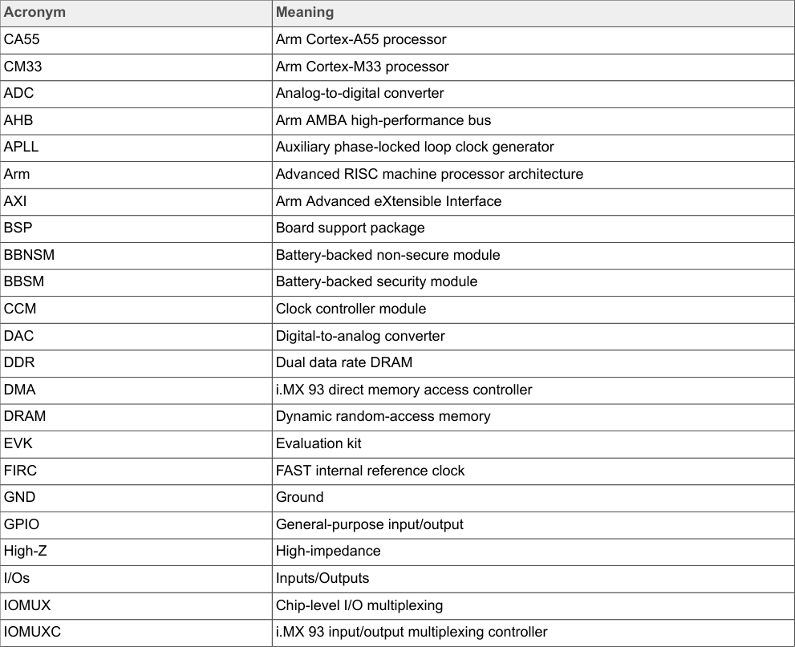
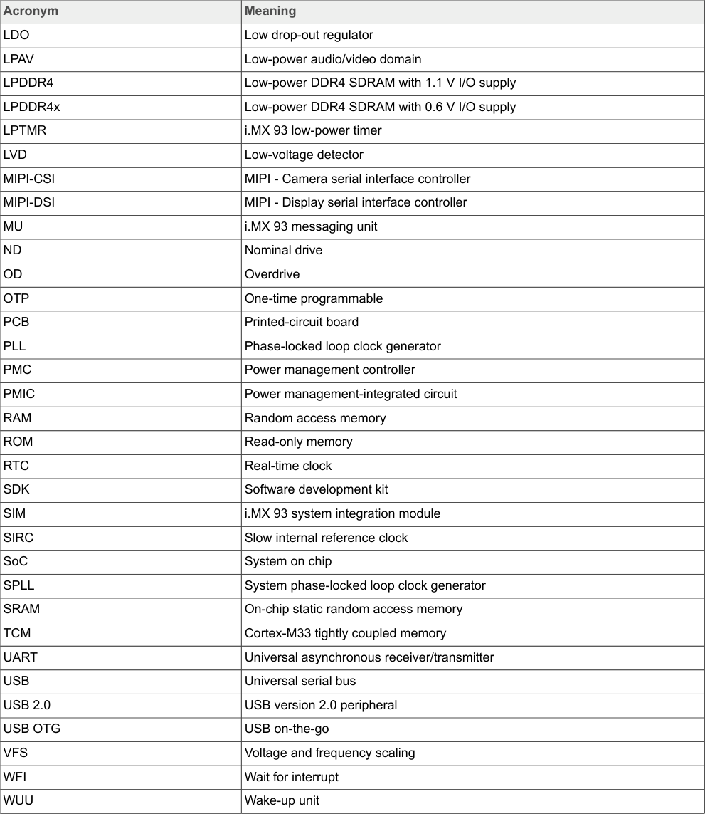

# 2  Acronyms

Table 1 lists the acronyms used in this document.

**Table 1. Acronyms**

<!-- VERBATIM_TABLE_START -->

|Table 1. Acronyms|Col2|
|---|---|
|Acronym|Meaning|
|CA55|Arm Cortex&amp;#45;A55 processor|
|CM33|Arm Cortex&amp;#45;M33 processor|
|ADC|Analog&amp;#45;to&amp;#45;digital converter|
|AHB|Arm AMBA high&amp;#45;performance bus|
|APLL|Auxiliary phase&amp;#45;locked loop clock generator|
|Arm|Advanced RISC machine processor architecture|
|AXI|Arm Advanced eXtensible Interface|
|BSP|Board support package|
|BBNSM|Battery&amp;#45;backed non&amp;#45;secure module|
|BBSM|Battery&amp;#45;backed security module|
|CCM|Clock controller module|
|DAC|Digital&amp;#45;to&amp;#45;analog converter|
|DDR|Dual data rate DRAM|
|DMA|i.MX 93 direct memory access controller|
|DRAM|Dynamic random&amp;#45;access memory|
|EVK|Evaluation kit|
|FIRC|FAST internal reference clock|
|GND|Ground|
|GPIO|General&amp;#45;purpose input/output|
|High&amp;#45;Z|High&amp;#45;impedance|
|I/Os|Inputs/Outputs|
|IOMUX|Chip&amp;#45;level I/O multiplexing|
|IOMUXC|i.MX 93 input/output multiplexing controller|
<!-- VERBATIM_TABLE_END -->

**Table 1. Acronyms...continued**

<!-- VERBATIM_TABLE_START -->

|Table 1. Acronyms...continued|Col2|
|---|---|
|Acronym|Meaning|
|LDO|Low drop&amp;#45;out regulator|
|LPAV|Low&amp;#45;power audio/video domain|
|LPDDR4|Low&amp;#45;power DDR4 SDRAM with 1.1 V I/O supply|
|LPDDR4x|Low&amp;#45;power DDR4 SDRAM with 0.6 V I/O supply|
|LPTMR|i.MX 93 low&amp;#45;power timer|
|LVD|Low&amp;#45;voltage detector|
|MIPI&amp;#45;CSI|MIPI &amp;#45; Camera serial interface controller|
|MIPI&amp;#45;DSI|MIPI &amp;#45; Display serial interface controller|
|MU|i.MX 93 messaging unit|
|ND|Nominal drive|
|OD|Overdrive|
|OTP|One&amp;#45;time programmable|
|PCB|Printed&amp;#45;circuit board|
|PLL|Phase&amp;#45;locked loop clock generator|
|PMC|Power management controller|
|PMIC|Power management&amp;#45;integrated circuit|
|RAM|Random access memory|
|ROM|Read&amp;#45;only memory|
|RTC|Real&amp;#45;time clock|
|SDK|Software development kit|
|SIM|i.MX 93 system integration module|
|SIRC|Slow internal reference clock|
|SoC|System on chip|
|SPLL|System phase&amp;#45;locked loop clock generator|
|SRAM|On&amp;#45;chip static random access memory|
|TCM|Cortex&amp;#45;M33 tightly coupled memory|
|UART|Universal asynchronous receiver/transmitter|
|USB|Universal serial bus|
|USB 2.0|USB version 2.0 peripheral|
|USB OTG|USB on&amp;#45;the&amp;#45;go|
|VFS|Voltage and frequency scaling|
|WFI|Wait for interrupt|
|WUU|Wake&amp;#45;up unit|
<!-- VERBATIM_TABLE_END -->

**Description of Tables:**

The images show a two-part acronym table (Table 1) that defines technical abbreviations used throughout the AN13917 application note for i.MX 93 Power Consumption Measurement. The table is split across two pages:

- **Part 1 (page 2)**: Contains the first portion of acronyms in alphabetical order with their corresponding definitions
- **Part 2 (page 3)**: Continuation of the acronym list with additional entries

The table uses a standard two-column format with acronyms in the left column and their full definitions in the right column. This reference table helps readers understand technical terminology and abbreviations used in the power consumption measurement documentation for the NXP i.MX 93 processor.