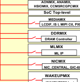
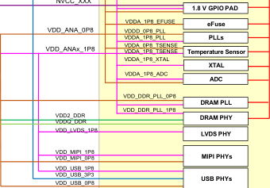
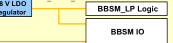

# 3 i.MX 93 power architecture

The power architecture of the chip is established with the presumption that the most affordable systems are built for the scenario in which the PMIC is used to supply all the power rails to the processor.

Figure 1 shows the power architecture diagram for the entire SoC.

**Note:** Figure 1 shows only the power supplies and does not show the capacitors that can be required for internal LDO regulators.

*The values in Figure 1 are for reference purpose only. For actual values, refer i.MX 93 EVK Applications Processors Data Sheet.*

From an architectural standpoint, most SoC digital and analog logic can be power gated in Low-power mode through an external PMIC supply or an internal power switch.

**Figure 1. i.MX 93 power architecture**

### Detailed Description of Figure 1:

This power architecture diagram illustrates the complete power supply distribution for the i.MX 93 SoC. The diagram shows:

**Left Side - External Power Supplies:**
- **VDD_SOC** (0.65 V, 0.80 V, 0.85 V, 0.90 V) - Main SoC power supply with multiple voltage levels
- **NVCC_SD** (3.3/1.8 V) - SD Card GPIO PAD supply (with optional filter)
- **NVCC_XXX** (3.3 V) - 3.3 V GPIO PAD supply
- **NVCC_XXX** (1.8 V) - 1.8 V GPIO PAD supply
- **Analog** (0.8 V) - Analog power supply (with filter)
- **VDD_BBSM** (1.8 V BBSM) - Battery-Backed Security Module supply (with optional battery and regulator)
- **DRAM IO** (1.1 V) - DRAM interface voltage
- **Optional DRAM IO** (0.6 V) - LPDDR4X only

**Center/Right Side - Cortex A55 Platform Components:**
The VDD_SOC rail powers multiple components including:
- **CPU #0** with L1 Cache and L2 Cache
- **CPU #1** with L1 Cache and L2 Cache
- **L3 Controller & SCU**
- **L3 Cache Memory**
- **ARM PLL** (powered by VDD_ARM_PLL_0P8 and VDD_ARM_PLL_1P8)
- **Top-level SoC components:**
  - HSIOMIX
  - NOCMIX, CORTEXMIX, M33MIX
  - SoC Top-level
  - MEDIAMIX
  - CORTEX_M & NPU_CM_PLT
  - NETCMIX
  - E-RAM Controller
  - ML MIX
  - BL IP
  - NOCMIX
  - BIG_GEN3TOL_GIC-600
  - WAKEUPMIX
  - WAKEUPMIX Logic

**SD Card and GPIO PADs:**
- SD Card GPIO PAD (3.3/1.8 V)
- 3.3 V GPIO PAD
- 1.8 V GPIO PAD

**Additional Power Domains:**
- **PLLs** (powered by VDD_ANA_0P8, VDD_ANA_1P8, VDD_USB_0P8)
- **Temperature Sensor**
- **XTAL**
- **ADC**
- **DRAM PLL** (VDD_DDR_PLL_0P8, VDD_DDR_PLL_1P8)
- **DRAM PHY** (VDD_DDR, VDD2_DDR, VDD_LPDDR)
- **LVDS PHY**
- **MIPI PHYs** (VDD_MIPI_0P8, VDD_MIPI_1P8)
- **USB PHYs** (VDD_USB_0P8, VDD_USB_1P8, VDD_USB_3P3)
- **BBSM LP Logic** and **BBSM IO** (powered by VDD_BBSM_0P8 and NVCC_BBSM_1P8)

The diagram uses color coding and connection lines to show the power distribution hierarchy from external supplies to internal SoC blocks.

<!-- VERBATIM_TABLE_START -->

|Col1|AONMIX, ANAMIX, SIOMIX, CCMSRCGPCMIX|
|---|---|
||SoC Top&amp;#45;level|
||MEDIAMIX LCDIF, IS I, MIPI Ctl, PX|
||DDRMIX|
||DRAM Controller MLMIX ML IP|
||NICMIX|
||NIC_CENTRAL, GIC&amp;#45;6|
||WAKEUPMIX|
<!-- VERBATIM_TABLE_END -->

<!-- VERBATIM_TABLE_START -->

|Col1|NVCC_XXX VDD_ANA_0P8|Col3|Col4|Col5|1.8 V GPIO PAD VDDA_1P8_EFUSE eFuse VDDD_0P8_PLL VDDA_1P8_PLL PLLs VDDA_0P8_TSENSE|Col7|Col8|
|---|---|---|---|---|---|---|---|
|||||||PLLs||
||VDD_ANAx_1P8||||VDDA_1P8_TSENSE VDDA_1P8_XTAL|Temperature Sensor XTAL||
||||||VDDA_1P8_ADC|ADC||
||||||VDD_DDR_PLL_0P8|||
|||VDD2_DDR VDDQ_DDR|VDD_DDR_PLL_1P8||VDD_DDR_PLL_1P8|DRAM PLL||
|||||||DRAM PHY||
|||VDD_LVDS_1P8||||LVDS PHY||
|||VDD_MIPI_1P8||||||
|||||||MIPI PHYs||
|||VDD_MIPI_0P8||||||
|VDD_USB_1P8 VDD_USB_3P3 VDD_USB_0P8|VDD_USB_1P8 VDD_USB_3P3|VDD_USB_1P8||||||
|||||||USB PHYs||
|||||||||
<!-- VERBATIM_TABLE_END -->

<!-- VERBATIM_TABLE_START -->

|Col1|BBSM_LP Logic|
|---|---|
||BBSM IO|
<!-- VERBATIM_TABLE_END -->

Table 2 summarizes the operating condition for all the external power rails.

**Note:** Table 2 does not include I/O for capacitors required to support internal LDO regulators. The values in this table are for reference purpose only. For actual values, refer i.MX 93 EVK Applications Processors Data Sheet.