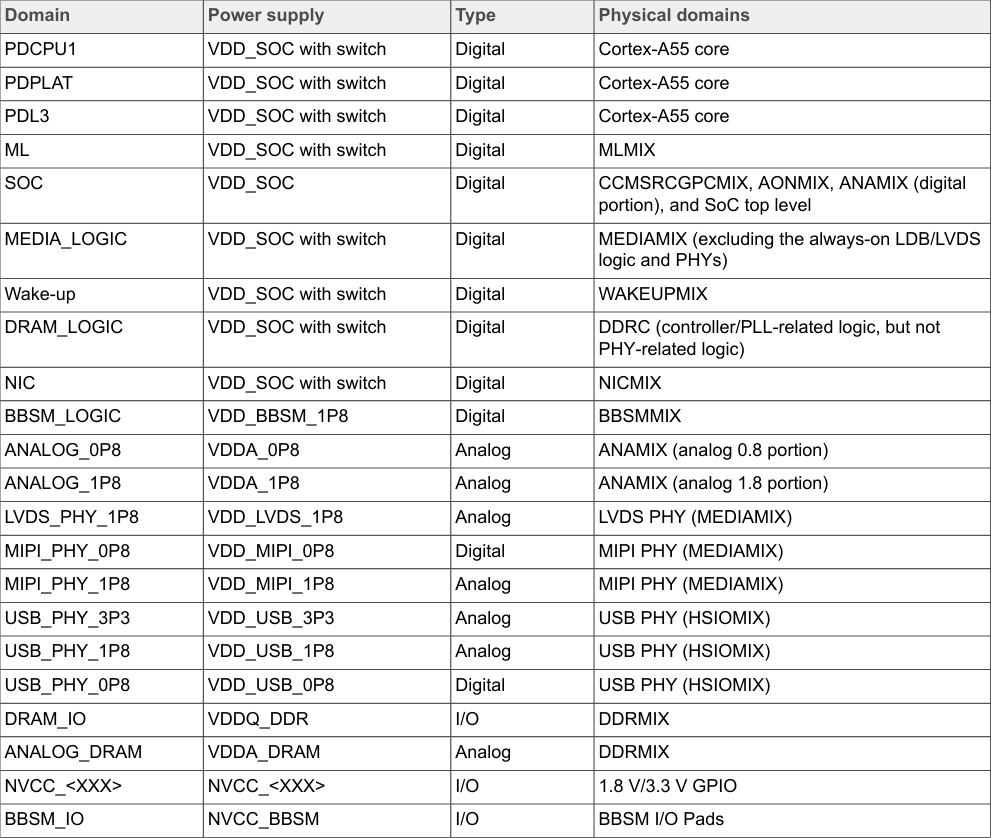
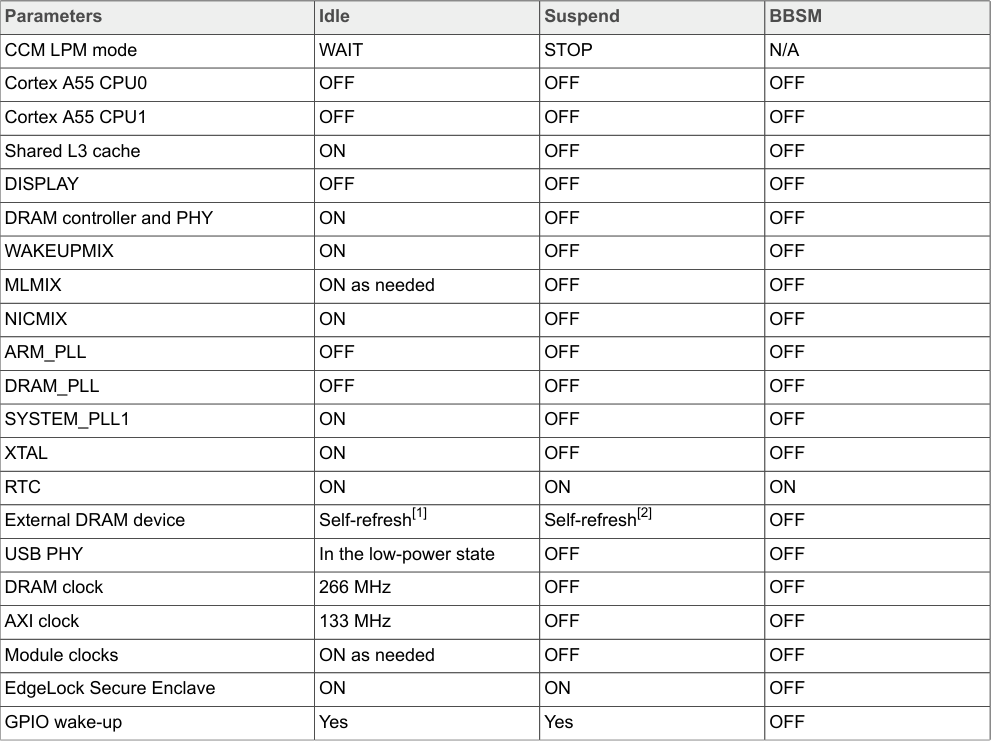

# 4  i.MX 93 power overview

This section describes the power domains and modes for the i.MX 93 processor.

## 4.1  i.MX 93 power domains overview

To optimize the power consumption in Low-power modes, i.MX 93 has multiple power domains. As a result, most SoC digital and analog logics are power gated with an internal power switch or an external supply from PMIC in Low-power mode.

**Note:** The values in Table 3 are for reference purpose only. For actual values, refer i.MX 93 EVK Applications Processors Data Sheet.

**Table 3 - SoC power domains:** This table provides a comprehensive overview of the power domain architecture of the i.MX 93 processor. It lists the various power domains within the SoC, including their supply rails, voltage levels, and the functional blocks or modules that each domain powers. Key power domains typically include:

- Core processor power domains (for Cortex-A55 CPUs)
- Always-On domain (AONMIX) for RTC and low-power management
- Mixed-signal domains (MIX) for various peripheral groups
- Memory controller power domains
- I/O power domains for different voltage interfaces

The table specifies which external power rails from the PMIC supply each domain and the operating voltage ranges for each rail.

<!-- VERBATIM_TABLE_START -->

|Domain|Power supply|Type|Physical domains|
|---|---|---|---|
|CPU|VDD_SOC|Digital|Cortex&amp;#45;A55 core|
|PDCPU0|VDD_SOC with switch|Digital|Cortex&amp;#45;A55 core|
<!-- VERBATIM_TABLE_END -->

**Table 3 continuation:** This continuation of the SoC power domains table provides additional power domain information, completing the full power architecture mapping for the i.MX 93 processor.

<!-- VERBATIM_TABLE_START -->

|Domain|Power supply|Type|Physical domains|
|---|---|---|---|
|PDCPU1|VDD_SOC with switch|Digital|Cortex&amp;#45;A55 core|
|PDPLAT|VDD_SOC with switch|Digital|Cortex&amp;#45;A55 core|
|PDL3|VDD_SOC with switch|Digital|Cortex&amp;#45;A55 core|
|ML|VDD_SOC with switch|Digital|MLMIX|
|SOC|VDD_SOC|Digital|CCMSRCGPCMIX, AONMIX, ANAMIX (digital portion), and SoC top level|
|MEDIA_LOGIC|VDD_SOC with switch|Digital|MEDIAMIX (excluding the always&amp;#45;on LDB/LVDS logic and PHYs)|
|Wake&amp;#45;up|VDD_SOC with switch|Digital|WAKEUPMIX|
|DRAM_LOGIC|VDD_SOC with switch|Digital|DDRC (controller/PLL&amp;#45;related logic, but not PHY&amp;#45;related logic)|
|NIC|VDD_SOC with switch|Digital|NICMIX|
|BBSM_LOGIC|VDD_BBSM_1P8|Digital|BBSMMIX|
|ANALOG_0P8|VDDA_0P8|Analog|ANAMIX (analog 0.8 portion)|
|ANALOG_1P8|VDDA_1P8|Analog|ANAMIX (analog 1.8 portion)|
|LVDS_PHY_1P8|VDD_LVDS_1P8|Analog|LVDS PHY (MEDIAMIX)|
|MIPI_PHY_0P8|VDD_MIPI_0P8|Digital|MIPI PHY (MEDIAMIX)|
|MIPI_PHY_1P8|VDD_MIPI_1P8|Analog|MIPI PHY (MEDIAMIX)|
|USB_PHY_3P3|VDD_USB_3P3|Analog|USB PHY (HSIOMIX)|
|USB_PHY_1P8|VDD_USB_1P8|Analog|USB PHY (HSIOMIX)|
|USB_PHY_0P8|VDD_USB_0P8|Digital|USB PHY (HSIOMIX)|
|DRAM_IO|VDDQ_DDR|I/O|DDRMIX|
|ANALOG_DRAM|VDDA_DRAM|Analog|DDRMIX|
|NVCC_&lt;XXX&gt;|NVCC_&lt;XXX&gt;|I/O|1.8 V/3.3 V GPIO|
|BBSM_IO|NVCC_BBSM|I/O|BBSM I/O Pads|
<!-- VERBATIM_TABLE_END -->

**Note:**
- For the recommended operating conditions of each supply rail, and a detailed description of the groups of pins powered by each I/O voltage supply, refer i.MX 93 EVK Applications Processors Data Sheet.
- For more details regarding the i.MX 93 power architecture, refer to the i.MX 93 Applications Processors Reference Manual (document IMX93RM).

## 4.2  i.MX 93 power mode overview

The i.MX 93 supports the following power modes:

- **Run mode:** In this mode, the Cortex-A55 CPU is active and running. Some portions can be shut off for power saving.

- **Low-power run mode:** This mode is defined as a Low-power run mode with all external power rails on. In this mode, all unnecessary power domains (MIX) can be off. The AONMIX and internal modules, such as OSC24M/PLL, are an exception in this mode. The Cortex CPU in AONMIX handles all the computing and data processing. Cortex-A55 is powered down and DRAM can be in self-refresh/retention mode.

- **Idle mode:** This mode is defined as one that a CPU can enter automatically when no threads are engaged, and no high-speed devices are in use. CPU can be put into a power-gated state, but with L3 data retained, DRAM, and bus clocks are reduced. Most of the internal logic is clock-gated; yet is still powered. In this mode, all the external power from PMIC remains the same, and most IPs remain in their state. Therefore, the interrupt response in this mode is quick compared to the Run mode.

- **Suspend mode:** This mode is defined as the most power-saving mode since it shuts off all the clocks and all the unnecessary power supplies. In this mode, the Cortex-A55 CPU is fully power gated, all internal digital logic, and the analog circuits that can be powered down are off, and all PHYs are power gated. VDD_SOC (and related digital supply) voltage is reduced to the "Suspend mode" voltage. Compared to Idle, this mode takes a longer time to exit, but it also uses far less energy.

- **BBSM mode:** This mode is also called RTC mode. In this mode, to keep RTC and BBSM logic alive, only the power for the BBSM domain remains on.

- **Off mode:** In this mode, all power rails are off.

### 4.2.1  Low-power modes

Table 4 defines the state of each module in the Idle mode, Suspend mode, and BBSM mode.

**Note:** The values in Table 4 are for reference purpose only. For actual values, refer i.MX 93 EVK Applications Processors Data Sheet.

**Table 4 - Low-power mode definition:** This table provides a detailed breakdown of the operational state of each major module and subsystem across the three primary low-power modes (Idle, Suspend, and BBSM). The table specifies for each mode:

- **Module/Block status:** Whether each functional block is powered on/off, clock-gated, or in retention mode
- **CPU states:** Status of Cortex-A55 cores and Cortex-M33 core in AONMIX
- **Memory states:** DRAM operation mode (active, self-refresh, retention, or off)
- **Clock states:** Which oscillators and PLLs remain active
- **Power domain states:** Which power domains (MIX blocks) are powered or gated
- **Peripheral states:** Status of various IP blocks and peripherals
- **Wake-up sources:** Which modules can generate wake-up events in each mode

This table serves as a critical reference for understanding power optimization strategies and selecting the appropriate low-power mode for specific application requirements.

<!-- VERBATIM_TABLE_START -->

|Table 4. Low&amp;#45;power mode definition|Col2|Col3|Col4|
|---|---|---|---|
|Parameters|Idle|Suspend|BBSM|
|CCM LPM mode|WAIT|STOP|N/A|
|Cortex A55 CPU0|OFF|OFF|OFF|
|Cortex A55 CPU1|OFF|OFF|OFF|
|Shared L3 cache|ON|OFF|OFF|
|DISPLAY|OFF|OFF|OFF|
|DRAM controller and PHY|ON|OFF|OFF|
|WAKEUPMIX|ON|OFF|OFF|
|MLMIX|ON as needed|OFF|OFF|
|NICMIX|ON|OFF|OFF|
|ARM_PLL|OFF|OFF|OFF|
|DRAM_PLL|OFF|OFF|OFF|
|SYSTEM_PLL1|ON|OFF|OFF|
|XTAL|ON|OFF|OFF|
|RTC|ON|ON|ON|
|External DRAM device|Self&amp;#45;refresh[1]|Self&amp;#45;refresh[2]|OFF|
|USB PHY|In the low&amp;#45;power state|OFF|OFF|
|DRAM clock|266 MHz|OFF|OFF|
|AXI clock|133 MHz|OFF|OFF|
|Module clocks|ON as needed|OFF|OFF|
|EdgeLock Secure Enclave|ON|ON|OFF|
|GPIO wake&amp;#45;up|Yes|Yes|OFF|
<!-- VERBATIM_TABLE_END -->