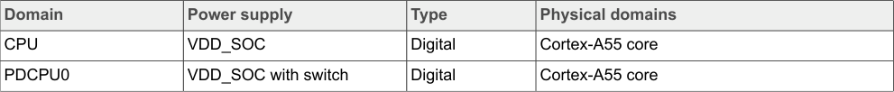

# 4.1  i.MX 93 power domains overview

To optimize the power consumption in Low-power modes, i.MX 93 has multiple power domains. As a result, most SoC digital and analog logics are power gated with an internal power switch or an external supply from PMIC in Low-power mode.

**Note:** The values in Table 3 are for reference purpose only. For actual values, refer i.MX 93 EVK Applications Processors Data Sheet.

## Table 3. SoC power domains

The image above shows a detailed table of the i.MX 93 SoC power domains. The table provides a comprehensive breakdown of the various power domains in the system, including:

* **Power domain names and identifiers** - Each domain is listed with its specific designation
* **Power management characteristics** - Information about how each domain is controlled and gated
* **Low-power mode behavior** - Details on which domains remain active or are powered down in different power states
* **Supply sources** - Whether domains are powered by internal switches or external PMIC supplies
* **Digital and analog logic groupings** - Organization of SoC functional blocks into their respective power domains

This table is essential for understanding the power architecture of the i.MX 93 processor and optimizing power consumption strategies in various operational modes.

<!-- VERBATIM_TABLE_START -->

|Domain|Power supply|Type|Physical domains|
|---|---|---|---|
|CPU|VDD_SOC|Digital|Cortex&amp;#45;A55 core|
|PDCPU0|VDD_SOC with switch|Digital|Cortex&amp;#45;A55 core|
<!-- VERBATIM_TABLE_END -->