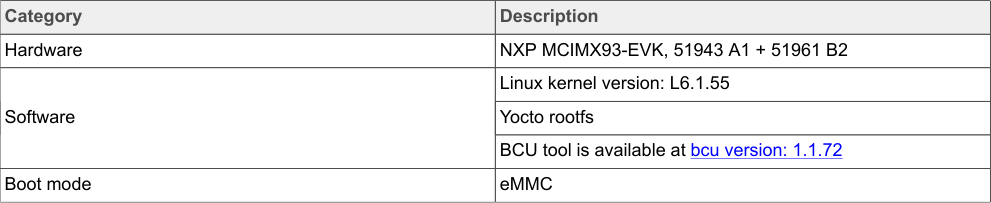

# 5  i.MX 93 processor power measurement

This document provides details of several use cases run by NXP on the NXP MCIMX93-EVK board to measure i.MX 93 power. These use cases are described under Section 6.

## 5.1  Hardware and software requirements

Table 5 provides details of the hardware and software used during the power measurement.



**Table 5. Hardware and software used**

<!-- VERBATIM_TABLE_START -->


|Table 5. Hardware and software used|Col2|
|---|---|
|Category|Description|
|Hardware|NXP MCIMX93&amp;#45;EVK, 51943 A1 + 51961 B2|
|Software|Linux kernel version: L6.1.55|
||Yocto rootfs|
||BCU tool is available at bcu version: 1.1.72|
|Boot mode|eMMC|
<!-- VERBATIM_TABLE_END -->

The table presents the hardware and software configuration used for power measurements:
- **Hardware**: NXP MCIMX93-EVK evaluation board with onboard measurement circuitry
- **Software**: NXP Board Control Utility (BCU) software tool and specific BSP/kernel versions
- Test conditions: Measurements taken at room temperature without thermal forcing equipment

**Note:** For the Software used, the measurements are performed using the onboard measurement circuitry and BCU software tool. These measurements are taken at room temperature without thermal forcing equipment.

## 5.2  Build the i.MX Yocto Project

To build the i.MX Yocto Project, perform the steps as follows:

1. To download and build the i.MX Yocto Project community BSP recipe layers, run the following commands:

   **Note:** For more information on the i.MX Yocto Project, refer i.MX Yocto Project User's Guide.

   ```bash
   repo init -u https://github.com/nxp-imx/imx-manifest -b imx-linux-mickledore -m
    imx-6.1.55-2.2.0.xml
   repo sync
   DISTRO=fsl-imx-xwayland MACHINE=imx93-11x11-lpddr4x-evk source imx-setup-release.sh -b
    build-imx93-11x11-lpddr4x-evk
   ```

2. For some audio or video cases, gstreamer1.0-libav is necessary. Put the following commands at the end of the `build-imx93-11x11-lpddr4x-evk/conf/local.conf` file:

   ```text
   LICENSE_FLAGS_ACCEPTED += "commercial" 
   IMAGE_INSTALL:append = "gstreamer1.0-libav" 
   PACKAGECONFIG:append_pn-gstreamer1.0-libav = "x264" 
   ```

3. To build, run the following command:

   ```bash
   bitbake imx-image-full
   ```