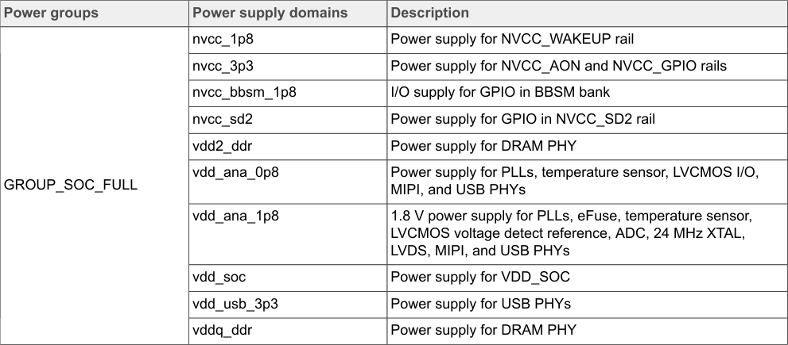

# 5.3  Power consumption measurement

To measure the i.MX 93 power consumption, the steps are as follows:

1. Connect a micro-USB cable between the host PC and the J1401 USB port on the MCIMX93-EVK board.
2. To start the monitor in the BCU path, run the following command:

```bash
bcu monitor -board=imx93evk11b1
```

3. Run the related use cases. These use cases are described under Section 6.
4. To reset the value, press "3" once the use case starts.
5. To switch measurement precision: mA/auto/uA, press "4". This step is optional.
6. Wait for 1 minute and record the data in the BCU.

The measurements are taken mainly for the power supply domains shown in Table 6. This table also provides a mapping between the power rails in BCU software, and the power supply domains in the i.MX 93 processor. For more information, download BCU.pdf.



**Table 6 Description:**

This table provides the mapping between power rails measured in the BCU (Board Controller Unit) software and the corresponding power supply domains in the i.MX 93 processor. The table contains the following information:

- **Power Rail Names in BCU:** Lists the identifiers used by the BCU monitoring software to track each power supply rail on the evaluation board
- **Power Supply Domain:** Maps each BCU rail name to the corresponding power domain in the i.MX 93 processor architecture
- **Purpose:** This mapping is essential for correlating BCU measurements with specific processor subsystems and power domains during power consumption analysis

<!-- VERBATIM_TABLE_START -->


|Power groups|Power supply domains|Description|
|---|---|---|
|GROUP_SOC_FULL|nvcc_1p8|Power supply for NVCC_WAKEUP rail|
||nvcc_3p3|Power supply for NVCC_AON and NVCC_GPIO rails|
||nvcc_bbsm_1p8|I/O supply for GPIO in BBSM bank|
||nvcc_sd2|Power supply for GPIO in NVCC_SD2 rail|
||vdd2_ddr|Power supply for DRAM PHY|
||vdd_ana_0p8|Power supply for PLLs, temperature sensor, LVCMOS I/O, MIPI, and USB PHYs|
||vdd_ana_1p8|1.8 V power supply for PLLs, eFuse, temperature sensor, LVCMOS voltage detect reference, ADC, 24 MHz XTAL, LVDS, MIPI, and USB PHYs|
||vdd_soc|Power supply for VDD_SOC|
||vdd_usb_3p3|Power supply for USB PHYs|
||vddq_ddr|Power supply for DRAM PHY|
<!-- VERBATIM_TABLE_END -->

**Table 6. Measured power supply domains**