# 6 Use cases and measurement results

The main use cases and subcases that form the benchmarks for the i.MX 93 internal power measurements on the EVK platform are described in the following sections.

Note:
• Before running a use case, <configuration_script>.sh must be run to configure the environment, see Section 8.
• For all use cases except TBD cases, the platform is booted from eMMC with the default DTB configuration (imx93-11x11-evk.dtb) in the U-Boot stage.
• The current sample resistors on the power path create a drop in the voltage on each power rail.

Table 7 summarizes the power measurement results of various use cases performed on the MCIMX93ULP-EVK board.

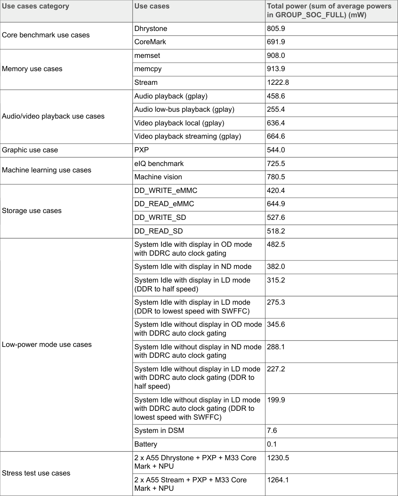

<!-- VERBATIM_TABLE_START -->


|Use cases category|Use cases|Total power (sum of average powers in GROUP_SOC_FULL) (mW)|
|---|---|---|
|Core benchmark use cases|Dhrystone|805.9|
||CoreMark|691.9|
|Memory use cases|memset|908.0|
||memcpy|913.9|
||Stream|1222.8|
|Audio/video playback use cases|Audio playback (gplay)|458.6|
||Audio low&amp;#45;bus playback (gplay)|255.4|
||Video playback local (gplay)|636.4|
||Video playback streaming (gplay)|664.6|
|Graphic use case|PXP|544.0|
|Machine learning use cases|eIQ benchmark|725.5|
||Machine vision|780.5|
|Storage use cases|DD_WRITE_eMMC|420.4|
||DD_READ_eMMC|644.9|
||DD_WRITE_SD|527.6|
||DD_READ_SD|518.2|
|Low&amp;#45;power mode use cases|System Idle with display in OD mode with DDRC auto clock gating|482.5|
||System Idle with display in ND mode|382.0|
||System Idle with display in LD mode (DDR to half speed)|315.2|
||System Idle with display in LD mode (DDR to lowest speed with SWFFC)|275.3|
||System Idle without display in OD mode with DDRC auto clock gating|345.6|
||System Idle without display in ND mode with DDRC auto clock gating|288.1|
||System Idle without display in LD mode with DDRC auto clock gating (DDR to half speed)|227.2|
||System Idle without display in LD mode with DDRC auto clock gating (DDR to lowest speed with SWFFC)|199.9|
||System in DSM|7.6|
||Battery|0.1|
|Stress test use cases|2 x A55 Dhrystone + PXP + M33 Core Mark + NPU|1230.5|
||2 x A55 Stream + PXP + M33 Core Mark + NPU|1264.1|
<!-- VERBATIM_TABLE_END -->


<!-- VERBATIM_TABLE_START -->


|Use cases category|Use cases|Total power (sum of average powers in GROUP_SOC_FULL) (mW)|
|---|---|---|
|Product use cases|Linux Suspend + M33 CoreMark (TCM)|128.2|
||Linux Suspend + M33 in WFI|122.4|
||Linux Suspend + M33 FlexCAN Transaction|132.3|
||Smart doorbell|772.1|
<!-- VERBATIM_TABLE_END -->

## 6.1 Core benchmark use cases

The following use cases scenarios have been tested with Cortex A55 cores:

• Dhrystone
• CoreMark

### 6.1.1 Dhrystone

Dhrystone is a synthetic benchmark used to measure the integer computational performance of processors and compilers. The small size of the Dhrystone benchmark enables it to fit into the L1 cache and minimizes access to the L2 cache and DDR.

In this use case, the two Cortex-A55 cores perform the Dhrystone test. Because Dhrystone is a single thread benchmark, two instances have been started. All Cortex-A55 cores run the test in a loop at a frequency of 1.7 GHz.

When the use case is running, the state of the system is as follows:

1. The CPU frequency is set to the maximum value of 1.7 GHz.
2. The DDR data rate is set to 3733 MT/s.
3. The display is OFF.
4. The CM33 is in reset hold, waiting for the reset signal release.

To measure the power consumption of Dhrystone, the steps are as follows:

1. Boot the Linux image with imx93-11x11-evk.dtb.
2. Run setup.sh, see Section 8.
3. Run dhrystone_loop.sh:

```bash
while [ "1" == "1" ]; do
  taskset -c 0 ./dhry2 &
  taskset -c 1 ./dhry2
done
```

4. Measure the power and record the results.

Table 8 shows the measurement results when this use case is applied to the i.MX 93 processor.

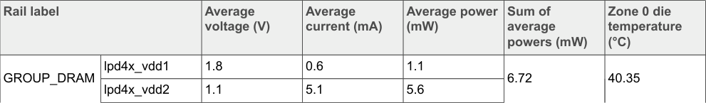

<!-- VERBATIM_TABLE_START -->


|Rail label|Col2|Average voltage (V)|Average current (mA)|Average power (mW)|Sum of average powers (mW)|Zone 0 die temperature (°C)|
|---|---|---|---|---|---|---|
|GROUP_DRAM|lpd4x_vdd1|1.8|0.6|1.1|6.72|40.35|
||lpd4x_vdd2|1.1|5.1|5.6|||
<!-- VERBATIM_TABLE_END -->

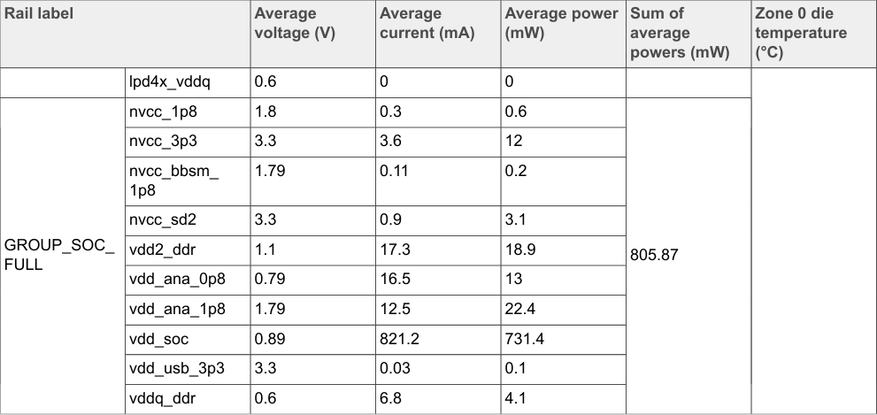

<!-- VERBATIM_TABLE_START -->


|Rail label|Col2|Average voltage (V)|Average current (mA)|Average power (mW)|Sum of average powers (mW)|Zone 0 die temperature (°C)|
|---|---|---|---|---|---|---|
||lpd4x_vddq|0.6|0|0|||
|GROUP_SOC_ FULL|nvcc_1p8|1.8|0.3|0.6|805.87||
||nvcc_3p3|3.3|3.6|12|||
||nvcc_bbsm_ 1p8|1.79|0.11|0.2|||
||nvcc_sd2|3.3|0.9|3.1|||
||vdd2_ddr|1.1|17.3|18.9|||
||vdd_ana_0p8|0.79|16.5|13|||
||vdd_ana_1p8|1.79|12.5|22.4|||
||vdd_soc|0.89|821.2|731.4|||
||vdd_usb_3p3|3.3|0.03|0.1|||
||vddq_ddr|0.6|6.8|4.1|||
<!-- VERBATIM_TABLE_END -->

### 6.1.2 CoreMark

CoreMark is a modern, sophisticated benchmark that lets you accurately measure the processor performance and is intended to replace the older Dhrystone benchmark. Arm recommends using CoreMark over Dhrystone.

When the use case is running, the state of the system is as follows:

1. The CPU frequency is set to the maximum value of 1.7 GHz.
2. The DDR data rate is set to 3733 MT/s.
3. The display is OFF.
4. The CM33 is in reset hold, waiting for the reset signal release.

To measure the power consumption of CoreMark, the steps are as follows:

1. Boot the Linux image with imx93-11x11-evk.dtb.
2. Run setup.sh, see Section 8.
3. Run coremark_loop.sh:

```bash
while true; do
  ./coremark > /dev/null 2>&1
done
```

Note: For the best performance, compile as follows:

```bash
make XCFLAGS="-DMULTITHREAD=2 -DUSE_PTHREAD -pthread"
```

4. Measure the power and record the results.

Table 9 shows the measurement results when this use case is applied to the i.MX 93 processor.


<!-- VERBATIM_TABLE_START -->


|Rail label|Col2|Average voltage (V)|Average current (mA)|Average power (mW)|Sum of average powers (mW)|Zone 0 die temperature (°C)|
|---|---|---|---|---|---|---|
|GROUP_DRAM|lpd4x_vdd1|1.8|0.44|0.8|5.91|38|
<!-- VERBATIM_TABLE_END -->

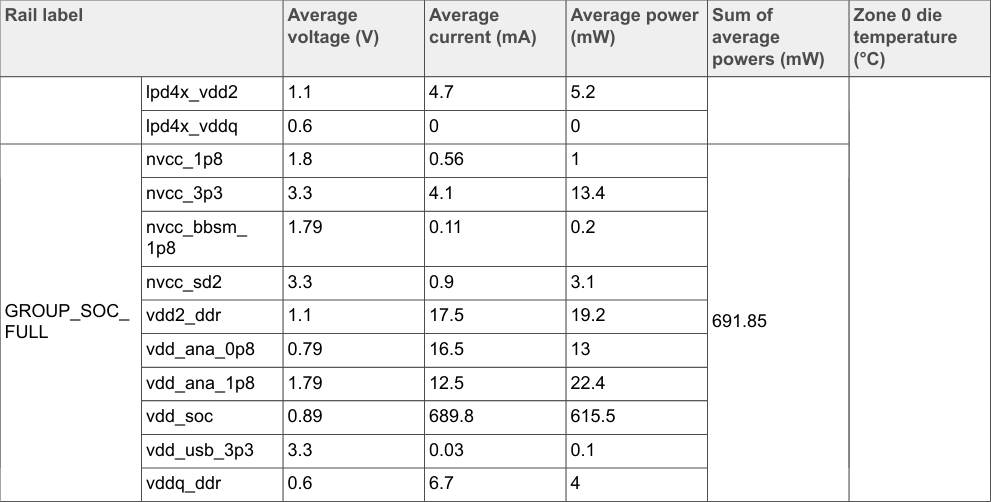

<!-- VERBATIM_TABLE_START -->


|Rail label|Col2|Average voltage (V)|Average current (mA)|Average power (mW)|Sum of average powers (mW)|Zone 0 die temperature (°C)|
|---|---|---|---|---|---|---|
||lpd4x_vdd2|1.1|4.7|5.2|||
||lpd4x_vddq|0.6|0|0|||
|GROUP_SOC_ FULL|nvcc_1p8|1.8|0.56|1|691.85||
||nvcc_3p3|3.3|4.1|13.4|||
||nvcc_bbsm_ 1p8|1.79|0.11|0.2|||
||nvcc_sd2|3.3|0.9|3.1|||
||vdd2_ddr|1.1|17.5|19.2|||
||vdd_ana_0p8|0.79|16.5|13|||
||vdd_ana_1p8|1.79|12.5|22.4|||
||vdd_soc|0.89|689.8|615.5|||
||vdd_usb_3p3|3.3|0.03|0.1|||
||vddq_ddr|0.6|6.7|4|||
<!-- VERBATIM_TABLE_END -->

## 6.2 Memory use cases

The following memory-centric use case scenarios have been tested:

• memset
• memcpy
• Stream

The memset and memcpy are part of a perf-bench, which is a general framework for benchmark suites.

### 6.2.1 memset

The memset use case is for evaluating the performance of a simple memory set in various ways.

When the use case is running, the state of the system is as follows:

1. The CPU frequency is set to the maximum value of 1.7 GHz.
2. The DDR data rate is set to 3733 MT/s.
3. The size for the memory buffers is set to 1024 MB.
4. The CM33 is in reset hold, waiting for the reset signal release.

To measure the power consumption of the memset, the steps are as follows:

1. Boot the Linux image with imx93-11x11-evk.dtb.
2. Run setup.sh, see Section 8.
3. Run memset_loop.sh:

```bash
while true; do
  buff_size=`cat /proc/meminfo | grep CmaFree | awk '{print$2}'`
  perf bench -f simple mem memset -l 20000 -s ${buff_size}KB
done
```

4. Measure the power and record the results.

Table 10 shows the measurement results when this use case is applied to the i.MX 93 processor.

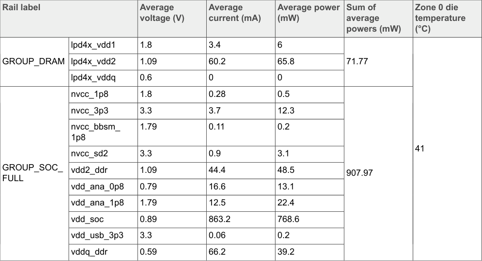

<!-- VERBATIM_TABLE_START -->


|Rail label|Col2|Average voltage (V)|Average current (mA)|Average power (mW)|Sum of average powers (mW)|Zone 0 die temperature (°C)|
|---|---|---|---|---|---|---|
|GROUP_DRAM|lpd4x_vdd1|1.8|3.4|6|71.77|41|
||lpd4x_vdd2|1.09|60.2|65.8|||
||lpd4x_vddq|0.6|0|0|||
|GROUP_SOC_ FULL|nvcc_1p8|1.8|0.28|0.5|907.97||
||nvcc_3p3|3.3|3.7|12.3|||
||nvcc_bbsm_ 1p8|1.79|0.11|0.2|||
||nvcc_sd2|3.3|0.9|3.1|||
||vdd2_ddr|1.09|44.4|48.5|||
||vdd_ana_0p8|0.79|16.6|13.1|||
||vdd_ana_1p8|1.79|12.5|22.4|||
||vdd_soc|0.89|863.2|768.6|||
||vdd_usb_3p3|3.3|0.06|0.2|||
||vddq_ddr|0.59|66.2|39.2|||
<!-- VERBATIM_TABLE_END -->

### 6.2.2 memcpy

The memcpy use case is for evaluating the performance of a simple memory copy in various ways.

When the use case is running, the state of the system is as follows:

1. The CPU frequency is set to the maximum value of 1.7 GHz.
2. The DDR data rate is set to 3733 MT/s.
3. The size for the memory buffers is set to 1024 MB.
4. The CM33 is in reset hold, waiting for the reset signal release.

To measure the power consumption of memcpy, the steps are as follows:

1. Boot the Linux image with imx93-11x11-evk.dtb.
2. Run setup.sh, see Section 8.
3. Run memcpy_loop.sh:

```bash
while true; do
  buff_size=`cat /proc/meminfo | grep CmaFree | awk '{print$2}'`
  perf bench -f simple mem memcpy -l 20000 -s ${buff_size}KB
done
```

4. Measure the power and record the results.

Table 11 shows the measurement results when this use case is applied to the i.MX 93 processor.

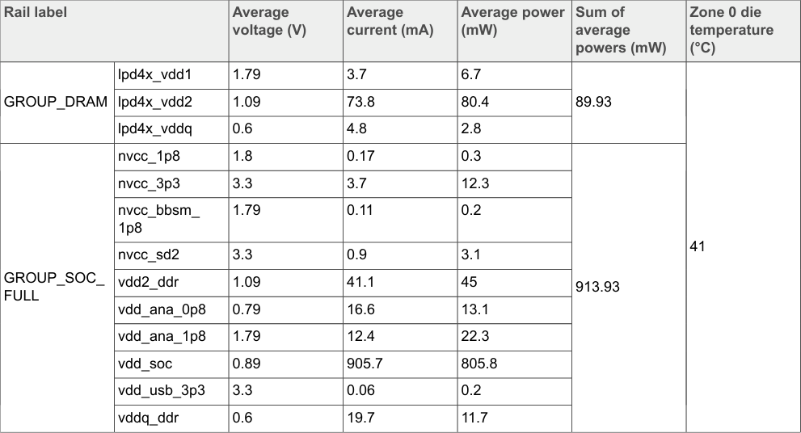

<!-- VERBATIM_TABLE_START -->


|Rail label|Col2|Average voltage (V)|Average current (mA)|Average power (mW)|Sum of average powers (mW)|Zone 0 die temperature (°C)|
|---|---|---|---|---|---|---|
|GROUP_DRAM|lpd4x_vdd1|1.79|3.7|6.7|89.93|41|
||lpd4x_vdd2|1.09|73.8|80.4|||
||lpd4x_vddq|0.6|4.8|2.8|||
|GROUP_SOC_ FULL|nvcc_1p8|1.8|0.17|0.3|913.93||
||nvcc_3p3|3.3|3.7|12.3|||
||nvcc_bbsm_ 1p8|1.79|0.11|0.2|||
||nvcc_sd2|3.3|0.9|3.1|||
||vdd2_ddr|1.09|41.1|45|||
||vdd_ana_0p8|0.79|16.6|13.1|||
||vdd_ana_1p8|1.79|12.4|22.3|||
||vdd_soc|0.89|905.7|805.8|||
||vdd_usb_3p3|3.3|0.06|0.2|||
||vddq_ddr|0.6|19.7|11.7|||
<!-- VERBATIM_TABLE_END -->

### 6.2.3 Stream

The stream benchmark is a simple synthetic benchmark program that measures the sustainable memory bandwidth (in MB/s) and the corresponding computation rate for simple vector kernels.

When the use case is running, the state of the system is as follows:

1. The CPU frequency is set to the maximum value of 1.7 GHz.
2. The DDR data rate is set to 3733 MT/s.
3. All phases, such as Copy, Scale, Add, and Triad, are included.
4. The CM33 is in reset hold, waiting for the reset signal release.

To measure the power consumption of the stream, the steps are as follows:

1. Boot the Linux image with imx93-11x11-evk.dtb.
2. Run setup.sh, see Section 8.
3. Run streamcpy_loop.sh:

```bash
while [ "1" == "1" ]; do
  taskset -c 0 stream -M 200M -N 1000 & 
  taskset -c 1 stream -M 200M -N 1000
done
```

4. Measure the power and record the results.

Table 12 shows the measurement results when this use case is applied to the i.MX 93 processor.

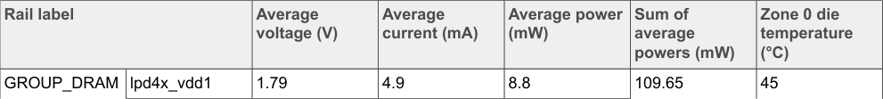

<!-- VERBATIM_TABLE_START -->


|Rail label|Col2|Average voltage (V)|Average current (mA)|Average power (mW)|Sum of average powers (mW)|Zone 0 die temperature (°C)|
|---|---|---|---|---|---|---|
|GROUP_DRAM|lpd4x_vdd1|1.79|4.9|8.8|109.65|45|
<!-- VERBATIM_TABLE_END -->

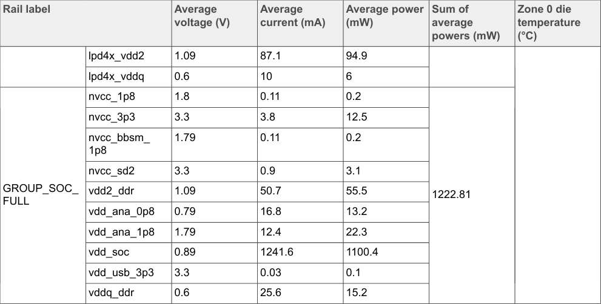

<!-- VERBATIM_TABLE_START -->


|Rail label|Col2|Average voltage (V)|Average current (mA)|Average power (mW)|Sum of average powers (mW)|Zone 0 die temperature (°C)|
|---|---|---|---|---|---|---|
||lpd4x_vdd2|1.09|87.1|94.9|||
||lpd4x_vddq|0.6|10|6|||
|GROUP_SOC_ FULL|nvcc_1p8|1.8|0.11|0.2|1222.81||
||nvcc_3p3|3.3|3.8|12.5|||
||nvcc_bbsm_ 1p8|1.79|0.11|0.2|||
||nvcc_sd2|3.3|0.9|3.1|||
||vdd2_ddr|1.09|50.7|55.5|||
||vdd_ana_0p8|0.79|16.8|13.2|||
||vdd_ana_1p8|1.79|12.4|22.3|||
||vdd_soc|0.89|1241.6|1100.4|||
||vdd_usb_3p3|3.3|0.03|0.1|||
||vddq_ddr|0.6|25.6|15.2|||
<!-- VERBATIM_TABLE_END -->

## 6.3 Audio/video playback use cases

The following audio use case scenarios have been tested:

• Audio playback (gplay)
• Audio low-bus playback (gplay)
• Video playback local (gplay)
• Video playback streaming (gplay)

### 6.3.1 Audio playback (gplay)

For this use case, the audio file is an MP3 file with a 128 kbit/s bit rate and a 44 kHz sample rate. CA55 handles audio decoding, I2S, and audio codec.

When the use case is running, the state of the system is as follows:

1. The CPU frequency is set to the maximum value of 1.7 GHz.
2. The DDR data rate is set to 3733 MT/s.
3. The CM33 is in reset hold, waiting for the reset signal release.

To measure the power consumption of the audio playback, the steps are as follows:

1. Boot the Linux image with imx93-11x11-evk.dtb.
2. Run setup.sh, see Section 8.
3. Run gplay_audio.sh:

```bash
gplay-1.0 Mpeg1L3_44kHz_128kbps_s_Ed_Rush_Sabotage_mplayer.mp3
```

Note: Prepare your own MP3 file. To obtain similar results in this document, ensure that the audio bit rate is about 128 kbit/s.

4. Measure the power and record the results.

Note:

If there is no sound, use the following command to query and set the sound card:

```bash
pacmd list-sinks
pacmd set-default-sink $index #Select the item index with the wm8962 keyword
```

Table 13 shows the measurement results when this use case is applied to the i.MX 93 processor.


<!-- VERBATIM_TABLE_START -->


|Rail label|Col2|Average voltage (V)|Average current (mA)|Average power (mW)|Sum of average powers (mW)|Zone 0 die temperature (°C)|
|---|---|---|---|---|---|---|
|GROUP_DRAM|lpd4x_vdd1|1.8|1|1.8|11.76|34|
||lpd4x_vdd2|1.1|8.9|9.7|||
||lpd4x_vddq|0.6|0.5|0.3|||
|GROUP_SOC_ FULL|nvcc_1p8|1.8|0.17|0.3|458.63||
||nvcc_3p3|3.3|6.2|20.4|||
||nvcc_bbsm_ 1p8|1.79|0.11|0.2|||
||nvcc_sd2|3.3|0.9|3.1|||
||vdd2_ddr|1.1|17.8|19.5|||
||vdd_ana_0p8|0.79|20.2|15.9|||
||vdd_ana_1p8|1.79|13.7|24.5|||
||vdd_soc|0.89|414.1|370.5|||
||vdd_usb_3p3|3.3|0.06|0.2|||
||vddq_ddr|0.6|6.8|4.1|||
<!-- VERBATIM_TABLE_END -->

### 6.3.2 Audio low-bus playback (gplay)

For this use case, the audio file is a WAV file with a 24 bit and a 32 kHz sample rate. CA55 handles audio decoding, I2S, and audio codec.

When the use case is running, the state of the system is as follows:

1. The CPU frequency is set to 1.4 GHz.
2. The DDR data rate is set to 625 MT/s.
3. The CM33 is in reset hold, waiting for the reset signal release.

To measure the power consumption of the audio low-bus playback, the steps are as follows:

1. Boot the Linux image with imx93-11x11-evk-ld.dtb.
2. Run DDRC_625MTS_setup.sh (625 MT/s data rate), see Section 8.
3. Run gplay_audio.sh:

```bash
gplay-1.0 Mpeg1L3_44kHz_128kbps_s_Ed_Rush_Sabotage_mplayer.mp3
```

Note: Prepare your own MP3 file. To obtain similar results in this document, ensure that the audio bit rate is about 128 kbit/s.

4. Measure the power and record the results.

Table 14 shows the measurement results when this use case is applied to the i.MX 93 processor.


<!-- VERBATIM_TABLE_START -->


|Rail label|Col2|Average voltage (V)|Average current (mA)|Average power (mW)|Sum of average powers (mW)|Zone 0 die temperature (°C)|
|---|---|---|---|---|---|---|
|GROUP_DRAM|lpd4x_vdd1|1.8|1.3|2.4|12.25|30|
||lpd4x_vdd2|1.1|7.7|8.4|||
||lpd4x_vddq|0.6|2.5|1.5|||
|GROUP_SOC_ FULL|nvcc_1p8|1.8|0.22|0.4|255.39||
||nvcc_3p3|3.3|6.2|20.6|||
||nvcc_bbsm_ 1p8|1.79|0.11|0.2|||
||nvcc_sd2|3.3|0.9|3.1|||
||vdd2_ddr|1.1|4.7|5.1|||
||vdd_ana_0p8|0.79|20.2|15.9|||
||vdd_ana_1p8|1.79|9.9|17.7|||
||vdd_soc|0.8|235.1|187.6|||
||vdd_usb_3p3|3.3|0.06|0.2|||
||vddq_ddr|0.6|7.9|4.7|||
<!-- VERBATIM_TABLE_END -->

### 6.3.3 Video playback local (gplay)

For this use case, the i.MX 93 EVK board is connected to an HDMI display through the MIPI-to-HDMI converter card (IMX-MIPI-HDMI).

The video file used for playback is an MP4 file format compressed using the H.264 480 p resolution at 24 frames per second (fps). The audio encoding is AACL with a 44.1 kHz sample rate in a two-channel configuration.

Note: In this SoC, there is no hardware decoder, so a software decoder is used.

When the use case is running, the state of the system is as follows:

1. The CPU frequency is set to the maximum value of 1.7 GHz.
2. The DDR data rate is set to 3733 MT/s.
3. The CM33 is in reset hold, waiting for the reset signal release.

To measure the power consumption of video playback local, the steps are as follows:

1. Connect the HDMI display to the board through the MIPI-to-HDMI converter card (IMX-MIPI-HDMI).
2. Boot the Linux image with imx93-11x11-evk.dtb.
3. To put the system into Idle mode, run setup_video.sh. See Section 8.
4. Run gplay_videoplayback.sh:

```bash
gplay-1.0 ./480p24.mp4
```

Note: Prepare your own MP4 file. To obtain similar results, ensure that this file is 480 p with a 24-frame rate, bit rate of about 1200 kbit/s, and encoded in H.264 format.

5. Measure the power and record the results.

Table 15 shows the measurement results when this use case is applied to the i.MX 93 processor.

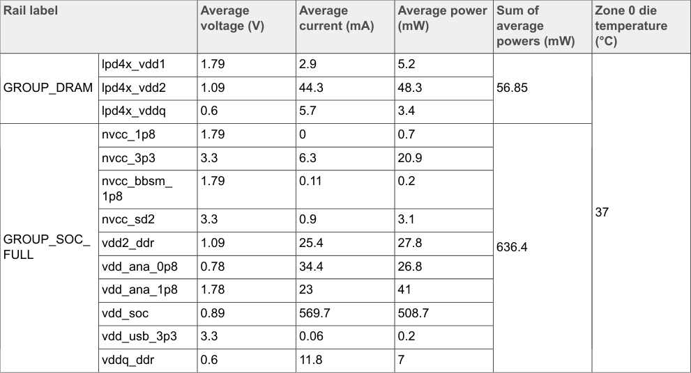

<!-- VERBATIM_TABLE_START -->


|Rail label|Col2|Average voltage (V)|Average current (mA)|Average power (mW)|Sum of average powers (mW)|Zone 0 die temperature (°C)|
|---|---|---|---|---|---|---|
|GROUP_DRAM|lpd4x_vdd1|1.79|2.9|5.2|56.85|37|
||lpd4x_vdd2|1.09|44.3|48.3|||
||lpd4x_vddq|0.6|5.7|3.4|||
|GROUP_SOC_ FULL|nvcc_1p8|1.79|0|0.7|636.4||
||nvcc_3p3|3.3|6.3|20.9|||
||nvcc_bbsm_ 1p8|1.79|0.11|0.2|||
||nvcc_sd2|3.3|0.9|3.1|||
||vdd2_ddr|1.09|25.4|27.8|||
||vdd_ana_0p8|0.78|34.4|26.8|||
||vdd_ana_1p8|1.78|23|41|||
||vdd_soc|0.89|569.7|508.7|||
||vdd_usb_3p3|3.3|0.06|0.2|||
||vddq_ddr|0.6|11.8|7|||
<!-- VERBATIM_TABLE_END -->

### 6.3.4 Video playback streaming (gplay)

For this use case, the i.MX 93 EVK board is connected to an HDMI display through the MIPI-to-HDMI converter card (IMX-MIPI-HDMI).

The video file used for playback is streamed through HTTP. An MP4 file format compressed using the H.264 480 p resolution at 24 fps. The audio encoding is AACL with a 44.1 kHz sample rate in a two-channel configuration.

When the use case is running, the state of the system is as follows:

1. The CPU frequency is set to the maximum value of 1.7 GHz.
2. The DDR data rate is set to 3733 MT/s.
3. The CM33 is in reset hold, waiting for the reset signal release.

To measure the power consumption of video playback streaming, the steps are as follows:

1. Connect your PC and board to the same local network.
2. Prepare the video file, named 480p24.mp4 on the PC.
3. On the server PC, perform the following steps:
   a. For Windows, download the Node.js from https://nodejs.org/en and install it.
   b. To install http-server, use the following command:

   ```bash
   npm install http-server -g
   ```

   c. Enter a target folder that contains the target video in the terminal.
   d. To obtain the <ip_server> similar to <ip address:port>, use "http-server -c-1".

4. On the board, perform the following steps:
   a. Boot the Linux image with imx93-11x11-evk.dtb.
   b. Connect the HDMI display to the board through the MIPI-to-HDMI converter card (IMX-MIPI-HDMI).
   c. Run setup_video_stream.sh on the board. See Section 8.
   d. Run the following command on the board:

   ```bash
   gplay-1.0 http://<ip_server>/480p24.mp4
   ```

   e. Measure the power for the board and record the results.

Table 16 shows the measurement results when this use case is applied to the i.MX 93 processor.

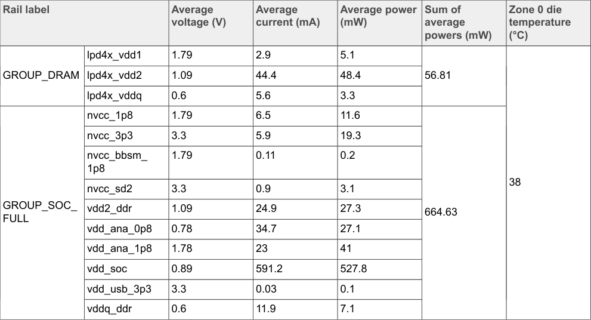

<!-- VERBATIM_TABLE_START -->


|Rail label|Col2|Average voltage (V)|Average current (mA)|Average power (mW)|Sum of average powers (mW)|Zone 0 die temperature (°C)|
|---|---|---|---|---|---|---|
|GROUP_DRAM|lpd4x_vdd1|1.79|2.9|5.1|56.81|38|
||lpd4x_vdd2|1.09|44.4|48.4|||
||lpd4x_vddq|0.6|5.6|3.3|||
|GROUP_SOC_ FULL|nvcc_1p8|1.79|6.5|11.6|664.63||
||nvcc_3p3|3.3|5.9|19.3|||
||nvcc_bbsm_ 1p8|1.79|0.11|0.2|||
||nvcc_sd2|3.3|0.9|3.1|||
||vdd2_ddr|1.09|24.9|27.3|||
||vdd_ana_0p8|0.78|34.7|27.1|||
||vdd_ana_1p8|1.78|23|41|||
||vdd_soc|0.89|591.2|527.8|||
||vdd_usb_3p3|3.3|0.03|0.1|||
||vddq_ddr|0.6|11.9|7.1|||
<!-- VERBATIM_TABLE_END -->

## 6.4 Graphic use case

For this use case, the PXP is used to perform 2D operation.

When the use case is running, the state of the system is as follows:

• The CPU frequency is set to the maximum value of 1.7 GHz.
• The DDR data rate is set to 3733 MT/s.
• The CM33 is in reset hold, waiting for the reset signal release.

To measure the power consumption of the graphic, the steps are as follows:

1. Boot the Linux image with imx93-11x11-evk.dtb.
2. Run setup_video.sh.
3. Run PXP_test.sh, see Section 8.
4. Measure the power and record the results.

Table 17 shows the measurement results when this use case is applied to the i.MX 93 processor.


<!-- VERBATIM_TABLE_START -->


|Rail label|Col2|Average voltage (V)|Average current (mA)|Average power (mW)|Sum of average powers (mW)|Zone 0 die temperature (°C)|
|---|---|---|---|---|---|---|
|GROUP_DRAM|lpd4x_vdd1|1.79|2.9|5.2|55.25|36|
<!-- VERBATIM_TABLE_END -->

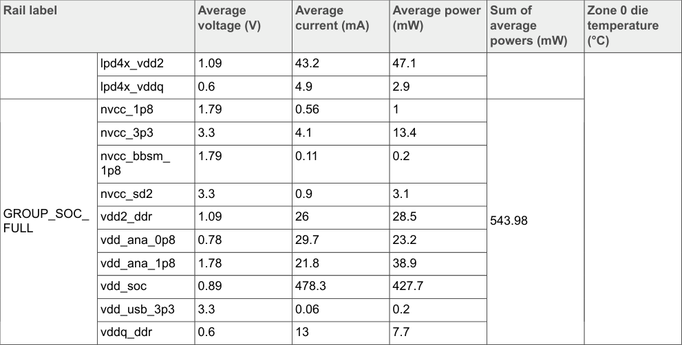

<!-- VERBATIM_TABLE_START -->


|Rail label|Col2|Average voltage (V)|Average current (mA)|Average power (mW)|Sum of average powers (mW)|Zone 0 die temperature (°C)|
|---|---|---|---|---|---|---|
||lpd4x_vdd2|1.09|43.2|47.1|||
||lpd4x_vddq|0.6|4.9|2.9|||
|GROUP_SOC_ FULL|nvcc_1p8|1.79|0.56|1|543.98||
||nvcc_3p3|3.3|4.1|13.4|||
||nvcc_bbsm_ 1p8|1.79|0.11|0.2|||
||nvcc_sd2|3.3|0.9|3.1|||
||vdd2_ddr|1.09|26|28.5|||
||vdd_ana_0p8|0.78|29.7|23.2|||
||vdd_ana_1p8|1.78|21.8|38.9|||
||vdd_soc|0.89|478.3|427.7|||
||vdd_usb_3p3|3.3|0.06|0.2|||
||vddq_ddr|0.6|13|7.7|||
<!-- VERBATIM_TABLE_END -->

## 6.5 Machine learning use cases

The tested use case scenarios for machine learning are as follows:

• eIQ benchmark
• Machine vision

### 6.5.1 eIQ benchmark

When the use case is running, the state of the system is as follows:

1. The CPU frequency is set to the maximum value of 1.7 GHz.
2. The DDR data rate is set to 3733 MT/s.
3. The CM33 is running the NPU software driver.

To measure the power consumption of the eIQ benchmark, the steps are as follows:

1. Boot the Linux image with imx93-11x11-evk.dtb.
2. Run setup.sh, see Section 8.
3. To generate the mobilenet_v1_1.0_224_quant_vela.tflite model file under the path /usr/bin/tensorflow-lite-2.12.1/examples, run the following command:

```bash
vela mobilenet_v1_1.0_224_quant.tflite
```

4. Copy the mobilenet_v1_1.0_224_quant_vela.tflite to /usr/bin/tensorflow-lite-2.12.1/examples from the output.
5. Copy ML_vela.sh to /usr/bin/tensorflow-lite-2.12.1/examples in rootfs and run the following command:

```bash
/usr/bin/tensorflow-lite-2.12.1/examples/ML_vela.sh 1
```

6. Measure the power and record the results.

Table 18 shows the measurement results when this use case applies to the i.MX 93 processor.

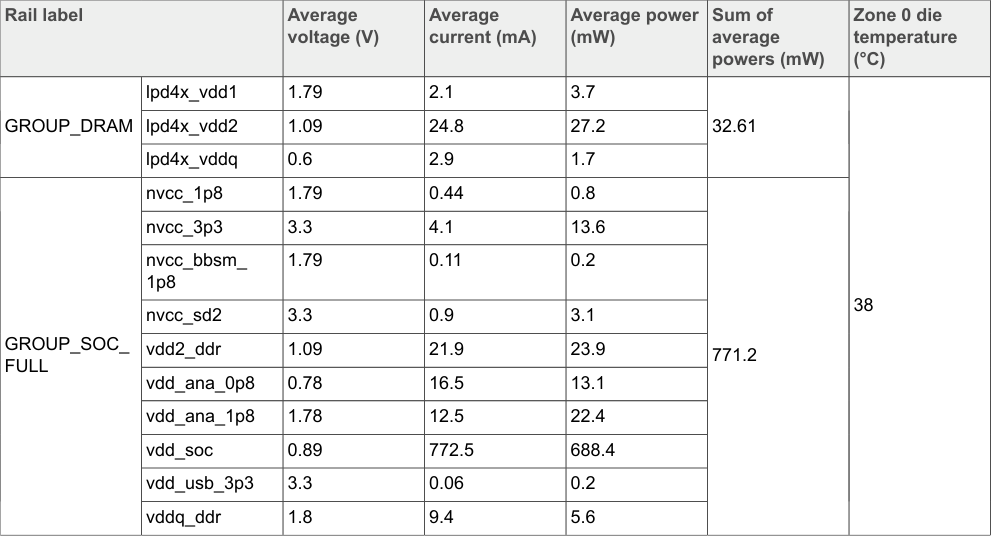

<!-- VERBATIM_TABLE_START -->


|Rail label|Col2|Average voltage (V)|Average current (mA)|Average power (mW)|Sum of average powers (mW)|Zone 0 die temperature (°C)|
|---|---|---|---|---|---|---|
|GROUP_DRAM|lpd4x_vdd1|1.79|2.1|3.7|32.61|38|
||lpd4x_vdd2|1.09|24.8|27.2|||
||lpd4x_vddq|0.6|2.9|1.7|||
|GROUP_SOC_ FULL|nvcc_1p8|1.79|0.44|0.8|771.2||
||nvcc_3p3|3.3|4.1|13.6|||
||nvcc_bbsm_ 1p8|1.79|0.11|0.2|||
||nvcc_sd2|3.3|0.9|3.1|||
||vdd2_ddr|1.09|21.9|23.9|||
||vdd_ana_0p8|0.78|16.5|13.1|||
||vdd_ana_1p8|1.78|12.5|22.4|||
||vdd_soc|0.89|772.5|688.4|||
||vdd_usb_3p3|3.3|0.06|0.2|||
||vddq_ddr|1.8|9.4|5.6|||
<!-- VERBATIM_TABLE_END -->

### 6.5.2 Machine vision

When the use case is running, the state of the system is as follows:

1. The CPU frequency is set to the maximum value of 1.7 GHz.
2. The DDR data rate is set to 3733 MT/s.
3. The CM33 is running the NPU software driver.

To measure the power consumption of the machine vision, the steps are as follows:

1. Download the ap1302 firmware from ONSemiconductor, and rename it as ap1302.fw.
2. Copy ap1302.fw to the target board under the path /lib/firmware/imx/camera/.
3. Connect AP1302 MIPI camera with J801 on i.MX 93 EVK.
4. Connect the display to the board through the HDMI interface.
5. Boot the Linux image with imx93-11x11-evk.dtb.
6. Download the trained neural network ssd_mobilenet_v2_coco_quant_postprocess.tffile and coco_labels.txt to the path /usr/bin/tensorflow-lite-2.12.1/examples. To generate the vela file, run the following command:

```bash
vela ssd_mobilenet_v2_coco_quant_postprocess.tflite
```

7. Run setup_video_stream.sh.
8. Copy MV_vela.sh, model file named mobilenet_v1_1.0_224_quant_vela.tflite, and label file named coco_labels.txt to /usr/bin/tensorflow-lite-2.12.1/examples in rootfs and run the following command:

```bash
/usr/bin/tensorflow-lite-2.12.1/examples/MV_vela.sh
```

9. Measure the power and record the results.

Table 19 shows the measurement results when this use case applies to the i.MX 93 processor.

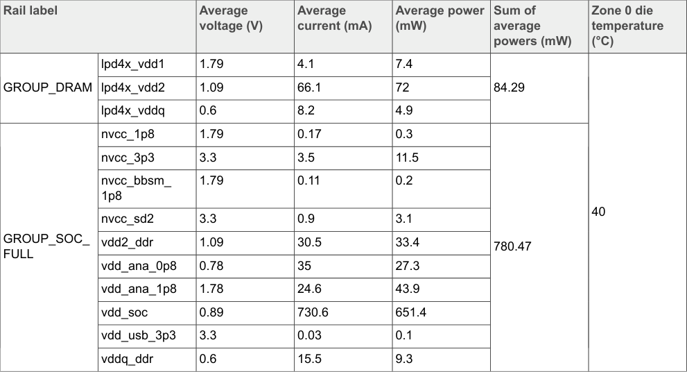

<!-- VERBATIM_TABLE_START -->


|Rail label|Col2|Average voltage (V)|Average current (mA)|Average power (mW)|Sum of average powers (mW)|Zone 0 die temperature (°C)|
|---|---|---|---|---|---|---|
|GROUP_DRAM|lpd4x_vdd1|1.79|4.1|7.4|84.29|40|
||lpd4x_vdd2|1.09|66.1|72|||
||lpd4x_vddq|0.6|8.2|4.9|||
|GROUP_SOC_ FULL|nvcc_1p8|1.79|0.17|0.3|780.47||
||nvcc_3p3|3.3|3.5|11.5|||
||nvcc_bbsm_ 1p8|1.79|0.11|0.2|||
||nvcc_sd2|3.3|0.9|3.1|||
||vdd2_ddr|1.09|30.5|33.4|||
||vdd_ana_0p8|0.78|35|27.3|||
||vdd_ana_1p8|1.78|24.6|43.9|||
||vdd_soc|0.89|730.6|651.4|||
||vdd_usb_3p3|3.3|0.03|0.1|||
||vddq_ddr|0.6|15.5|9.3|||
<!-- VERBATIM_TABLE_END -->

## 6.6 Storage use cases

The tested use case scenarios for storage are as follows:

• DD_WRITE_eMMC
• DD_READ_eMMC
• DD_WRITE_SD
• DD_READ_SD

### 6.6.1 DD_WRITE_eMMC

When the use case is running, the state of the system is as follows:

1. The CPU frequency is set to the maximum value of 1.7 GHz.
2. The DDR data rate is set to 3733 MT/s.
3. The CM33 is in reset hold, waiting for the reset signal release.
4. The maximum amount of data the kernel reads ahead for a single file is set to 512 kB.

To measure the power consumption of DD_WRITE_eMMC, the steps are as follows:

1. Boot the Linux image with imx93-11x11-evk.dtb.
2. Run setup.sh.
3. Copy dd_write.sh on the eMMC partition and run.
4. Measure the power and record the results.

Table 20 shows the measurement results when this use case applies to the i.MX 93 processor.

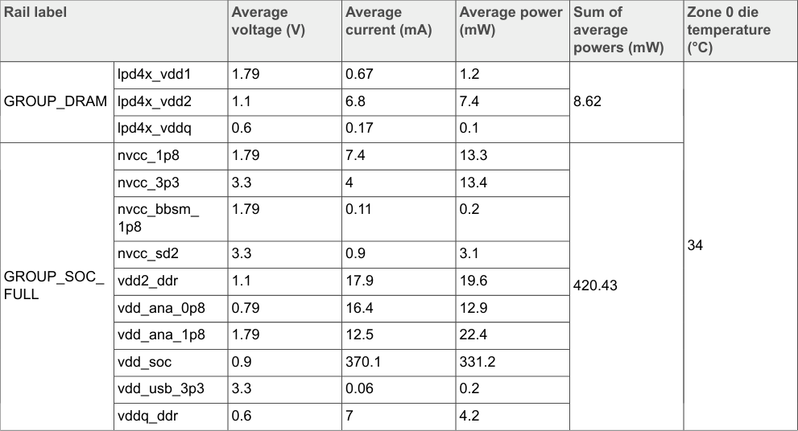

<!-- VERBATIM_TABLE_START -->


|Rail label|Col2|Average voltage (V)|Average current (mA)|Average power (mW)|Sum of average powers (mW)|Zone 0 die temperature (°C)|
|---|---|---|---|---|---|---|
|GROUP_DRAM|lpd4x_vdd1|1.79|0.67|1.2|8.62|34|
||lpd4x_vdd2|1.1|6.8|7.4|||
||lpd4x_vddq|0.6|0.17|0.1|||
|GROUP_SOC_ FULL|nvcc_1p8|1.79|7.4|13.3|420.43||
||nvcc_3p3|3.3|4|13.4|||
||nvcc_bbsm_ 1p8|1.79|0.11|0.2|||
||nvcc_sd2|3.3|0.9|3.1|||
||vdd2_ddr|1.1|17.9|19.6|||
||vdd_ana_0p8|0.79|16.4|12.9|||
||vdd_ana_1p8|1.79|12.5|22.4|||
||vdd_soc|0.9|370.1|331.2|||
||vdd_usb_3p3|3.3|0.06|0.2|||
||vddq_ddr|0.6|7|4.2|||
<!-- VERBATIM_TABLE_END -->

### 6.6.2 DD_READ_eMMC

The state of the system, when the use case is running, is as follows:

1. The CPU frequency is set to the maximum value of 1.7 GHz.
2. The DDR data rate is set to 3733 MT/s.
3. The CM33 is in reset hold, waiting for the reset signal release.
4. The maximum amount of data the kernel reads ahead for a single file is set to 512 kB.

To measure the power consumption of DD_READ_eMMC, the steps are as follows:

1. Boot the Linux image with imx93-11x11-evk.dtb.
2. Run setup.sh.
3. Make sure the file dd_obs_testfile exists and rename it to dd_ibs_testfile.
4. Copy dd_read_bs4096.sh on the eMMC partition and run.
5. Measure the power and record the results.

Table 21 shows the measurement results when this use case applies to the i.MX 93 processor.

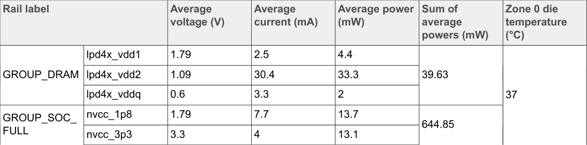

<!-- VERBATIM_TABLE_START -->


|Rail label|Col2|Average voltage (V)|Average current (mA)|Average power (mW)|Sum of average powers (mW)|Zone 0 die temperature (°C)|
|---|---|---|---|---|---|---|
|GROUP_DRAM|lpd4x_vdd1|1.79|2.5|4.4|39.63|37|
||lpd4x_vdd2|1.09|30.4|33.3|||
||lpd4x_vddq|0.6|3.3|2|||
|GROUP_SOC_ FULL|nvcc_1p8|1.79|7.7|13.7|644.85||
||nvcc_3p3|3.3|4|13.1|||
<!-- VERBATIM_TABLE_END -->

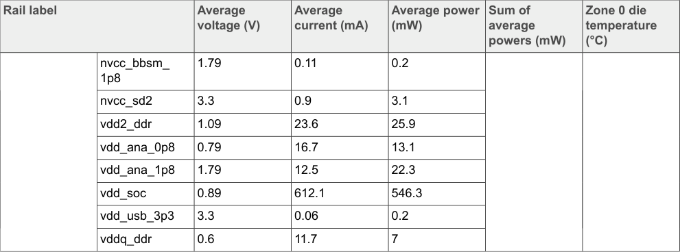

<!-- VERBATIM_TABLE_START -->


|Rail label|Col2|Average voltage (V)|Average current (mA)|Average power (mW)|Sum of average powers (mW)|Zone 0 die temperature (°C)|
|---|---|---|---|---|---|---|
||nvcc_bbsm_ 1p8|1.79|0.11|0.2|||
||nvcc_sd2|3.3|0.9|3.1|||
||vdd2_ddr|1.09|23.6|25.9|||
||vdd_ana_0p8|0.79|16.7|13.1|||
||vdd_ana_1p8|1.79|12.5|22.3|||
||vdd_soc|0.89|612.1|546.3|||
||vdd_usb_3p3|3.3|0.06|0.2|||
||vddq_ddr|0.6|11.7|7|||
<!-- VERBATIM_TABLE_END -->

### 6.6.3 DD_WRITE_SD

When the use case is running, the state of the system is as follows:

1. The CPU frequency is set to the maximum value of 1.7 GHz.
2. The DDR data rate is set to 3733 MT/s.
3. The CM33 is in reset hold, waiting for the reset signal release.
4. The maximum amount of data the kernel reads ahead for a single file is set to 512 kB.

To measure the power consumption of DD_WRITE_SD, the steps are as follows:

1. Boot the Linux image with imx93-11x11-evk.dtb.
2. Run setup.sh.
3. Copy dd_write.sh on the SD partition and run.
4. Measure the power and record the results.

Table 22 shows the measurement results when this use case applies to the i.MX 93 processor.

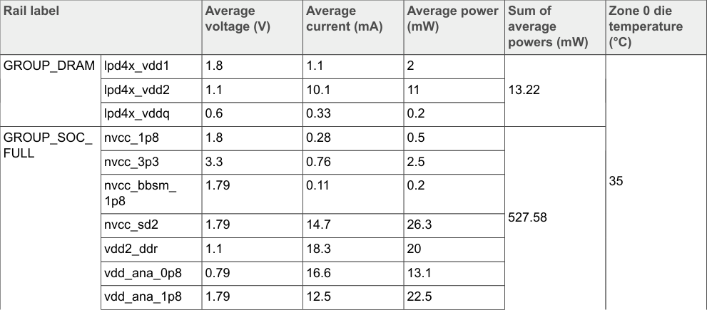

<!-- VERBATIM_TABLE_START -->


|Rail label|Col2|Average voltage (V)|Average current (mA)|Average power (mW)|Sum of average powers (mW)|Zone 0 die temperature (°C)|
|---|---|---|---|---|---|---|
|GROUP_DRAM|lpd4x_vdd1|1.8|1.1|2|13.22|35|
||lpd4x_vdd2|1.1|10.1|11|||
||lpd4x_vddq|0.6|0.33|0.2|||
|GROUP_SOC_ FULL|nvcc_1p8|1.8|0.28|0.5|527.58||
||nvcc_3p3|3.3|0.76|2.5|||
||nvcc_bbsm_ 1p8|1.79|0.11|0.2|||
||nvcc_sd2|1.79|14.7|26.3|||
||vdd2_ddr|1.1|18.3|20|||
||vdd_ana_0p8|0.79|16.6|13.1|||
||vdd_ana_1p8|1.79|12.5|22.5|||
<!-- VERBATIM_TABLE_END -->


<!-- VERBATIM_TABLE_START -->


|Rail label|Col2|Average voltage (V)|Average current (mA)|Average power (mW)|Sum of average powers (mW)|Zone 0 die temperature (°C)|
|---|---|---|---|---|---|---|
||vdd_soc|0.89|490|438|||
||vdd_usb_3p3|3.3|0.06|0.2|||
||vddq_ddr|0.6|7.4|4.4|||
<!-- VERBATIM_TABLE_END -->

### 6.6.4 DD_READ_SD

When the use case is running, the state of the system is as follows:

1. The CPU frequency is set to the maximum value of 1.7 GHz.
2. The DDR data rate is set to 3733 MT/s.
3. The CM33 is in reset hold, waiting for the reset signal release.
4. The maximum amount of data the kernel reads ahead for a single file is set to 512 kB.

To measure the power consumption of DD_READ_SD, the steps are as follows:

1. Boot the Linux image with imx93-11x11-evk.dtb.
2. Run setup.sh.
3. Make sure the file dd_obs_testfile exists and rename it to dd_ibs_testfile.
4. Copy dd_read.sh on the SD partition and run.
5. Measure the power and record the results.

Table 23 shows the measurement results when this use case applies to the i.MX 93 processor.

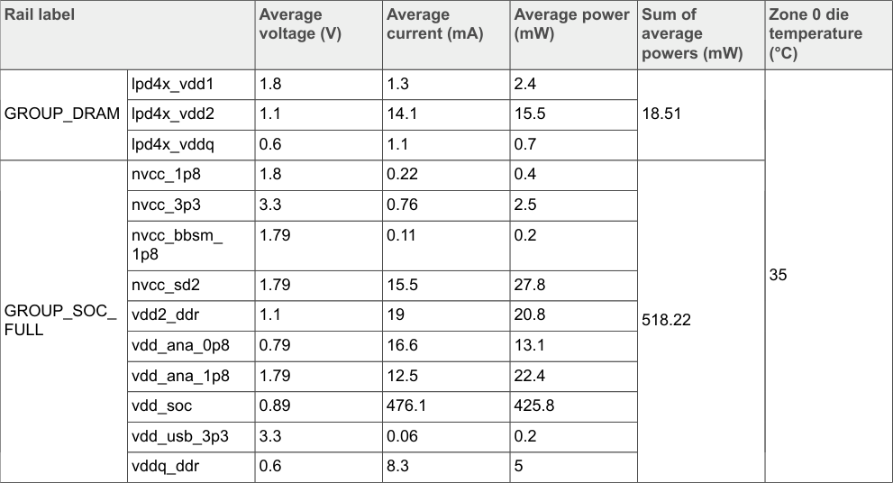

<!-- VERBATIM_TABLE_START -->


|Rail label|Col2|Average voltage (V)|Average current (mA)|Average power (mW)|Sum of average powers (mW)|Zone 0 die temperature (°C)|
|---|---|---|---|---|---|---|
|GROUP_DRAM|lpd4x_vdd1|1.8|1.3|2.4|18.51|35|
||lpd4x_vdd2|1.1|14.1|15.5|||
||lpd4x_vddq|0.6|1.1|0.7|||
|GROUP_SOC_ FULL|nvcc_1p8|1.8|0.22|0.4|518.22||
||nvcc_3p3|3.3|0.76|2.5|||
||nvcc_bbsm_ 1p8|1.79|0.11|0.2|||
||nvcc_sd2|1.79|15.5|27.8|||
||vdd2_ddr|1.1|19|20.8|||
||vdd_ana_0p8|0.79|16.6|13.1|||
||vdd_ana_1p8|1.79|12.5|22.4|||
||vdd_soc|0.89|476.1|425.8|||
||vdd_usb_3p3|3.3|0.06|0.2|||
||vddq_ddr|0.6|8.3|5|||
<!-- VERBATIM_TABLE_END -->

## 6.7 Low-power mode use cases

The following Low-power mode use case scenarios have been tested:

• System Idle with display in OD mode with DDRC auto clock gating
• System Idle with display in ND mode
• System Idle with display in LD mode (DDR to half speed)
• System Idle with display in LD mode (DDR to lowest speed with SWFFC)
• System Idle with display in OD mode without DDRC auto clock gating
• System Idle with display in ND mode without DDRC auto clock gating
• System Idle with display in LD mode without DDRC auto clock gating (DDR to half speed)
• System Idle with display in LD mode without DDRC auto clock gating (DDR to lowest speed with SWFFC)
• System in DSM
• Battery

### 6.7.1 System Idle with display in OD mode with DDRC auto clock gating

The state of the system, when the use case is running, is as follows:

1. The CPU default frequency is set to 1.7 GHz.
2. The DDR data rate is set to 3733 MT/s.
3. The CM33 is in reset hold, waiting for the reset signal release.

To measure the power consumption for the system Idle with display in OD mode with DDRC auto clock gating, the steps are as follows:

1. Connect the HDMI display to the board through the MIPI-to-HDMI converter card (IMX-MIPI-HDMI).
2. Boot the Linux image with imx93-11x11-evk.dtb.
3. Run setup_video.sh.
4. The default mode is the OD mode.
5. Measure the power and record the results.

Table 24 shows the measurement results when this use case is applied to the i.MX 93 processor.

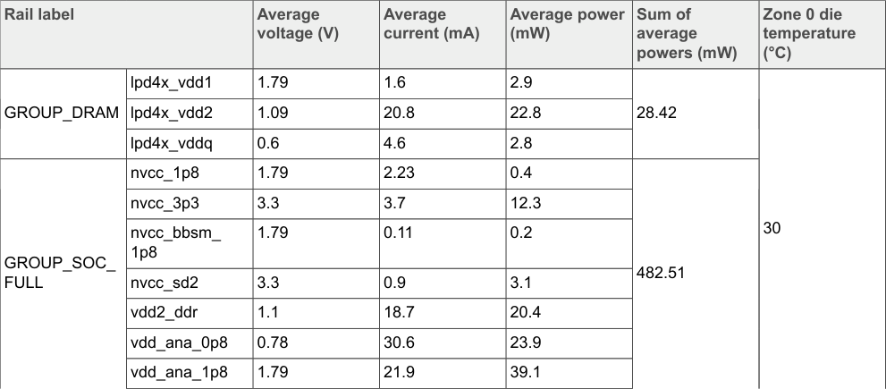

<!-- VERBATIM_TABLE_START -->


|clock_gating (average value)|Col2|Col3|Col4|Col5|Col6|Col7|
|---|---|---|---|---|---|---|
|Rail label||Average voltage (V)|Average current (mA)|Average power (mW)|Sum of average powers (mW)|Zone 0 die temperature (°C)|
|GROUP_DRAM|lpd4x_vdd1|1.79|1.6|2.9|28.42|30|
||lpd4x_vdd2|1.09|20.8|22.8|||
||lpd4x_vddq|0.6|4.6|2.8|||
|GROUP_SOC_ FULL|nvcc_1p8|1.79|2.23|0.4|482.51||
||nvcc_3p3|3.3|3.7|12.3|||
||nvcc_bbsm_ 1p8|1.79|0.11|0.2|||
||nvcc_sd2|3.3|0.9|3.1|||
||vdd2_ddr|1.1|18.7|20.4|||
||vdd_ana_0p8|0.78|30.6|23.9|||
||vdd_ana_1p8|1.79|21.9|39.1|||
<!-- VERBATIM_TABLE_END -->

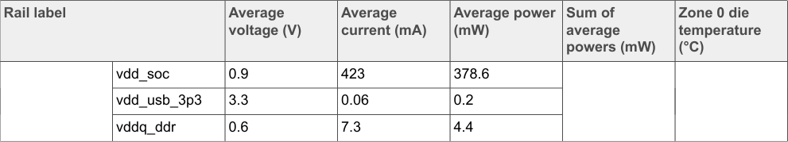

<!-- VERBATIM_TABLE_START -->


|Rail label|Col2|Average voltage (V)|Average current (mA)|Average power (mW)|Sum of average powers (mW)|Zone 0 die temperature (°C)|
|---|---|---|---|---|---|---|
||vdd_soc|0.9|423|378.6|||
||vdd_usb_3p3|3.3|0.06|0.2|||
||vddq_ddr|0.6|7.3|4.4|||
<!-- VERBATIM_TABLE_END -->

### 6.7.2 System Idle with display in ND mode

When the use case is running, the state of the system is as follows:

1. The CPU default frequency is set to 1.4 GHz.
2. The DDR data rate is set to 2800 MT/s.
3. The CM33 is in reset hold, waiting for the reset signal release.

To measure the power consumption for the system Idle with display on ND mode with DDRC auto clock gating, the steps are as follows:

1. Connect the HDMI display to the board through the MIPI-to-HDMI converter card (IMX-MIPI-HDMI).
2. Boot the Linux image with imx93-11x11-evk.dtb.
3. Run setup_video.sh.
4. To put the system into the ND mode, run the following command:

```bash
echo 1 > /sys/devices/platform/imx93-lpm/mode
```

5. Measure the power and record the results.

Table 25 shows the measurement results when this use case is applied to the i.MX 93 processor.

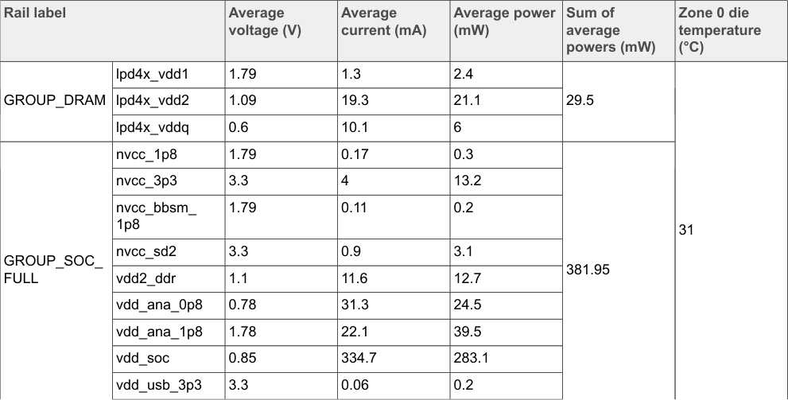

<!-- VERBATIM_TABLE_START -->


|clock_gating (average value)|Col2|Col3|Col4|Col5|Col6|Col7|
|---|---|---|---|---|---|---|
|Rail label||Average voltage (V)|Average current (mA)|Average power (mW)|Sum of average powers (mW)|Zone 0 die temperature (°C)|
|GROUP_DRAM|lpd4x_vdd1|1.79|1.3|2.4|29.5|31|
||lpd4x_vdd2|1.09|19.3|21.1|||
||lpd4x_vddq|0.6|10.1|6|||
|GROUP_SOC_ FULL|nvcc_1p8|1.79|0.17|0.3|381.95||
||nvcc_3p3|3.3|4|13.2|||
||nvcc_bbsm_ 1p8|1.79|0.11|0.2|||
||nvcc_sd2|3.3|0.9|3.1|||
||vdd2_ddr|1.1|11.6|12.7|||
||vdd_ana_0p8|0.78|31.3|24.5|||
||vdd_ana_1p8|1.78|22.1|39.5|||
||vdd_soc|0.85|334.7|283.1|||
||vdd_usb_3p3|3.3|0.06|0.2|||
<!-- VERBATIM_TABLE_END -->

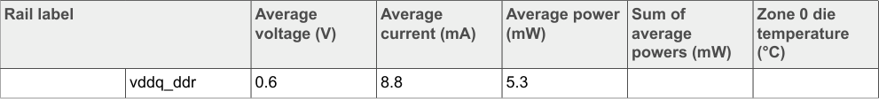

<!-- VERBATIM_TABLE_START -->


|Rail label|Col2|Average voltage (V)|Average current (mA)|Average power (mW)|Sum of average powers (mW)|Zone 0 die temperature (°C)|
|---|---|---|---|---|---|---|
||vddq_ddr|0.6|8.8|5.3|||
<!-- VERBATIM_TABLE_END -->

### 6.7.3 System Idle with display in LD mode (DDR to half speed)

When the use case is running, the state of the system is as follows:

1. The CPU default frequency is set to 0.9 GHz.
2. The DDR frequency is set to 1866 MT/s.
3. The CM33 is in reset hold, waiting for the reset signal release.

To measure the power consumption for the system Idle with display on LD mode with DDRC auto clock gating, DDR to half speed, the steps are as follows:

1. Connect the HDMI display to the board through the MIPI-to-HDMI converter card (IMX-MIPI-HDMI).
2. Boot the Linux image with imx93-11x11-evk-ld.dtb.
3. Run setup_video.sh.
4. To put the system into the LD mode (DDR to half speed), run the following command:

```bash
echo 2 > /sys/devices/platform/imx93-lpm/mode
```

5. Measure the power and record the results.

Table 26 shows the measurement results when this use case is applied to the i.MX 93 processor.

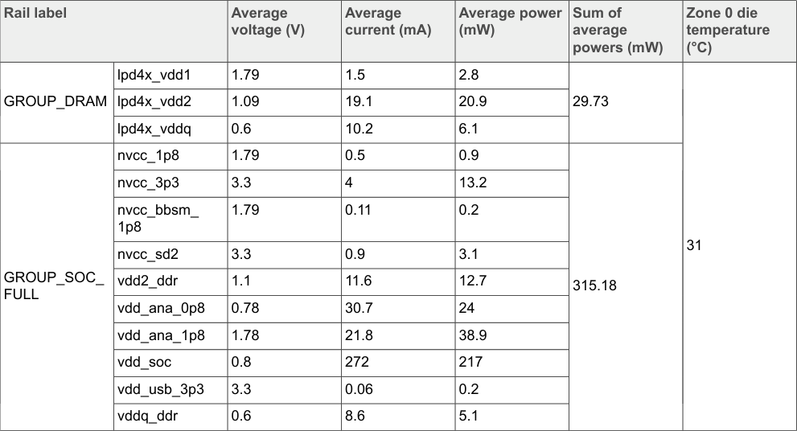

<!-- VERBATIM_TABLE_START -->


|(average value)|Col2|Col3|Col4|Col5|Col6|Col7|
|---|---|---|---|---|---|---|
|Rail label||Average voltage (V)|Average current (mA)|Average power (mW)|Sum of average powers (mW)|Zone 0 die temperature (°C)|
|GROUP_DRAM|lpd4x_vdd1|1.79|1.5|2.8|29.73|31|
||lpd4x_vdd2|1.09|19.1|20.9|||
||lpd4x_vddq|0.6|10.2|6.1|||
|GROUP_SOC_ FULL|nvcc_1p8|1.79|0.5|0.9|315.18||
||nvcc_3p3|3.3|4|13.2|||
||nvcc_bbsm_ 1p8|1.79|0.11|0.2|||
||nvcc_sd2|3.3|0.9|3.1|||
||vdd2_ddr|1.1|11.6|12.7|||
||vdd_ana_0p8|0.78|30.7|24|||
||vdd_ana_1p8|1.78|21.8|38.9|||
||vdd_soc|0.8|272|217|||
||vdd_usb_3p3|3.3|0.06|0.2|||
||vddq_ddr|0.6|8.6|5.1|||
<!-- VERBATIM_TABLE_END -->

### 6.7.4 System Idle with display in LD mode (DDR to lowest speed with SWFFC)

When the use case is running, the state of

---

## Verbatim tables

<!-- VERBATIM_TABLE_START -->


|Use cases category|Use cases|Total power (sum of average powers in GROUP_SOC_FULL) (mW)|
|---|---|---|
|Core benchmark use cases|Dhrystone|805.9|
||CoreMark|691.9|
|Memory use cases|memset|908.0|
||memcpy|913.9|
||Stream|1222.8|
|Audio/video playback use cases|Audio playback (gplay)|458.6|
||Audio low&amp;#45;bus playback (gplay)|255.4|
||Video playback local (gplay)|636.4|
||Video playback streaming (gplay)|664.6|
|Graphic use case|PXP|544.0|
|Machine learning use cases|eIQ benchmark|725.5|
||Machine vision|780.5|
|Storage use cases|DD_WRITE_eMMC|420.4|
||DD_READ_eMMC|644.9|
||DD_WRITE_SD|527.6|
||DD_READ_SD|518.2|
|Low&amp;#45;power mode use cases|System Idle with display in OD mode with DDRC auto clock gating|482.5|
||System Idle with display in ND mode|382.0|
||System Idle with display in LD mode (DDR to half speed)|315.2|
||System Idle with display in LD mode (DDR to lowest speed with SWFFC)|275.3|
||System Idle without display in OD mode with DDRC auto clock gating|345.6|
||System Idle without display in ND mode with DDRC auto clock gating|288.1|
||System Idle without display in LD mode with DDRC auto clock gating (DDR to half speed)|227.2|
||System Idle without display in LD mode with DDRC auto clock gating (DDR to lowest speed with SWFFC)|199.9|
||System in DSM|7.6|
||Battery|0.1|
|Stress test use cases|2 x A55 Dhrystone + PXP + M33 Core Mark + NPU|1230.5|
||2 x A55 Stream + PXP + M33 Core Mark + NPU|1264.1|
<!-- VERBATIM_TABLE_END -->

<!-- VERBATIM_TABLE_START -->


|Use cases category|Use cases|Total power (sum of average powers in GROUP_SOC_FULL) (mW)|
|---|---|---|
|Product use cases|Linux Suspend + M33 CoreMark (TCM)|128.2|
||Linux Suspend + M33 in WFI|122.4|
||Linux Suspend + M33 FlexCAN Transaction|132.3|
||Smart doorbell|772.1|
<!-- VERBATIM_TABLE_END -->

<!-- VERBATIM_TABLE_START -->


|Rail label|Col2|Average voltage (V)|Average current (mA)|Average power (mW)|Sum of average powers (mW)|Zone 0 die temperature (°C)|
|---|---|---|---|---|---|---|
|GROUP_DRAM|lpd4x_vdd1|1.8|0.6|1.1|6.72|40.35|
||lpd4x_vdd2|1.1|5.1|5.6|||
<!-- VERBATIM_TABLE_END -->

<!-- VERBATIM_TABLE_START -->


|Rail label|Col2|Average voltage (V)|Average current (mA)|Average power (mW)|Sum of average powers (mW)|Zone 0 die temperature (°C)|
|---|---|---|---|---|---|---|
||lpd4x_vddq|0.6|0|0|||
|GROUP_SOC_ FULL|nvcc_1p8|1.8|0.3|0.6|805.87||
||nvcc_3p3|3.3|3.6|12|||
||nvcc_bbsm_ 1p8|1.79|0.11|0.2|||
||nvcc_sd2|3.3|0.9|3.1|||
||vdd2_ddr|1.1|17.3|18.9|||
||vdd_ana_0p8|0.79|16.5|13|||
||vdd_ana_1p8|1.79|12.5|22.4|||
||vdd_soc|0.89|821.2|731.4|||
||vdd_usb_3p3|3.3|0.03|0.1|||
||vddq_ddr|0.6|6.8|4.1|||
<!-- VERBATIM_TABLE_END -->

<!-- VERBATIM_TABLE_START -->


|Rail label|Col2|Average voltage (V)|Average current (mA)|Average power (mW)|Sum of average powers (mW)|Zone 0 die temperature (°C)|
|---|---|---|---|---|---|---|
|GROUP_DRAM|lpd4x_vdd1|1.8|0.44|0.8|5.91|38|
<!-- VERBATIM_TABLE_END -->

<!-- VERBATIM_TABLE_START -->


|Rail label|Col2|Average voltage (V)|Average current (mA)|Average power (mW)|Sum of average powers (mW)|Zone 0 die temperature (°C)|
|---|---|---|---|---|---|---|
||lpd4x_vdd2|1.1|4.7|5.2|||
||lpd4x_vddq|0.6|0|0|||
|GROUP_SOC_ FULL|nvcc_1p8|1.8|0.56|1|691.85||
||nvcc_3p3|3.3|4.1|13.4|||
||nvcc_bbsm_ 1p8|1.79|0.11|0.2|||
||nvcc_sd2|3.3|0.9|3.1|||
||vdd2_ddr|1.1|17.5|19.2|||
||vdd_ana_0p8|0.79|16.5|13|||
||vdd_ana_1p8|1.79|12.5|22.4|||
||vdd_soc|0.89|689.8|615.5|||
||vdd_usb_3p3|3.3|0.03|0.1|||
||vddq_ddr|0.6|6.7|4|||
<!-- VERBATIM_TABLE_END -->

<!-- VERBATIM_TABLE_START -->


|Rail label|Col2|Average voltage (V)|Average current (mA)|Average power (mW)|Sum of average powers (mW)|Zone 0 die temperature (°C)|
|---|---|---|---|---|---|---|
|GROUP_DRAM|lpd4x_vdd1|1.8|3.4|6|71.77|41|
||lpd4x_vdd2|1.09|60.2|65.8|||
||lpd4x_vddq|0.6|0|0|||
|GROUP_SOC_ FULL|nvcc_1p8|1.8|0.28|0.5|907.97||
||nvcc_3p3|3.3|3.7|12.3|||
||nvcc_bbsm_ 1p8|1.79|0.11|0.2|||
||nvcc_sd2|3.3|0.9|3.1|||
||vdd2_ddr|1.09|44.4|48.5|||
||vdd_ana_0p8|0.79|16.6|13.1|||
||vdd_ana_1p8|1.79|12.5|22.4|||
||vdd_soc|0.89|863.2|768.6|||
||vdd_usb_3p3|3.3|0.06|0.2|||
||vddq_ddr|0.59|66.2|39.2|||
<!-- VERBATIM_TABLE_END -->

<!-- VERBATIM_TABLE_START -->


|Rail label|Col2|Average voltage (V)|Average current (mA)|Average power (mW)|Sum of average powers (mW)|Zone 0 die temperature (°C)|
|---|---|---|---|---|---|---|
|GROUP_DRAM|lpd4x_vdd1|1.79|3.7|6.7|89.93|41|
||lpd4x_vdd2|1.09|73.8|80.4|||
||lpd4x_vddq|0.6|4.8|2.8|||
|GROUP_SOC_ FULL|nvcc_1p8|1.8|0.17|0.3|913.93||
||nvcc_3p3|3.3|3.7|12.3|||
||nvcc_bbsm_ 1p8|1.79|0.11|0.2|||
||nvcc_sd2|3.3|0.9|3.1|||
||vdd2_ddr|1.09|41.1|45|||
||vdd_ana_0p8|0.79|16.6|13.1|||
||vdd_ana_1p8|1.79|12.4|22.3|||
||vdd_soc|0.89|905.7|805.8|||
||vdd_usb_3p3|3.3|0.06|0.2|||
||vddq_ddr|0.6|19.7|11.7|||
<!-- VERBATIM_TABLE_END -->

<!-- VERBATIM_TABLE_START -->


|Rail label|Col2|Average voltage (V)|Average current (mA)|Average power (mW)|Sum of average powers (mW)|Zone 0 die temperature (°C)|
|---|---|---|---|---|---|---|
|GROUP_DRAM|lpd4x_vdd1|1.79|4.9|8.8|109.65|45|
<!-- VERBATIM_TABLE_END -->

<!-- VERBATIM_TABLE_START -->


|Rail label|Col2|Average voltage (V)|Average current (mA)|Average power (mW)|Sum of average powers (mW)|Zone 0 die temperature (°C)|
|---|---|---|---|---|---|---|
||lpd4x_vdd2|1.09|87.1|94.9|||
||lpd4x_vddq|0.6|10|6|||
|GROUP_SOC_ FULL|nvcc_1p8|1.8|0.11|0.2|1222.81||
||nvcc_3p3|3.3|3.8|12.5|||
||nvcc_bbsm_ 1p8|1.79|0.11|0.2|||
||nvcc_sd2|3.3|0.9|3.1|||
||vdd2_ddr|1.09|50.7|55.5|||
||vdd_ana_0p8|0.79|16.8|13.2|||
||vdd_ana_1p8|1.79|12.4|22.3|||
||vdd_soc|0.89|1241.6|1100.4|||
||vdd_usb_3p3|3.3|0.03|0.1|||
||vddq_ddr|0.6|25.6|15.2|||
<!-- VERBATIM_TABLE_END -->

<!-- VERBATIM_TABLE_START -->


|Rail label|Col2|Average voltage (V)|Average current (mA)|Average power (mW)|Sum of average powers (mW)|Zone 0 die temperature (°C)|
|---|---|---|---|---|---|---|
|GROUP_DRAM|lpd4x_vdd1|1.8|1|1.8|11.76|34|
||lpd4x_vdd2|1.1|8.9|9.7|||
||lpd4x_vddq|0.6|0.5|0.3|||
|GROUP_SOC_ FULL|nvcc_1p8|1.8|0.17|0.3|458.63||
||nvcc_3p3|3.3|6.2|20.4|||
||nvcc_bbsm_ 1p8|1.79|0.11|0.2|||
||nvcc_sd2|3.3|0.9|3.1|||
||vdd2_ddr|1.1|17.8|19.5|||
||vdd_ana_0p8|0.79|20.2|15.9|||
||vdd_ana_1p8|1.79|13.7|24.5|||
||vdd_soc|0.89|414.1|370.5|||
||vdd_usb_3p3|3.3|0.06|0.2|||
||vddq_ddr|0.6|6.8|4.1|||
<!-- VERBATIM_TABLE_END -->

<!-- VERBATIM_TABLE_START -->


|Rail label|Col2|Average voltage (V)|Average current (mA)|Average power (mW)|Sum of average powers (mW)|Zone 0 die temperature (°C)|
|---|---|---|---|---|---|---|
|GROUP_DRAM|lpd4x_vdd1|1.8|1.3|2.4|12.25|30|
||lpd4x_vdd2|1.1|7.7|8.4|||
||lpd4x_vddq|0.6|2.5|1.5|||
|GROUP_SOC_ FULL|nvcc_1p8|1.8|0.22|0.4|255.39||
||nvcc_3p3|3.3|6.2|20.6|||
||nvcc_bbsm_ 1p8|1.79|0.11|0.2|||
||nvcc_sd2|3.3|0.9|3.1|||
||vdd2_ddr|1.1|4.7|5.1|||
||vdd_ana_0p8|0.79|20.2|15.9|||
||vdd_ana_1p8|1.79|9.9|17.7|||
||vdd_soc|0.8|235.1|187.6|||
||vdd_usb_3p3|3.3|0.06|0.2|||
||vddq_ddr|0.6|7.9|4.7|||
<!-- VERBATIM_TABLE_END -->

<!-- VERBATIM_TABLE_START -->


|Rail label|Col2|Average voltage (V)|Average current (mA)|Average power (mW)|Sum of average powers (mW)|Zone 0 die temperature (°C)|
|---|---|---|---|---|---|---|
|GROUP_DRAM|lpd4x_vdd1|1.79|2.9|5.2|56.85|37|
||lpd4x_vdd2|1.09|44.3|48.3|||
||lpd4x_vddq|0.6|5.7|3.4|||
|GROUP_SOC_ FULL|nvcc_1p8|1.79|0|0.7|636.4||
||nvcc_3p3|3.3|6.3|20.9|||
||nvcc_bbsm_ 1p8|1.79|0.11|0.2|||
||nvcc_sd2|3.3|0.9|3.1|||
||vdd2_ddr|1.09|25.4|27.8|||
||vdd_ana_0p8|0.78|34.4|26.8|||
||vdd_ana_1p8|1.78|23|41|||
||vdd_soc|0.89|569.7|508.7|||
||vdd_usb_3p3|3.3|0.06|0.2|||
||vddq_ddr|0.6|11.8|7|||
<!-- VERBATIM_TABLE_END -->

<!-- VERBATIM_TABLE_START -->


|Rail label|Col2|Average voltage (V)|Average current (mA)|Average power (mW)|Sum of average powers (mW)|Zone 0 die temperature (°C)|
|---|---|---|---|---|---|---|
|GROUP_DRAM|lpd4x_vdd1|1.79|2.9|5.1|56.81|38|
||lpd4x_vdd2|1.09|44.4|48.4|||
||lpd4x_vddq|0.6|5.6|3.3|||
|GROUP_SOC_ FULL|nvcc_1p8|1.79|6.5|11.6|664.63||
||nvcc_3p3|3.3|5.9|19.3|||
||nvcc_bbsm_ 1p8|1.79|0.11|0.2|||
||nvcc_sd2|3.3|0.9|3.1|||
||vdd2_ddr|1.09|24.9|27.3|||
||vdd_ana_0p8|0.78|34.7|27.1|||
||vdd_ana_1p8|1.78|23|41|||
||vdd_soc|0.89|591.2|527.8|||
||vdd_usb_3p3|3.3|0.03|0.1|||
||vddq_ddr|0.6|11.9|7.1|||
<!-- VERBATIM_TABLE_END -->

<!-- VERBATIM_TABLE_START -->


|Rail label|Col2|Average voltage (V)|Average current (mA)|Average power (mW)|Sum of average powers (mW)|Zone 0 die temperature (°C)|
|---|---|---|---|---|---|---|
|GROUP_DRAM|lpd4x_vdd1|1.79|2.9|5.2|55.25|36|
<!-- VERBATIM_TABLE_END -->

<!-- VERBATIM_TABLE_START -->


|Rail label|Col2|Average voltage (V)|Average current (mA)|Average power (mW)|Sum of average powers (mW)|Zone 0 die temperature (°C)|
|---|---|---|---|---|---|---|
||lpd4x_vdd2|1.09|43.2|47.1|||
||lpd4x_vddq|0.6|4.9|2.9|||
|GROUP_SOC_ FULL|nvcc_1p8|1.79|0.56|1|543.98||
||nvcc_3p3|3.3|4.1|13.4|||
||nvcc_bbsm_ 1p8|1.79|0.11|0.2|||
||nvcc_sd2|3.3|0.9|3.1|||
||vdd2_ddr|1.09|26|28.5|||
||vdd_ana_0p8|0.78|29.7|23.2|||
||vdd_ana_1p8|1.78|21.8|38.9|||
||vdd_soc|0.89|478.3|427.7|||
||vdd_usb_3p3|3.3|0.06|0.2|||
||vddq_ddr|0.6|13|7.7|||
<!-- VERBATIM_TABLE_END -->

<!-- VERBATIM_TABLE_START -->


|Rail label|Col2|Average voltage (V)|Average current (mA)|Average power (mW)|Sum of average powers (mW)|Zone 0 die temperature (°C)|
|---|---|---|---|---|---|---|
|GROUP_DRAM|lpd4x_vdd1|1.79|2.1|3.7|32.61|38|
||lpd4x_vdd2|1.09|24.8|27.2|||
||lpd4x_vddq|0.6|2.9|1.7|||
|GROUP_SOC_ FULL|nvcc_1p8|1.79|0.44|0.8|771.2||
||nvcc_3p3|3.3|4.1|13.6|||
||nvcc_bbsm_ 1p8|1.79|0.11|0.2|||
||nvcc_sd2|3.3|0.9|3.1|||
||vdd2_ddr|1.09|21.9|23.9|||
||vdd_ana_0p8|0.78|16.5|13.1|||
||vdd_ana_1p8|1.78|12.5|22.4|||
||vdd_soc|0.89|772.5|688.4|||
||vdd_usb_3p3|3.3|0.06|0.2|||
||vddq_ddr|1.8|9.4|5.6|||
<!-- VERBATIM_TABLE_END -->

<!-- VERBATIM_TABLE_START -->


|Rail label|Col2|Average voltage (V)|Average current (mA)|Average power (mW)|Sum of average powers (mW)|Zone 0 die temperature (°C)|
|---|---|---|---|---|---|---|
|GROUP_DRAM|lpd4x_vdd1|1.79|4.1|7.4|84.29|40|
||lpd4x_vdd2|1.09|66.1|72|||
||lpd4x_vddq|0.6|8.2|4.9|||
|GROUP_SOC_ FULL|nvcc_1p8|1.79|0.17|0.3|780.47||
||nvcc_3p3|3.3|3.5|11.5|||
||nvcc_bbsm_ 1p8|1.79|0.11|0.2|||
||nvcc_sd2|3.3|0.9|3.1|||
||vdd2_ddr|1.09|30.5|33.4|||
||vdd_ana_0p8|0.78|35|27.3|||
||vdd_ana_1p8|1.78|24.6|43.9|||
||vdd_soc|0.89|730.6|651.4|||
||vdd_usb_3p3|3.3|0.03|0.1|||
||vddq_ddr|0.6|15.5|9.3|||
<!-- VERBATIM_TABLE_END -->

<!-- VERBATIM_TABLE_START -->


|Rail label|Col2|Average voltage (V)|Average current (mA)|Average power (mW)|Sum of average powers (mW)|Zone 0 die temperature (°C)|
|---|---|---|---|---|---|---|
|GROUP_DRAM|lpd4x_vdd1|1.79|0.67|1.2|8.62|34|
||lpd4x_vdd2|1.1|6.8|7.4|||
||lpd4x_vddq|0.6|0.17|0.1|||
|GROUP_SOC_ FULL|nvcc_1p8|1.79|7.4|13.3|420.43||
||nvcc_3p3|3.3|4|13.4|||
||nvcc_bbsm_ 1p8|1.79|0.11|0.2|||
||nvcc_sd2|3.3|0.9|3.1|||
||vdd2_ddr|1.1|17.9|19.6|||
||vdd_ana_0p8|0.79|16.4|12.9|||
||vdd_ana_1p8|1.79|12.5|22.4|||
||vdd_soc|0.9|370.1|331.2|||
||vdd_usb_3p3|3.3|0.06|0.2|||
||vddq_ddr|0.6|7|4.2|||
<!-- VERBATIM_TABLE_END -->

<!-- VERBATIM_TABLE_START -->


|Rail label|Col2|Average voltage (V)|Average current (mA)|Average power (mW)|Sum of average powers (mW)|Zone 0 die temperature (°C)|
|---|---|---|---|---|---|---|
|GROUP_DRAM|lpd4x_vdd1|1.79|2.5|4.4|39.63|37|
||lpd4x_vdd2|1.09|30.4|33.3|||
||lpd4x_vddq|0.6|3.3|2|||
|GROUP_SOC_ FULL|nvcc_1p8|1.79|7.7|13.7|644.85||
||nvcc_3p3|3.3|4|13.1|||
<!-- VERBATIM_TABLE_END -->

<!-- VERBATIM_TABLE_START -->


|Rail label|Col2|Average voltage (V)|Average current (mA)|Average power (mW)|Sum of average powers (mW)|Zone 0 die temperature (°C)|
|---|---|---|---|---|---|---|
||nvcc_bbsm_ 1p8|1.79|0.11|0.2|||
||nvcc_sd2|3.3|0.9|3.1|||
||vdd2_ddr|1.09|23.6|25.9|||
||vdd_ana_0p8|0.79|16.7|13.1|||
||vdd_ana_1p8|1.79|12.5|22.3|||
||vdd_soc|0.89|612.1|546.3|||
||vdd_usb_3p3|3.3|0.06|0.2|||
||vddq_ddr|0.6|11.7|7|||
<!-- VERBATIM_TABLE_END -->

<!-- VERBATIM_TABLE_START -->


|Rail label|Col2|Average voltage (V)|Average current (mA)|Average power (mW)|Sum of average powers (mW)|Zone 0 die temperature (°C)|
|---|---|---|---|---|---|---|
|GROUP_DRAM|lpd4x_vdd1|1.8|1.1|2|13.22|35|
||lpd4x_vdd2|1.1|10.1|11|||
||lpd4x_vddq|0.6|0.33|0.2|||
|GROUP_SOC_ FULL|nvcc_1p8|1.8|0.28|0.5|527.58||
||nvcc_3p3|3.3|0.76|2.5|||
||nvcc_bbsm_ 1p8|1.79|0.11|0.2|||
||nvcc_sd2|1.79|14.7|26.3|||
||vdd2_ddr|1.1|18.3|20|||
||vdd_ana_0p8|0.79|16.6|13.1|||
||vdd_ana_1p8|1.79|12.5|22.5|||
<!-- VERBATIM_TABLE_END -->

<!-- VERBATIM_TABLE_START -->


|Rail label|Col2|Average voltage (V)|Average current (mA)|Average power (mW)|Sum of average powers (mW)|Zone 0 die temperature (°C)|
|---|---|---|---|---|---|---|
||vdd_soc|0.89|490|438|||
||vdd_usb_3p3|3.3|0.06|0.2|||
||vddq_ddr|0.6|7.4|4.4|||
<!-- VERBATIM_TABLE_END -->

<!-- VERBATIM_TABLE_START -->


|Rail label|Col2|Average voltage (V)|Average current (mA)|Average power (mW)|Sum of average powers (mW)|Zone 0 die temperature (°C)|
|---|---|---|---|---|---|---|
|GROUP_DRAM|lpd4x_vdd1|1.8|1.3|2.4|18.51|35|
||lpd4x_vdd2|1.1|14.1|15.5|||
||lpd4x_vddq|0.6|1.1|0.7|||
|GROUP_SOC_ FULL|nvcc_1p8|1.8|0.22|0.4|518.22||
||nvcc_3p3|3.3|0.76|2.5|||
||nvcc_bbsm_ 1p8|1.79|0.11|0.2|||
||nvcc_sd2|1.79|15.5|27.8|||
||vdd2_ddr|1.1|19|20.8|||
||vdd_ana_0p8|0.79|16.6|13.1|||
||vdd_ana_1p8|1.79|12.5|22.4|||
||vdd_soc|0.89|476.1|425.8|||
||vdd_usb_3p3|3.3|0.06|0.2|||
||vddq_ddr|0.6|8.3|5|||
<!-- VERBATIM_TABLE_END -->

<!-- VERBATIM_TABLE_START -->


|clock_gating (average value)|Col2|Col3|Col4|Col5|Col6|Col7|
|---|---|---|---|---|---|---|
|Rail label||Average voltage (V)|Average current (mA)|Average power (mW)|Sum of average powers (mW)|Zone 0 die temperature (°C)|
|GROUP_DRAM|lpd4x_vdd1|1.79|1.6|2.9|28.42|30|
||lpd4x_vdd2|1.09|20.8|22.8|||
||lpd4x_vddq|0.6|4.6|2.8|||
|GROUP_SOC_ FULL|nvcc_1p8|1.79|2.23|0.4|482.51||
||nvcc_3p3|3.3|3.7|12.3|||
||nvcc_bbsm_ 1p8|1.79|0.11|0.2|||
||nvcc_sd2|3.3|0.9|3.1|||
||vdd2_ddr|1.1|18.7|20.4|||
||vdd_ana_0p8|0.78|30.6|23.9|||
||vdd_ana_1p8|1.79|21.9|39.1|||
<!-- VERBATIM_TABLE_END -->

<!-- VERBATIM_TABLE_START -->


|Rail label|Col2|Average voltage (V)|Average current (mA)|Average power (mW)|Sum of average powers (mW)|Zone 0 die temperature (°C)|
|---|---|---|---|---|---|---|
||vdd_soc|0.9|423|378.6|||
||vdd_usb_3p3|3.3|0.06|0.2|||
||vddq_ddr|0.6|7.3|4.4|||
<!-- VERBATIM_TABLE_END -->

<!-- VERBATIM_TABLE_START -->


|clock_gating (average value)|Col2|Col3|Col4|Col5|Col6|Col7|
|---|---|---|---|---|---|---|
|Rail label||Average voltage (V)|Average current (mA)|Average power (mW)|Sum of average powers (mW)|Zone 0 die temperature (°C)|
|GROUP_DRAM|lpd4x_vdd1|1.79|1.3|2.4|29.5|31|
||lpd4x_vdd2|1.09|19.3|21.1|||
||lpd4x_vddq|0.6|10.1|6|||
|GROUP_SOC_ FULL|nvcc_1p8|1.79|0.17|0.3|381.95||
||nvcc_3p3|3.3|4|13.2|||
||nvcc_bbsm_ 1p8|1.79|0.11|0.2|||
||nvcc_sd2|3.3|0.9|3.1|||
||vdd2_ddr|1.1|11.6|12.7|||
||vdd_ana_0p8|0.78|31.3|24.5|||
||vdd_ana_1p8|1.78|22.1|39.5|||
||vdd_soc|0.85|334.7|283.1|||
||vdd_usb_3p3|3.3|0.06|0.2|||
<!-- VERBATIM_TABLE_END -->

<!-- VERBATIM_TABLE_START -->


|Rail label|Col2|Average voltage (V)|Average current (mA)|Average power (mW)|Sum of average powers (mW)|Zone 0 die temperature (°C)|
|---|---|---|---|---|---|---|
||vddq_ddr|0.6|8.8|5.3|||
<!-- VERBATIM_TABLE_END -->

<!-- VERBATIM_TABLE_START -->


|(average value)|Col2|Col3|Col4|Col5|Col6|Col7|
|---|---|---|---|---|---|---|
|Rail label||Average voltage (V)|Average current (mA)|Average power (mW)|Sum of average powers (mW)|Zone 0 die temperature (°C)|
|GROUP_DRAM|lpd4x_vdd1|1.79|1.5|2.8|29.73|31|
||lpd4x_vdd2|1.09|19.1|20.9|||
||lpd4x_vddq|0.6|10.2|6.1|||
|GROUP_SOC_ FULL|nvcc_1p8|1.79|0.5|0.9|315.18||
||nvcc_3p3|3.3|4|13.2|||
||nvcc_bbsm_ 1p8|1.79|0.11|0.2|||
||nvcc_sd2|3.3|0.9|3.1|||
||vdd2_ddr|1.1|11.6|12.7|||
||vdd_ana_0p8|0.78|30.7|24|||
||vdd_ana_1p8|1.78|21.8|38.9|||
||vdd_soc|0.8|272|217|||
||vdd_usb_3p3|3.3|0.06|0.2|||
||vddq_ddr|0.6|8.6|5.1|||
<!-- VERBATIM_TABLE_END -->

<!-- VERBATIM_TABLE_START -->
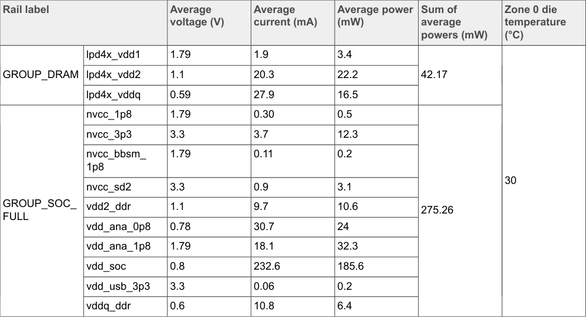

|DDR_SWFFC (average value)|Col2|Col3|Col4|Col5|Col6|Col7|
|---|---|---|---|---|---|---|
|Rail label||Average voltage (V)|Average current (mA)|Average power (mW)|Sum of average powers (mW)|Zone 0 die temperature (°C)|
|GROUP_DRAM|lpd4x_vdd1|1.79|1.9|3.4|42.17|30|
||lpd4x_vdd2|1.1|20.3|22.2|||
||lpd4x_vddq|0.59|27.9|16.5|||
|GROUP_SOC_ FULL|nvcc_1p8|1.79|0.30|0.5|275.26||
||nvcc_3p3|3.3|3.7|12.3|||
||nvcc_bbsm_ 1p8|1.79|0.11|0.2|||
||nvcc_sd2|3.3|0.9|3.1|||
||vdd2_ddr|1.1|9.7|10.6|||
||vdd_ana_0p8|0.78|30.7|24|||
||vdd_ana_1p8|1.79|18.1|32.3|||
||vdd_soc|0.8|232.6|185.6|||
||vdd_usb_3p3|3.3|0.06|0.2|||
||vddq_ddr|0.6|10.8|6.4|||
<!-- VERBATIM_TABLE_END -->

<!-- VERBATIM_TABLE_START -->
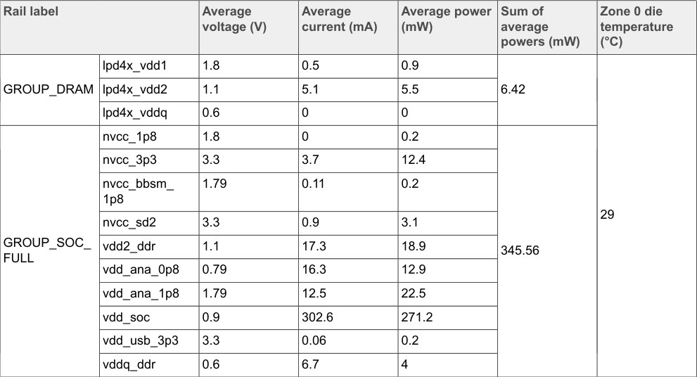

|clock_gating (average value)|Col2|Col3|Col4|Col5|Col6|Col7|
|---|---|---|---|---|---|---|
|Rail label||Average voltage (V)|Average current (mA)|Average power (mW)|Sum of average powers (mW)|Zone 0 die temperature (°C)|
|GROUP_DRAM|lpd4x_vdd1|1.8|0.5|0.9|6.42|29|
||lpd4x_vdd2|1.1|5.1|5.5|||
||lpd4x_vddq|0.6|0|0|||
|GROUP_SOC_ FULL|nvcc_1p8|1.8|0|0.2|345.56||
||nvcc_3p3|3.3|3.7|12.4|||
||nvcc_bbsm_ 1p8|1.79|0.11|0.2|||
||nvcc_sd2|3.3|0.9|3.1|||
||vdd2_ddr|1.1|17.3|18.9|||
||vdd_ana_0p8|0.79|16.3|12.9|||
||vdd_ana_1p8|1.79|12.5|22.5|||
||vdd_soc|0.9|302.6|271.2|||
||vdd_usb_3p3|3.3|0.06|0.2|||
||vddq_ddr|0.6|6.7|4|||
<!-- VERBATIM_TABLE_END -->

<!-- VERBATIM_TABLE_START -->


|clock_gating (average value)|Col2|Col3|Col4|Col5|Col6|Col7|
|---|---|---|---|---|---|---|
|Rail label||Average voltage (V)|Average current (mA)|Average power (mW)|Sum of average powers (mW)|Zone 0 die temperature (°C)|
|GROUP_DRAM|lpd4x_vdd1|1.8|0.39|0.7|5.72|29|
||lpd4x_vdd2|1.1|4.5|5|||
||lpd4x_vddq|0.6|0.17|0.1|||
|GROUP_SOC_ FULL|nvcc_1p8|1.8|0|0.3|288.11||
||nvcc_3p3|3.3|3.8|12.5|||
||nvcc_bbsm_ 1p8|1.79|0.11|0.2|||
||nvcc_sd2|3.3|0.9|3.1|||
||vdd2_ddr|1.1|8.7|9.6|||
||vdd_ana_0p8|0.79|17|13.4|||
||vdd_ana_1p8|1.79|12.7|22.8|||
||vdd_soc|0.85|261.8|221.6|||
||vdd_usb_3p3|3.3|0.06|0.2|||
||vddq_ddr|0.6|7.5|4.5|||
<!-- VERBATIM_TABLE_END -->

<!-- VERBATIM_TABLE_START -->
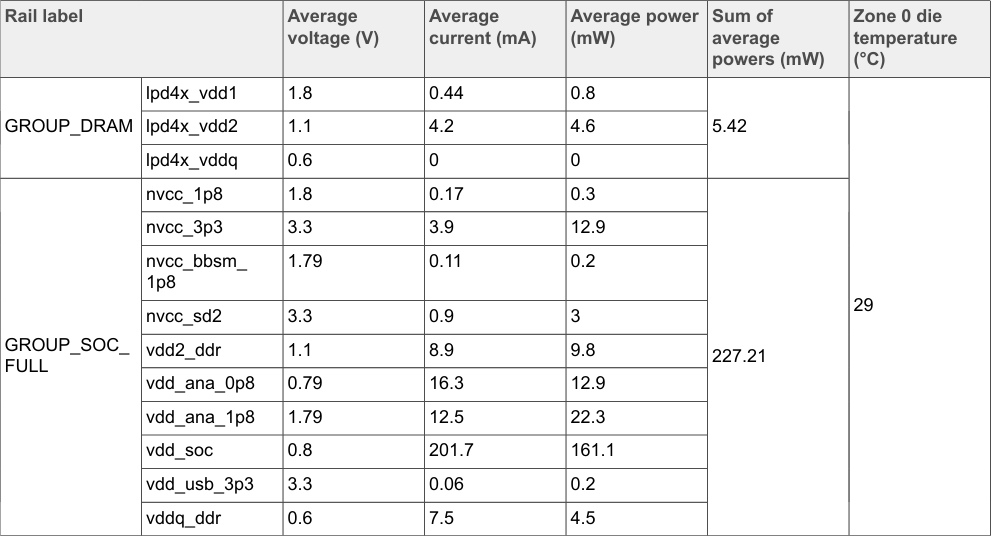

|Rail label|Col2|Average voltage (V)|Average current (mA)|Average power (mW)|Sum of average powers (mW)|Zone 0 die temperature (°C)|
|---|---|---|---|---|---|---|
|GROUP_DRAM|lpd4x_vdd1|1.8|0.44|0.8|5.42|29|
||lpd4x_vdd2|1.1|4.2|4.6|||
||lpd4x_vddq|0.6|0|0|||
|GROUP_SOC_ FULL|nvcc_1p8|1.8|0.17|0.3|227.21||
||nvcc_3p3|3.3|3.9|12.9|||
||nvcc_bbsm_ 1p8|1.79|0.11|0.2|||
||nvcc_sd2|3.3|0.9|3|||
||vdd2_ddr|1.1|8.9|9.8|||
||vdd_ana_0p8|0.79|16.3|12.9|||
||vdd_ana_1p8|1.79|12.5|22.3|||
||vdd_soc|0.8|201.7|161.1|||
||vdd_usb_3p3|3.3|0.06|0.2|||
||vddq_ddr|0.6|7.5|4.5|||
<!-- VERBATIM_TABLE_END -->

<!-- VERBATIM_TABLE_START -->
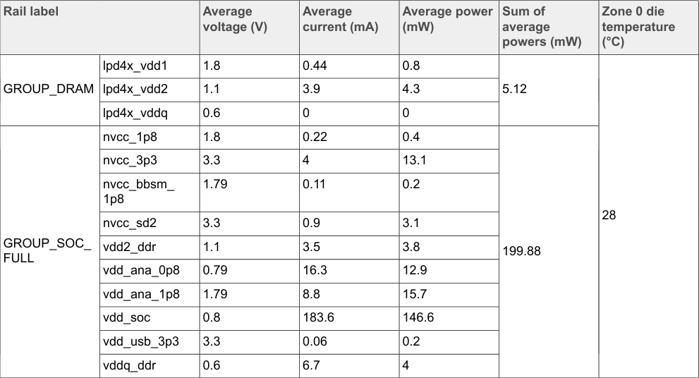

|Rail label|Col2|Average voltage (V)|Average current (mA)|Average power (mW)|Sum of average powers (mW)|Zone 0 die temperature (°C)|
|---|---|---|---|---|---|---|
|GROUP_DRAM|lpd4x_vdd1|1.8|0.44|0.8|5.12|28|
||lpd4x_vdd2|1.1|3.9|4.3|||
||lpd4x_vddq|0.6|0|0|||
|GROUP_SOC_ FULL|nvcc_1p8|1.8|0.22|0.4|199.88||
||nvcc_3p3|3.3|4|13.1|||
||nvcc_bbsm_ 1p8|1.79|0.11|0.2|||
||nvcc_sd2|3.3|0.9|3.1|||
||vdd2_ddr|1.1|3.5|3.8|||
||vdd_ana_0p8|0.79|16.3|12.9|||
||vdd_ana_1p8|1.79|8.8|15.7|||
||vdd_soc|0.8|183.6|146.6|||
||vdd_usb_3p3|3.3|0.06|0.2|||
||vddq_ddr|0.6|6.7|4|||
<!-- VERBATIM_TABLE_END -->

<!-- VERBATIM_TABLE_START -->
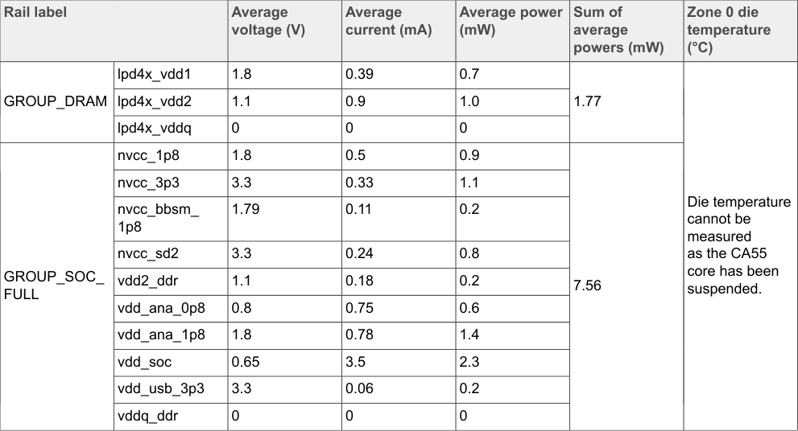

|Rail label|Col2|Average voltage (V)|Average current (mA)|Average power (mW)|Sum of average powers (mW)|Zone 0 die temperature (°C)|
|---|---|---|---|---|---|---|
|GROUP_DRAM|lpd4x_vdd1|1.8|0.39|0.7|1.77|Die temperature cannot be measured as the CA55 core has been suspended.|
||lpd4x_vdd2|1.1|0.9|1.0|||
||lpd4x_vddq|0|0|0|||
|GROUP_SOC_ FULL|nvcc_1p8|1.8|0.5|0.9|7.56||
||nvcc_3p3|3.3|0.33|1.1|||
||nvcc_bbsm_ 1p8|1.79|0.11|0.2|||
||nvcc_sd2|3.3|0.24|0.8|||
||vdd2_ddr|1.1|0.18|0.2|||
||vdd_ana_0p8|0.8|0.75|0.6|||
||vdd_ana_1p8|1.8|0.78|1.4|||
||vdd_soc|0.65|3.5|2.3|||
||vdd_usb_3p3|3.3|0.06|0.2|||
||vddq_ddr|0|0|0|||
<!-- VERBATIM_TABLE_END -->

<!-- VERBATIM_TABLE_START -->
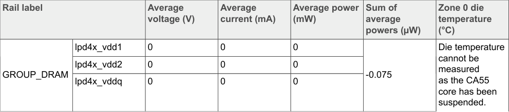

|Rail label|Col2|Average voltage (V)|Average current (mA)|Average power (mW)|Sum of average powers (µW)|Zone 0 die temperature (°C)|
|---|---|---|---|---|---|---|
|GROUP_DRAM|lpd4x_vdd1|0|0|0|&amp;#45;0.075|Die temperature cannot be measured as the CA55 core has been suspended.|
||lpd4x_vdd2|0|0|0|||
||lpd4x_vddq|0|0|0|||
<!-- VERBATIM_TABLE_END -->

<!-- VERBATIM_TABLE_START -->
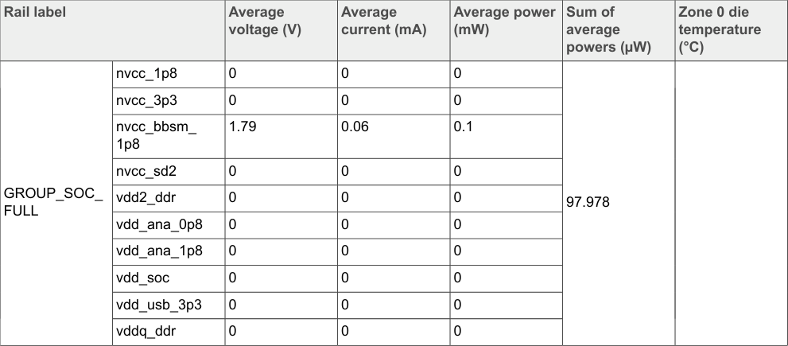

|Rail label|Col2|Average voltage (V)|Average current (mA)|Average power (mW)|Sum of average powers (µW)|Zone 0 die temperature (°C)|
|---|---|---|---|---|---|---|
|GROUP_SOC_ FULL|nvcc_1p8|0|0|0|97.978||
||nvcc_3p3|0|0|0|||
||nvcc_bbsm_ 1p8|1.79|0.06|0.1|||
||nvcc_sd2|0|0|0|||
||vdd2_ddr|0|0|0|||
||vdd_ana_0p8|0|0|0|||
||vdd_ana_1p8|0|0|0|||
||vdd_soc|0|0|0|||
||vdd_usb_3p3|0|0|0|||
||vddq_ddr|0|0|0|||
<!-- VERBATIM_TABLE_END -->

<!-- VERBATIM_TABLE_START -->
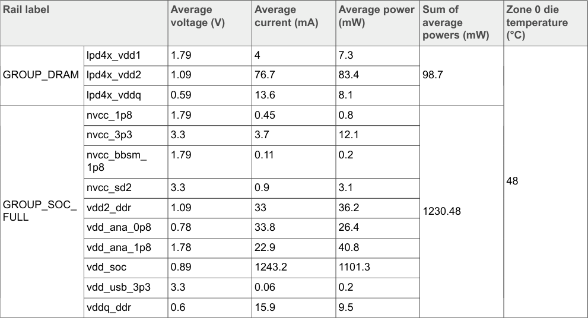

|value)|Col2|Col3|Col4|Col5|Col6|Col7|
|---|---|---|---|---|---|---|
|Rail label||Average voltage (V)|Average current (mA)|Average power (mW)|Sum of average powers (mW)|Zone 0 die temperature (°C)|
|GROUP_DRAM|lpd4x_vdd1|1.79|4|7.3|98.7|48|
||lpd4x_vdd2|1.09|76.7|83.4|||
||lpd4x_vddq|0.59|13.6|8.1|||
|GROUP_SOC_ FULL|nvcc_1p8|1.79|0.45|0.8|1230.48||
||nvcc_3p3|3.3|3.7|12.1|||
||nvcc_bbsm_ 1p8|1.79|0.11|0.2|||
||nvcc_sd2|3.3|0.9|3.1|||
||vdd2_ddr|1.09|33|36.2|||
||vdd_ana_0p8|0.78|33.8|26.4|||
||vdd_ana_1p8|1.78|22.9|40.8|||
||vdd_soc|0.89|1243.2|1101.3|||
||vdd_usb_3p3|3.3|0.06|0.2|||
||vddq_ddr|0.6|15.9|9.5|||
<!-- VERBATIM_TABLE_END -->

<!-- VERBATIM_TABLE_START -->


|value)|Col2|Col3|Col4|Col5|Col6|Col7|
|---|---|---|---|---|---|---|
|Rail label||Average voltage (V)|Average current (mA)|Average power (mW)|Sum of average powers (mW)|Zone 0 die temperature (°C)|
|GROUP_DRAM|lpd4x_vdd1|1.79|7.1|12.6|158.25|48|
||lpd4x_vdd2|1.08|122.5|132.9|||
||lpd4x_vddq|0.59|21.6|12.7|||
|GROUP_SOC_ FULL|nvcc_1p8|1.79|0.22|0.4|1264.123||
||nvcc_3p3|3.3|3.8|12.6|||
||nvcc_bbsm_ 1p8|1.79|0.11|0.2|||
||nvcc_sd2|3.3|0.9|3.1|||
||vdd2_ddr|1.09|47.6|52|||
||vdd_ana_0p8|0.78|34|26.5|||
||vdd_ana_1p8|1.78|22.8|40.7|||
||vdd_soc|0.89|1256.9|1113.1|||
||vdd_usb_3p3|3.3|0.06|0.2|||
||vddq_ddr|0.6|25.7|15.3|||
<!-- VERBATIM_TABLE_END -->

<!-- VERBATIM_TABLE_START -->
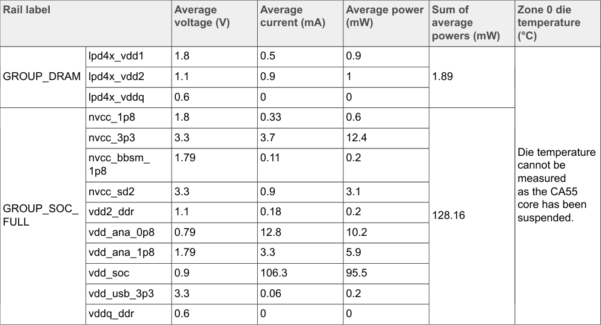

|Rail label|Col2|Average voltage (V)|Average current (mA)|Average power (mW)|Sum of average powers (mW)|Zone 0 die temperature (°C)|
|---|---|---|---|---|---|---|
|GROUP_DRAM|lpd4x_vdd1|1.8|0.5|0.9|1.89|Die temperature cannot be measured as the CA55 core has been suspended.|
||lpd4x_vdd2|1.1|0.9|1|||
||lpd4x_vddq|0.6|0|0|||
|GROUP_SOC_ FULL|nvcc_1p8|1.8|0.33|0.6|128.16||
||nvcc_3p3|3.3|3.7|12.4|||
||nvcc_bbsm_ 1p8|1.79|0.11|0.2|||
||nvcc_sd2|3.3|0.9|3.1|||
||vdd2_ddr|1.1|0.18|0.2|||
||vdd_ana_0p8|0.79|12.8|10.2|||
||vdd_ana_1p8|1.79|3.3|5.9|||
||vdd_soc|0.9|106.3|95.5|||
||vdd_usb_3p3|3.3|0.06|0.2|||
||vddq_ddr|0.6|0|0|||
<!-- VERBATIM_TABLE_END -->

<!-- VERBATIM_TABLE_START -->


|Rail label|Col2|Average voltage (V)|Average current (mA)|Average power (mW)|Sum of average powers (mW)|Zone 0 die temperature (°C)|
|---|---|---|---|---|---|---|
|GROUP_DRAM|lpd4x_vdd1|1.8|0.44|0.8|1.84|Die temperature cannot be measured as the CA55 core has been suspended.|
||lpd4x_vdd2|1.1|1|1.1|||
||lpd4x_vddq|0.6|0|0|||
|GROUP_SOC_ FULL|nvcc_1p8|1.8|0.28|0.5|122.41||
||nvcc_3p3|3.3|3.7|12.2|||
||nvcc_bbsm_ 1p8|1.79|0.11|0.2|||
||nvcc_sd2|3.3|0.9|3.1|||
||vdd2_ddr|1.1|0.09|0.1|||
||vdd_ana_0p8|0.79|12.8|10.2|||
||vdd_ana_1p8|1.79|6.14|11.01|||
||vdd_soc|0.9|100.3|90.1|||
||vdd_usb_3p3|3.3|0.06|0.2|||
||vddq_ddr|0.6|0|0|||
<!-- VERBATIM_TABLE_END -->

<!-- VERBATIM_TABLE_START -->
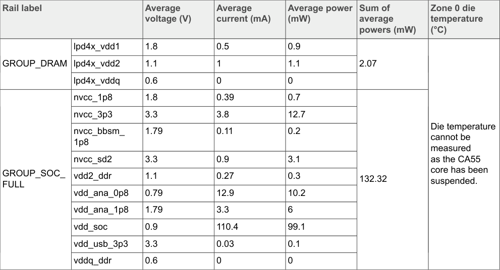

|Rail label|Col2|Average voltage (V)|Average current (mA)|Average power (mW)|Sum of average powers (mW)|Zone 0 die temperature (°C)|
|---|---|---|---|---|---|---|
|GROUP_DRAM|lpd4x_vdd1|1.8|0.5|0.9|2.07|Die temperature cannot be measured as the CA55 core has been suspended.|
||lpd4x_vdd2|1.1|1|1.1|||
||lpd4x_vddq|0.6|0|0|||
|GROUP_SOC_ FULL|nvcc_1p8|1.8|0.39|0.7|132.32||
||nvcc_3p3|3.3|3.8|12.7|||
||nvcc_bbsm_ 1p8|1.79|0.11|0.2|||
||nvcc_sd2|3.3|0.9|3.1|||
||vdd2_ddr|1.1|0.27|0.3|||
||vdd_ana_0p8|0.79|12.9|10.2|||
||vdd_ana_1p8|1.79|3.3|6|||
||vdd_soc|0.9|110.4|99.1|||
||vdd_usb_3p3|3.3|0.03|0.1|||
||vddq_ddr|0.6|0|0|||
<!-- VERBATIM_TABLE_END -->
