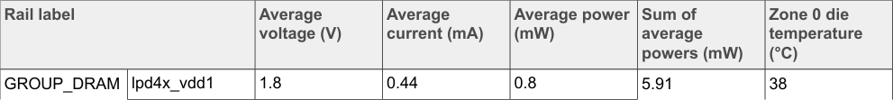

# 6.1.2  CoreMark

CoreMark is a modern, sophisticated benchmark that lets you accurately measure the processor performance and is intended to replace the older Dhrystone benchmark. Arm recommends using CoreMark over Dhrystone.

When the use case is running, the state of the system is as follows:

1. The CPU frequency is set to the maximum value of 1.7 GHz.
2. The DDR data rate is set to 3733 MT/s.
3. The display is OFF.
4. The CM33 is in reset hold, waiting for the reset signal release.

To measure the power consumption of CoreMark, the steps are as follows:

1. Boot the Linux image with imx93-11x11-evk.dtb.
2. Run setup.sh, see Section 8.
3. Run coremark_loop.sh:

```bash
while true; do
  ./coremark > /dev/null 2>&1
done
```

**Note:** For the best performance, compile as follows:

```bash
make XCFLAGS="-DMULTITHREAD=2 -DUSE_PTHREAD -pthread"
```

4. Measure the power and record the results.

Table 9 shows the measurement results when this use case is applied to the i.MX 93 processor.



**Table 9 Description:**

The image shows a table containing measurement results for the CoreMark benchmark running on the i.MX 93-11x11-EVK board. The table presents average power consumption values across different power rails and conditions for this specific use case. This data is critical for understanding the power profile of the processor when running CoreMark workloads at maximum CPU frequency (1.7 GHz) and DDR data rate (3733 MT/s).

<!-- VERBATIM_TABLE_START -->


|Rail label|Col2|Average voltage (V)|Average current (mA)|Average power (mW)|Sum of average powers (mW)|Zone 0 die temperature (°C)|
|---|---|---|---|---|---|---|
|GROUP_DRAM|lpd4x_vdd1|1.8|0.44|0.8|5.91|38|
<!-- VERBATIM_TABLE_END -->

**Table 9. Measurement results for i.MX 93-11x11-EVK_B_CoreMark_loop (average value)**