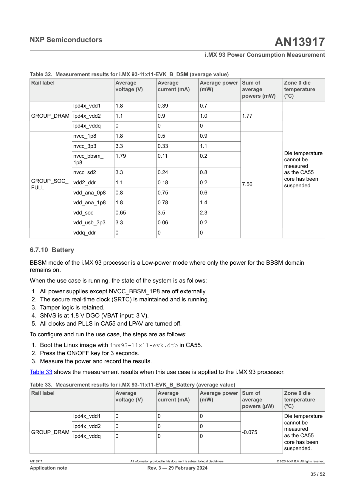

# 6.7.10 Battery

BBSM mode of the i.MX 93 processor is a Low-power mode where only the power for the BBSM domain remains on.

When the use case is running, the state of the system is as follows:

1. All power supplies except NVCC_BBSM_1P8 are off externally.
2. The secure real-time clock (SRTC) is maintained and is running.
3. Tamper logic is retained.
4. SNVS is at 1.8 V DGO (VBAT input: 3 V).
5. All clocks and PLLS in CA55 and LPAV are turned off.

To configure and run the use case, the steps are as follows:

1. Boot the Linux image with `imx93-11x11-evk.dtb` in CA55.
2. Press the ON/OFF key for 3 seconds.
3. Measure the power and record the results.

Table 33 shows the measurement results when this use case is applied to the i.MX 93 processor.

## Table 33. Measurement results for i.MX 93-11x11-EVK_B_Battery (average value)

| Rail label | | Average voltage (V) | Average current (mA) | Average power (mW) | Sum of average powers (µW) | Zone 0 die temperature (°C) |
|------------|------------|---------------------|----------------------|--------------------|----------------------------|----------------------------|
| GROUP_DRAM | lpd4x_vdd1 | 0 | 0 | 0 | -0.075 | Die temperature cannot be measured as the CA55 core has been suspended. |
| GROUP_DRAM | lpd4x_vdd2 | 0 | 0 | 0 | -0.075 | Die temperature cannot be measured as the CA55 core has been suspended. |
| GROUP_DRAM | lpd4x_vddq | 0 | 0 | 0 | -0.075 | Die temperature cannot be measured as the CA55 core has been suspended. |

**Diagram Description:**

The image shows Table 33 displaying measurement results for the i.MX 93-11x11-EVK_B_Battery use case in average value mode. The table contains the following technical details:

- **Rail labels**: Three LPDDR4 power rails are shown (lpd4x_vdd1, lpd4x_vdd2, lpd4x_vddq) grouped under GROUP_DRAM
- **Measurements**: All voltage, current, and power readings show 0 values, indicating these power rails are completely off in BBSM battery mode
- **Sum of average powers**: Shows -0.075 µW across all rails
- **Temperature note**: A note indicates that die temperature cannot be measured because the CA55 core has been suspended in this low-power battery mode

This data demonstrates the ultra-low power consumption achieved in BBSM (Battery-Backed Security Module) mode where only essential security and RTC functions remain active.