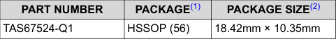
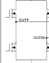

# 3 Description

The TAS67524-Q1 is a four-channel digital-input Class-D audio amplifier that implements 1L modulation only requiring one inductor per BTL channel reducing system size and cost by removing four inductors compared to a traditional solution. Additionally, 1L modulation lowers switching losses compared to traditional Class-D modulation schemes.

The TAS67524-Q1 integrates DC and AC Load Diagnostics to determine the status of the connected loads. During audio playback this status can be monitored through output current sense which is available for each channel and reports the measurement to a host processor through TDM with minimal delay. The device monitors the output load condition while playing audio through real-time load diagnostics independent of the host and audio input.

The TAS67524-Q1 device features an additional a low latency signal path for each channel, providing up to 70% faster signal processing at 48kHz which enables time-sensitive Active Noise Cancellation (ANC), Road Noise Cancellation (RNC) applications.

The device supports global temperature, channel temperature and PVDD values using I2C readout for easy system level thermal management.

The device is offered in a 56 pin HSSOP package with the exposed thermal pad up.

## Package Information

| PART NUMBER | PACKAGE(1) | PACKAGE SIZE(2) |
|-------------|------------|-----------------|
| TAS67524-Q1 | HSSOP (56) | 18.42mm × 10.35mm |

(1) For all available packages, see the orderable addendum at the end of the data sheet.

(2) The package size (length × width) is a nominal value and includes pins, where applicable.

## 1L Modulation Channel Schematic

**Figure Description:**

This simplified schematic diagram illustrates the 1L modulation architecture of the TAS67524-Q1. The diagram shows:

- **Title:** "1L Modulation Channel Schematic"
- **Power Supply:** PVDD input at the top
- **Key Feature Callout:** A text box highlighting "Only 1 inductor needed per channel"
- **Circuit Components:** The schematic depicts a bridge-tied load (BTL) output configuration with switching elements
- **Single Inductor Design:** Unlike traditional Class-D amplifiers requiring multiple inductors, this design shows only one inductor per channel, which is the core advantage of 1L modulation
- **Output Configuration:** Shows the connection to the load (speaker) in a BTL configuration

This architecture enables significant cost and space savings by eliminating four inductors compared to conventional Class-D amplifier designs, while also reducing switching losses.

<!-- VERBATIM_TABLE_START -->
<!-- VERBATIM_TABLE_START -->

|PART NUMBER|PACKAGE(1)|PACKAGE SIZE(2)|
|---|---|---|
|TAS67524-Q1|HSSOP (56)|18.42mm × 10.35mm|
<!-- VERBATIM_TABLE_END -->
<!-- VERBATIM_TABLE_END -->

<!-- VERBATIM_TABLE_START -->
<!-- VERBATIM_TABLE_START -->

|Col1|Col2|
|---|---|
||OUTP OUTM|
<!-- VERBATIM_TABLE_END -->
<!-- VERBATIM_TABLE_END -->