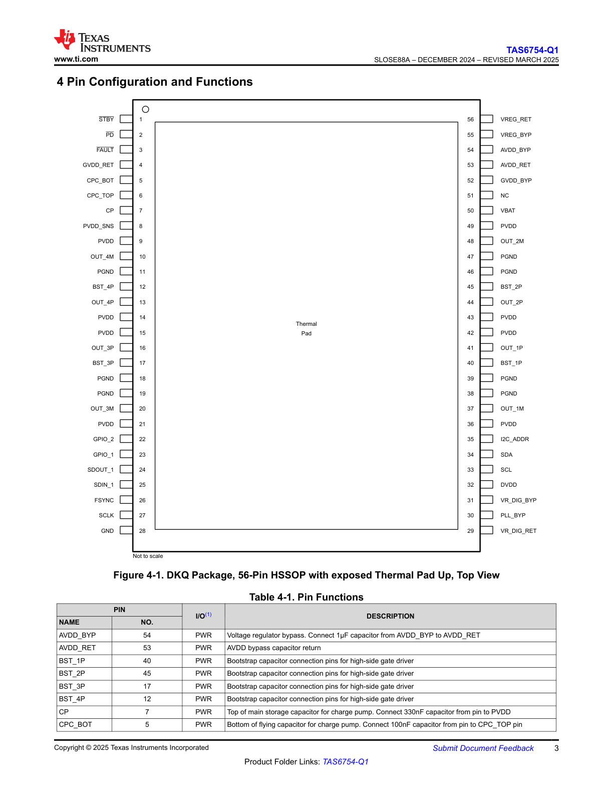
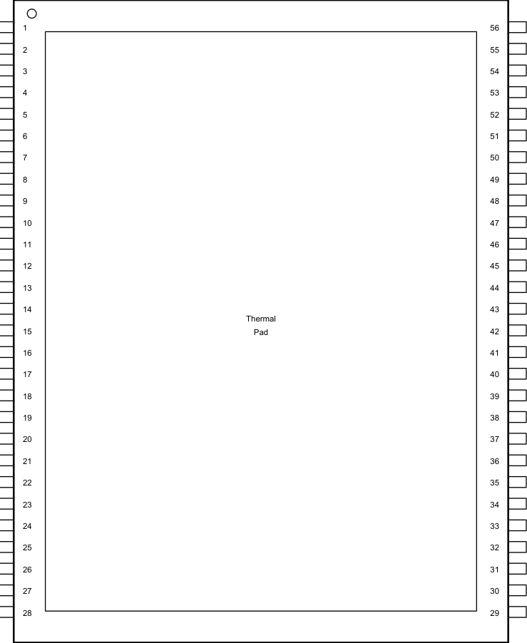
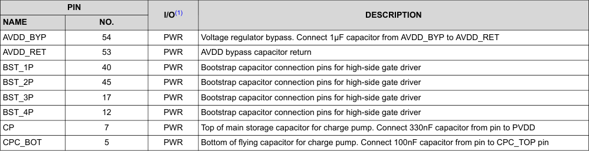
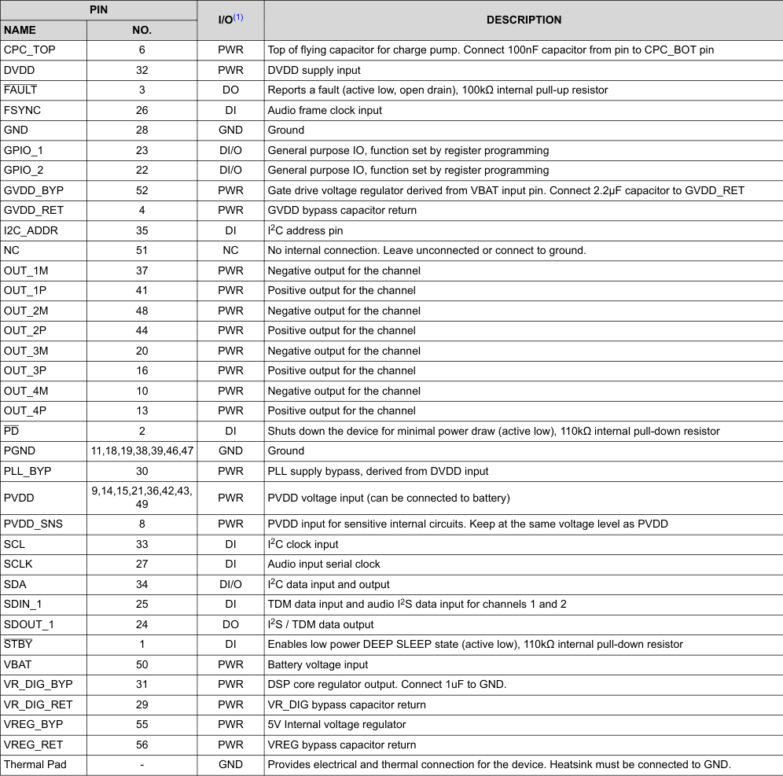

# 4 Pin Configuration and Functions

**Figure 4-1. DKQ Package, 56-Pin HSSOP with exposed Thermal Pad Up, Top View**

This diagram shows the top view of the TAS6754-Q1 in a 56-pin HSSOP package with an exposed thermal pad. The package is rectangular with pins numbered sequentially around the perimeter:

- **Left side (pins 1-28):** Starting from the top-left corner, pins include STBY (1), PD (2), FAULT (3), GVDD_RET (4), CPC_BOT (5), CPC_TOP (6), CP (7), PVDD_SNS (8), PVDD (9), OUT_4M (10), PGND (11), BST_4P (12), OUT_4P (13), PVDD (14-15), OUT_3P (16), BST_3P (17), PGND (18-19), OUT_3M (20), PVDD (21), GPIO_2 (22), GPIO_1 (23), SDOUT_1 (24), SDIN_1 (25), FSYNC (26), SCLK (27), and GND (28).

- **Right side (pins 29-56):** Starting from the bottom-right corner, pins include VR_DIG_RET (29), PLL_BYP (30), VR_DIG_BYP (31), DVDD (32), SCL (33), SDA (34), I2C_ADDR (35), PVDD (36), OUT_1M (37), PGND (38-39), OUT_1P (41), BST_1P (40), PVDD (42-43), OUT_2P (44), BST_2P (45), PGND (46-47), OUT_2M (48), PVDD (49), VBAT (50), NC (51), GVDD_BYP (52), AVDD_RET (53), AVDD_BYP (54), VREG_BYP (55), and VREG_RET (56).

- **Center:** The exposed thermal pad is located in the center of the package for enhanced thermal performance.

The diagram is marked "Not to scale" and shows the standard rectangular IC package layout with clear pin identification.

---

## Table 4-1. Pin Functions

| PIN | NO. | I/O⁽¹⁾ | DESCRIPTION |
|-----|-----|--------|-------------|
| **NAME** | | | |
| AVDD_BYP | 54 | PWR | Voltage regulator bypass. Connect 1µF capacitor from AVDD_BYP to AVDD_RET |
| AVDD_RET | 53 | PWR | AVDD bypass capacitor return |
| BST_1P | 40 | PWR | Bootstrap capacitor connection pins for high-side gate driver |
| BST_2P | 45 | PWR | Bootstrap capacitor connection pins for high-side gate driver |
| BST_3P | 17 | PWR | Bootstrap capacitor connection pins for high-side gate driver |
| BST_4P | 12 | PWR | Bootstrap capacitor connection pins for high-side gate driver |
| CP | 7 | PWR | Top of main storage capacitor for charge pump. Connect 330nF capacitor from pin to PVDD |
| CPC_BOT | 5 | PWR | Bottom of flying capacitor for charge pump. Connect 100nF capacitor from pin to CPC_TOP pin |

⁽¹⁾ DI = digital input, DO = digital output, DI/O = digital input/output, GND = ground, NC = no connect, NO = negative output, PO = positive output, PWR = power

---

## Verbatim tables

<!-- VERBATIM_TABLE_START -->

|guration and Functions|Col2|
|---|---|
|1 56 2 55 3 54 4 53 5 52 6 51 7 50 8 49 9 48 10 47 11 46 12 45 13 44 14 43 Thermal 15 Pad 42 16 41 17 40 18 39 19 38 20 37 21 36 22 35 23 34 24 33 25 32 26 31 27 30 28 29||
|||
|||
|||
|||
|||
|||
|||
|||
|||
|||
|||
|||
|||
|||
|||
|||
|||
|||
|||
|||
|||
|||
|||
|||
|||
|||
|||
|||
|||
|||
|||
|||
|||
|||
|||
|||
|||
|||
|||
|||
|||
|||
|||
|||
|||
|||
|||
|||
|||
|||
|||
|||
|||
|||
|||
|||
<!-- VERBATIM_TABLE_END -->

<!-- VERBATIM_TABLE_START -->

|Col1|Col2|Col3|Table 4-1. Pin Functions|
|---|---|---|---|
|PIN||I/O(1)|DESCRIPTION|
|NAME|NO.|||
|AVDD_BYP|54|PWR|Voltage regulator bypass. Connect 1µF capacitor from AVDD_BYP to AVDD_RET|
|AVDD_RET|53|PWR|AVDD bypass capacitor return|
|BST_1P|40|PWR|Bootstrap capacitor connection pins for high-side gate driver|
|BST_2P|45|PWR|Bootstrap capacitor connection pins for high-side gate driver|
|BST_3P|17|PWR|Bootstrap capacitor connection pins for high-side gate driver|
|BST_4P|12|PWR|Bootstrap capacitor connection pins for high-side gate driver|
|CP|7|PWR|Top of main storage capacitor for charge pump. Connect 330nF capacitor from pin to PVDD|
|CPC_BOT|5|PWR|Bottom of flying capacitor for charge pump. Connect 100nF capacitor from pin to CPC_TOP pin|
<!-- VERBATIM_TABLE_END -->

<!-- VERBATIM_TABLE_START -->

|PIN|Col2|I/O(1)|DESCRIPTION|
|---|---|---|---|
|NAME|NO.|||
|CPC_TOP|6|PWR|Top of flying capacitor for charge pump. Connect 100nF capacitor from pin to CPC_BOT pin|
|DVDD|32|PWR|DVDD supply input|
|FAULT|3|DO|Reports a fault (active low, open drain), 100kΩ internal pull-up resistor|
|FSYNC|26|DI|Audio frame clock input|
|GND|28|GND|Ground|
|GPIO_1|23|DI/O|General purpose IO, function set by register programming|
|GPIO_2|22|DI/O|General purpose IO, function set by register programming|
|GVDD_BYP|52|PWR|Gate drive voltage regulator derived from VBAT input pin. Connect 2.2µF capacitor to GVDD_RET|
|GVDD_RET|4|PWR|GVDD bypass capacitor return|
|I2C_ADDR|35|DI|I2C address pin|
|NC|51|NC|No internal connection. Leave unconnected or connect to ground.|
|OUT_1M|37|PWR|Negative output for the channel|
|OUT_1P|41|PWR|Positive output for the channel|
|OUT_2M|48|PWR|Negative output for the channel|
|OUT_2P|44|PWR|Positive output for the channel|
|OUT_3M|20|PWR|Negative output for the channel|
|OUT_3P|16|PWR|Positive output for the channel|
|OUT_4M|10|PWR|Negative output for the channel|
|OUT_4P|13|PWR|Positive output for the channel|
|PD|2|DI|Shuts down the device for minimal power draw (active low), 110kΩ internal pull-down resistor|
|PGND|11,18,19,38,39,46,47|GND|Ground|
|PLL_BYP|30|PWR|PLL supply bypass, derived from DVDD input|
|PVDD|9,14,15,21,36,42,43, 49|PWR|PVDD voltage input (can be connected to battery)|
|PVDD_SNS|8|PWR|PVDD input for sensitive internal circuits. Keep at the same voltage level as PVDD|
|SCL|33|DI|I2C clock input|
|SCLK|27|DI|Audio input serial clock|
|SDA|34|DI/O|I2C data input and output|
|SDIN_1|25|DI|TDM data input and audio I2S data input for channels 1 and 2|
|SDOUT_1|24|DO|I2S / TDM data output|
|STBY|1|DI|Enables low power DEEP SLEEP state (active low), 110kΩ internal pull-down resistor|
|VBAT|50|PWR|Battery voltage input|
|VR_DIG_BYP|31|PWR|DSP core regulator output. Connect 1uF to GND.|
|VR_DIG_RET|29|PWR|VR_DIG bypass capacitor return|
|VREG_BYP|55|PWR|5V Internal voltage regulator|
|VREG_RET|56|PWR|VREG bypass capacitor return|
|Thermal Pad|-|GND|Provides electrical and thermal connection for the device. Heatsink must be connected to GND.|
<!-- VERBATIM_TABLE_END -->
