# 5 Specifications

[STRICT_MODE: LLM output rejected due to potential hallucinated technical values]

New technical tokens detected: -115ma, -4µa, 0.01w, 0db, 100db, 100ma, 100w, 10µa, 120w, 14.5db, 160ma, 16w ...

5 Specifications
5.1 Absolute Maximum Ratings
over operating free-air temperature range (unless otherwise noted)(1)

<!-- VERBATIM_TABLE_START -->
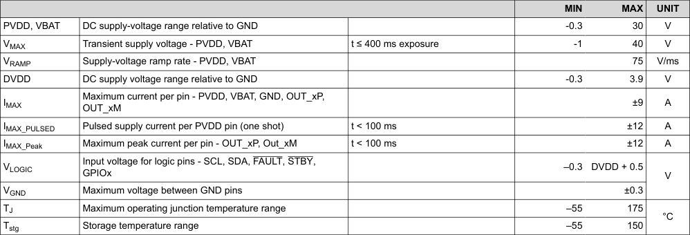

|Col1|Col2|Col3|MIN|MAX|UNIT|
|---|---|---|---|---|---|
|PVDD, VBAT D|C supply-voltage range relative to GND||-0.3 30||V|
|VMAX T|ransient supply voltage - PVDD, VBAT|t ≤ 400 ms exposure|-1 40||V|
|VRAMP S|upply-voltage ramp rate - PVDD, VBAT||75||V/ms|
|DVDD D|C supply voltage range relative to GND||-0.3 3.9||V|
|M IMAX O|aximum current per pin - PVDD, VBAT, GND, OUT_xP, UT_xM||±9||A|
|IMAX_PULSED P|ulsed supply current per PVDD pin (one shot)|t < 100 ms|±12||A|
|IMAX_Peak M|aximum peak current per pin - OUT_xP, Out_xM|t < 100 ms|±12||A|
|I VLOGIC G|nput voltage for logic pins - SCL, SDA, FAULT, STBY, PIOx||–0.3 DVDD + 0.5||V|
|VGND M|aximum voltage between GND pins||±0.3|||
|TJ M|aximum operating junction temperature range||–55 175||°C|
|Tstg S|torage temperature range||–55 150|||
<!-- VERBATIM_TABLE_END -->

(1)
Operation outside the Absolute Maximum Ratings may cause permanent device damage. Absolute Maximum Ratings do not imply 
functional operation of the device at these or any other conditions beyond those listed under Recommended Operating Conditions. 
If used outside the Recommended Operating Conditions but within the Absolute Maximum Ratings, the device may not be fully 
functional, and this may affect device reliability, functionality, performance, and shorten the device lifetime.
www.ti.com
TAS6754-Q1
SLOSE88A – DECEMBER 2024 – REVISED MARCH 2025
Copyright © 2025 Texas Instruments Incorporated
Submit Document Feedback
5
Product Folder Links: TAS6754-Q1

5.2 Recommended Operating Conditions

<!-- VERBATIM_TABLE_START -->

|Col1|Col2|Col3|MIN|TYP|MAX|UNIT|
|---|---|---|---|---|---|---|
|PVDD|Output FET Supply Voltage Range|Relative to GND|4.5 14.4 19|||V|
|VBAT|Battery Supply Voltage Input|Relative to GND|4.5 14.4 19|||V|
|DVDD|DC Logic supply|Relative to GND|1.62 3.6|||V|
|TA|Ambient temperature||–40 125|||°C|
|TJ|Junction temperature|An adequate thermal design is required|–40 175||||
|RL|Nominal speaker load impedance|BTL Mode|2 4|||Ω|
|RPU_I2C|I2C pullup resistance on SDA and SCL pins||1 4.7 10|||kΩ|
|CBypass|External capacitance on bypass pins|Pin 30, 31, 32, 54, 55|1|||µF|
|CGVDD|External capacitance on GVDD pins|Pin 52|2.2|||µF|
|LO|OUTP output filter inductance - ISD|Minimum output filter inductance at ISD current levels. Applies to short to ground or short to power protection.|1|||µH|
<!-- VERBATIM_TABLE_END -->

5.3 ESD Ratings

<!-- VERBATIM_TABLE_START -->

|5.3 ESD Ratings|Col2|Col3|Col4|Col5|Col6|
|---|---|---|---|---|---|
|||||VALUE|UNIT|
|V(ESD)|Electrostatic discharge|Human-body model (HBM), per AEC Q100-002(1)||±3500|V|
|||Charged-device model (CDM), per AEC Q100-011|All pins|±1000||
<!-- VERBATIM_TABLE_END -->

(1)
AEC Q100-002 indicates that HBM stressing shall be in accordance with the ANSI/ESDA/JEDEC JS-001 specification.
5.4 Thermal Information

<!-- VERBATIM_TABLE_START -->

|5.4 Thermal Information|Col2|Col3|Col4|
|---|---|---|---|
|THERMAL METRIC(1)||TAS6754-Q1(2)|UNIT|
|R θJA|Junction-to-ambient thermal resistance|38.9|°C/W|
|R θJC(top)|Junction-to-case (top) thermal resistance|0.3|°C/W|
|R θJB|Junction-to-board thermal resistance|17.1|°C/W|
|ψ JT|Junction-to-top characterization parameter|0.2|°C/W|
|ψ JB|Junction-to-board characterization parameter|16.6|°C/W|
|R θJC(bot)|Junction-to-case (bottom) thermal resistance|-|°C/W|
<!-- VERBATIM_TABLE_END -->

(1)
For more information about traditional and new thermalmetrics, see the Semiconductor and IC Package Thermal Metrics application 
report.
(2)
JEDEC Standard, 4-Layer PCB.
TAS6754-Q1
SLOSE88A – DECEMBER 2024 – REVISED MARCH 2025
www.ti.com
6
Submit Document Feedback
Copyright © 2025 Texas Instruments Incorporated
Product Folder Links: TAS6754-Q1

5.5 Electrical Characteristics
Test conditions (unless otherwise noted): TC = 25°C, PVDD = 14.4V, VBAT = 14.4V, DVDD = 1.8V, RL = 4Ω,
Pout = 1W/ch, ƒout = 1kHz, Fsw = 2.048MHz, AES17 Filter, reconstruction filter inductor used: 3.3µH-VCMT053T-3R3MN5 and 
1µF, default I2C settings + start-up script, see application diagram

<!-- VERBATIM_TABLE_START -->

|PARAMETER|Col2|TEST CONDITIONS|MIN|TYP|MAX|UNIT|
|---|---|---|---|---|---|---|
|OPERATING CURRENT|||||||
|IDVDD|DVDD supply current|All channels playing, -60dB Signal|22 28|||mA|
|||All channels playing, -60dB Signal, DVDD = 3.3V|22||||
|IPVDD_IDLE|PVDD idle current|All channels playing, no audio input, FSW = 2.048MHz|47 60|||mA|
|IVBAT_IDLE|VBAT idle current|All channels playing, no audio input, FSW = 2.048MHz|115 130|||mA|
|IPVDD_Shutdown|PVDD shutdown current|PD active, DVDD = 0V|4 5|||μA|
|IVBAT_Shutdown|VBAT shutdown current|PD active, DVDD = 0V|5 7|||μA|
|ITOTAL_Shutdown|PVDD+VBAT shutdown current|PD active, DVDD = 0V|12|||μA|
|IDVDD_Shutdown|DVDD shutdown current|PD active, DVDD = 1.8V|1 3|||μA|
|||PD active, DVDD = 3.3V|1 3||||
|OUTPUT POWER|||||||
|PO_BTL|Output power per channel, BTL|4Ω, PVDD = 14.4V, THD+N = 1%,TC = 75℃|21 23|||W|
|||4Ω, PVDD = 14.4V, THD+N = 10%,TC = 75℃|26 30||||
|||4Ω, PVDD = 18V, THD+N = 1%,TC = 75℃|33 37||||
|||4Ω, PVDD = 18V, THD+N = 10%,TC = 75℃|41 46||||
|||2Ω, PVDD = 14.4V, THD+N = 1%,TC = 75℃|37 40||||
|||2Ω, PVDD = 14.4V, THD+N = 10%,TC = 75℃|44 50||||
|EFFP|Power efficiency|4 channels operating, 25W output power per channel, RL = 4Ω, PVDD = 14.4V, TC = 25°C; (includes output filter losses)|87|||%|
|AUDIO PERFORMANCE|||||||
|Vn|Output noise voltage|Zero input, A-weighting, Gain = -5dB to match PVDD of 14.4V|35|||μV|
|G|Gain|Peak output voltage at full scale digital input|28|||V/FS|
|THD+N|Total harmonic distortion + noise||0.03|||%|
|||20Hz to 20kHz|0.08|||%|
|FBW|Frequency response|20Hz to 20kHz, without LC filter impact or integrated compensation|0.5|||dB|
|GMUTE|Output attenuation|Assert MUTE and compare to amp playing 1W audio into 4Ω|100|||dB|
|Crosstalk|Channel crosstalk|PVDD = 14.4Vdc, ƒ = 1kHz|-90 -80|||dB|
|PSRR|Power-supply rejection ratio|PVDD = 14.4Vdc + 1VRMS, ƒ = 1kHz|-75|||dB|
|DIGITAL INPUT PINS|||||||
|VIH|Input logic level high||70|||%DVDD|
|VIL|Input logic level low||30||||
|IIH|Input logic current|VI = DVDD|15|||µA|
|IIL||VI = 0|-15||||
|DIGITAL OUTPUT PINS|||||||
|VOH|Output voltage for logic level high|I = ±1mA|90|||%DVDD|
|VOL|Output voltage for logic level low||10||||
|VOH|Output voltage for logic level high|DVDD = 3.3V, I = ±2mA|90|||%DVDD|
|VOL|Output voltage for logic level low|DVDD = 3.3V, I = ±2mA|10|||%DVDD|
|BYPASS VOLTAGES|||||||
|VGVDD|Gate drive bypass pin voltage||5|||V|
|VAVDD_BYP , VVREG_BYP|Analog bypass pins voltage||5|||V|
|VDVDD_BYP, VPLL_BYP, VVR_DIG|Digital bypass pins voltage||1.5|||V|
|OVERVOLTAGE (OV) PROTECTION|||||||
|PVDDOV_SET|PVDD overvoltage shutdown set||19.1 20 21|||V|
|PVDDOV_HYS|PVDD overvoltage recovery hysteresis||0.5|||V|
<!-- VERBATIM_TABLE_END -->

www.ti.com
TAS6754-Q1
SLOSE88A – DECEMBER 2024 – REVISED MARCH 2025
Copyright © 2025 Texas Instruments Incorporated
Submit Document Feedback
7
Product Folder Links: TAS6754-Q1

Test conditions (unless otherwise noted): TC = 25°C, PVDD = 14.4V, VBAT = 14.4V, DVDD = 1.8V, RL = 4Ω,
Pout = 1W/ch, ƒout = 1kHz, Fsw = 2.048MHz, AES17 Filter, reconstruction filter inductor used: 3.3µH-VCMT053T-3R3MN5 and 
1µF, default I2C settings + start-up script, see application diagram

<!-- VERBATIM_TABLE_START -->
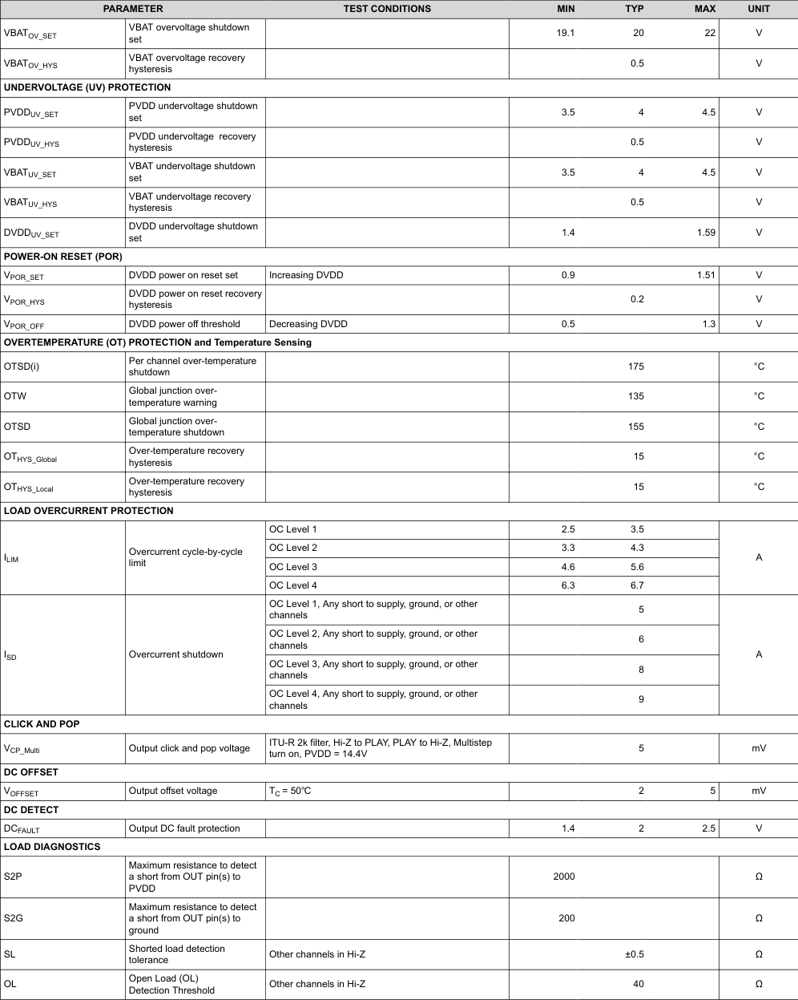

|PARAMETER|Col2|TEST CONDITIONS|MIN|TYP|MAX|UNIT|
|---|---|---|---|---|---|---|
|VBATOV_SET|VBAT overvoltage shutdown set||19.1 20 22|||V|
|VBATOV_HYS|VBAT overvoltage recovery hysteresis||0.5|||V|
|UNDERVOLTAGE (UV) PROTECTION|||||||
|PVDDUV_SET|PVDD undervoltage shutdown set||3.5 4 4.5|||V|
|PVDDUV_HYS|PVDD undervoltage recovery hysteresis||0.5|||V|
|VBATUV_SET|VBAT undervoltage shutdown set||3.5 4 4.5|||V|
|VBATUV_HYS|VBAT undervoltage recovery hysteresis||0.5|||V|
|DVDDUV_SET|DVDD undervoltage shutdown set||1.4 1.59|||V|
|POWER-ON RESET (POR)|||||||
|VPOR_SET|DVDD power on reset set|Increasing DVDD|0.9 1.51|||V|
|VPOR_HYS|DVDD power on reset recovery hysteresis||0.2|||V|
|VPOR_OFF|DVDD power off threshold|Decreasing DVDD|0.5 1.3|||V|
|OVERTEMPERATURE (OT) PROTECTION and Temperature Sensing|||||||
|OTSD(i)|Per channel over-temperature shutdown||175|||°C|
|OTW|Global junction over- temperature warning||135|||°C|
|OTSD|Global junction over- temperature shutdown||155|||°C|
|OTHYS_Global|Over-temperature recovery hysteresis||15|||°C|
|OTHYS_Local|Over-temperature recovery hysteresis||15|||°C|
|LOAD OVERCURRENT PROTECTION|||||||
|ILIM|Overcurrent cycle-by-cycle limit|OC Level 1|2.5 3.5|||A|
|||OC Level 2|3.3 4.3||||
|||OC Level 3|4.6 5.6||||
|||OC Level 4|6.3 6.7||||
|ISD|Overcurrent shutdown|OC Level 1, Any short to supply, ground, or other channels|5|||A|
|||OC Level 2, Any short to supply, ground, or other channels|6||||
|||OC Level 3, Any short to supply, ground, or other channels|8||||
|||OC Level 4, Any short to supply, ground, or other channels|9||||
|CLICK AND POP|||||||
|VCP_Multi|Output click and pop voltage|ITU-R 2k filter, Hi-Z to PLAY, PLAY to Hi-Z, Multistep turn on, PVDD = 14.4V|5|||mV|
|DC OFFSET|||||||
|VOFFSET|Output offset voltage|TC = 50℃|2 5|||mV|
|DC DETECT|||||||
|DCFAULT|Output DC fault protection||1.4 2 2.5|||V|
|LOAD DIAGNOSTICS|||||||
|S2P|Maximum resistance to detect a short from OUT pin(s) to PVDD||2000|||Ω|
|S2G|Maximum resistance to detect a short from OUT pin(s) to ground||200|||Ω|
|SL|Shorted load detection tolerance|Other channels in Hi-Z|±0.5|||Ω|
|OL|Open Load (OL) Detection Threshold|Other channels in Hi-Z|40|||Ω|
<!-- VERBATIM_TABLE_END -->

TAS6754-Q1
SLOSE88A – DECEMBER 2024 – REVISED MARCH 2025
www.ti.com
8
Submit Document Feedback
Copyright © 2025 Texas Instruments Incorporated
Product Folder Links: TAS6754-Q1

Test conditions (unless otherwise noted): TC = 25°C, PVDD = 14.4V, VBAT = 14.4V, DVDD = 1.8V, RL = 4Ω,
Pout = 1W/ch, ƒout = 1kHz, Fsw = 2.048MHz, AES17 Filter, reconstruction filter inductor used: 3.3µH-VCMT053T-3R3MN5 and 
1µF, default I2C settings + start-up script, see application diagram

<!-- VERBATIM_TABLE_START -->
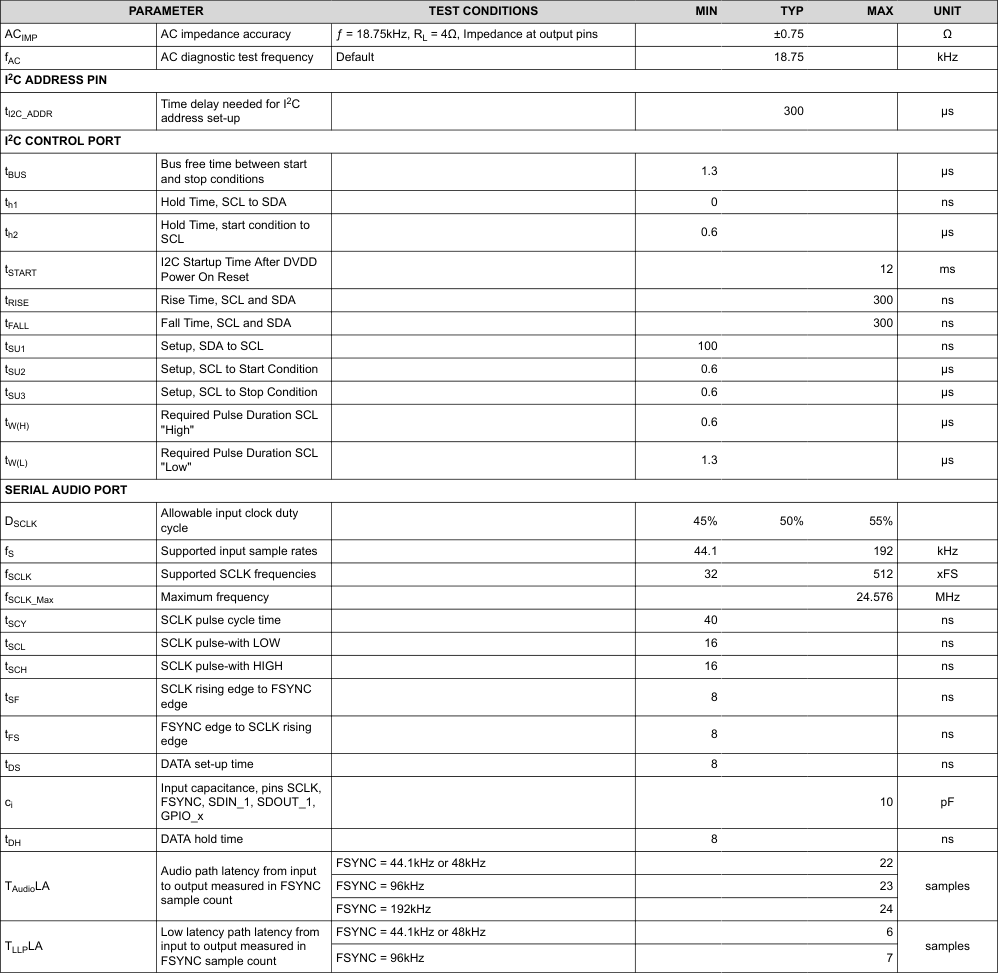

|PARAMETER|Col2|TEST CONDITIONS|MIN|TYP|MAX|UNIT|
|---|---|---|---|---|---|---|
|ACIMP|AC impedance accuracy|ƒ = 18.75kHz, RL = 4Ω, Impedance at output pins|±0.75|||Ω|
|fAC|AC diagnostic test frequency|Default|18.75|||kHz|
|I2C ADDRESS PIN|||||||
|tI2C_ADDR|Time delay needed for I2C address set-up||300|||μs|
|I2C CONTROL PORT|||||||
|tBUS|Bus free time between start and stop conditions||1.3|||μs|
|th1|Hold Time, SCL to SDA||0|||ns|
|th2|Hold Time, start condition to SCL||0.6|||μs|
|tSTART|I2C Startup Time After DVDD Power On Reset||12|||ms|
|tRISE|Rise Time, SCL and SDA||300|||ns|
|tFALL|Fall Time, SCL and SDA||300|||ns|
|tSU1|Setup, SDA to SCL||100|||ns|
|tSU2|Setup, SCL to Start Condition||0.6|||μs|
|tSU3|Setup, SCL to Stop Condition||0.6|||μs|
|tW(H)|Required Pulse Duration SCL "High"||0.6|||μs|
|tW(L)|Required Pulse Duration SCL "Low"||1.3|||μs|
|SERIAL AUDIO PORT|||||||
|DSCLK|Allowable input clock duty cycle||45% 50% 55%||||
|fS|Supported input sample rates||44.1 192|||kHz|
|fSCLK|Supported SCLK frequencies||32 512|||xFS|
|fSCLK_Max|Maximum frequency||24.576|||MHz|
|tSCY|SCLK pulse cycle time||40|||ns|
|tSCL|SCLK pulse-with LOW||16|||ns|
|tSCH|SCLK pulse-with HIGH||16|||ns|
|tSF|SCLK rising edge to FSYNC edge||8|||ns|
|tFS|FSYNC edge to SCLK rising edge||8|||ns|
|tDS|DATA set-up time||8|||ns|
|ci|Input capacitance, pins SCLK, FSYNC, SDIN_1, SDOUT_1, GPIO_x||10|||pF|
|tDH|DATA hold time||8|||ns|
|TAudioLA|Audio path latency from input to output measured in FSYNC sample count|FSYNC = 44.1kHz or 48kHz|22|||samples|
|||FSYNC = 96kHz|23||||
|||FSYNC = 192kHz|24||||
|TLLPLA|Low latency path latency from input to output measured in FSYNC sample count|FSYNC = 44.1kHz or 48kHz|6|||samples|
|||FSYNC = 96kHz|7||||
<!-- VERBATIM_TABLE_END -->

www.ti.com
TAS6754-Q1
SLOSE88A – DECEMBER 2024 – REVISED MARCH 2025
Copyright © 2025 Texas Instruments Incorporated
Submit Document Feedback
9
Product Folder Links: TAS6754-Q1

5.6 Typical Characteristics
Test conditions (unless otherwise noted): TC = 25°C, PVDD = 14.4V, VBAT = 14.4V, DVDD = 1.8V, RL = 4Ω, Pout = 1W/ch, 
ƒout = 1kHz, Fsw = 2.048MHz, AES17 Filter, reconstruction filter as described in Parameter Measurement Information, default 
I2C settings + start-up script, see application diagram

<!-- VERBATIM_TABLE_START -->
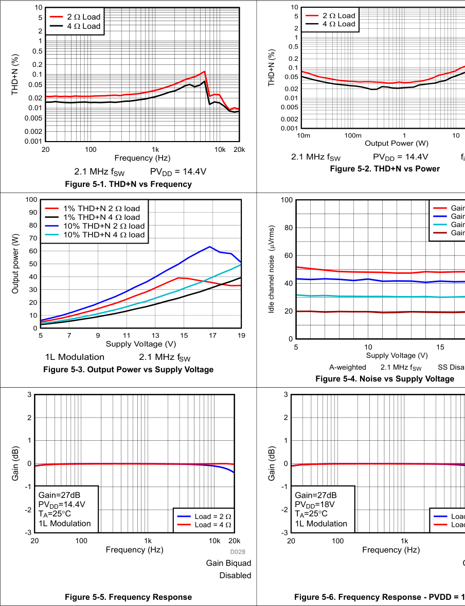

|10 5 2 Load 4 Load 2 1 0.5 (%) 0.2 0.1 THD+N 0.05 0.02 0.01 0.005 0.002 0.001 20 100 1k 10k 20k Frequency (Hz) 2.1 MHz f PV = 14.4V SW DD Figure 5-1. THD+N vs Frequency|Figure 5-2. THD+N vs Power|
|---|---|
|100 1% THD+N 2 load 90 1% THD+N 4 load 80 10% THD+N 2 load 10% THD+N 4 load 70 (W) 60 power 50 40 Output 30 20 10 0 5 7 9 11 13 15 17 19 Supply Voltage (V) 1L Modulation 2.1 MHz f SW Figure 5-3. Output Power vs Supply Voltage|100 Gain Gain 80 Gain (Vrms) Gain 60 noise channel 40 Idle 20 0 5 10 15 Supply Voltage (V) A-weighted 2.1 MHz fSW SS Disa Figure 5-4. Noise vs Supply Voltage|
|3 2 1 (dB) 0 Gain -1 Gain=27dB PVDD=14.4V -2 TA=25C Load = 2  1L Modulation Load = 4  -3 20 100 1k 10k 20k Frequency (Hz) DD002225 Gain Biquad Disabled Figure 5-5. Frequency Response|Figure 5-6. Frequency Response - PVDD = 1|
<!-- VERBATIM_TABLE_END -->

<!-- VERBATIM_TABLE_START -->
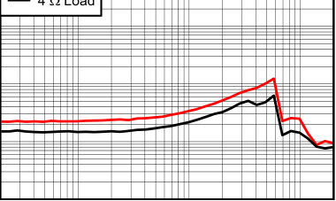

|Col1|4|Lo|oad|Col5|Col6|Col7|Col8|Col9|Col10|Col11|Col12|Col13|Col14|
|---|---|---|---|---|---|---|---|---|---|---|---|---|---|
||4|Lo|ad|||||||||||
|||||||||||||||
|||||||||||||||
|||||||||||||||
|||||||||||||||
|||||||||||||||
<!-- VERBATIM_TABLE_END -->

<!-- VERBATIM_TABLE_START -->
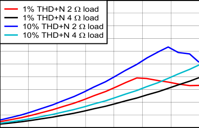

|1%|THD+|N 2 l|oad|Col5|Col6|Col7|
|---|---|---|---|---|---|---|
|1%|THD+|N 4 l|oad||||
|10 10|% THD % THD|+N 2  +N 4 |load load||||
||||||||
||||||||
||||||||
||||||||
||||||||
||||||||
||||||||
<!-- VERBATIM_TABLE_END -->

<!-- VERBATIM_TABLE_START -->
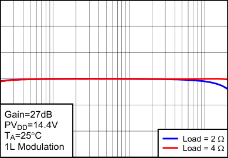

|Col1|Col2|Col3|Col4|Col5|Col6|Col7|Col8|Col9|Col10|Col11|Col12|Col13|Col14|Col15|Col16|Col17|
|---|---|---|---|---|---|---|---|---|---|---|---|---|---|---|---|---|
||||||||||||||||||
||||||||||||||||||
||||||||||||||||||
|G P|ain VD|=27 D=14|dB .4V||||||||||||||
|TA 1L|=2 M|5C odul|ation|||||||||||L L|oad oad|= 2  = 4 |
||||||||||||||||||
<!-- VERBATIM_TABLE_END -->

Gain Biquad 
Disabled
TAS6754-Q1
SLOSE88A – DECEMBER 2024 – REVISED MARCH 2025
www.ti.com
10
Submit Document Feedback
Copyright © 2025 Texas Instruments Incorporated
Product Folder Links: TAS6754-Q1

5.6 Typical Characteristics (continued)
Test conditions (unless otherwise noted): TC = 25°C, PVDD = 14.4V, VBAT = 14.4V, DVDD = 1.8V, RL = 4Ω, Pout = 1W/ch, 
ƒout = 1kHz, Fsw = 2.048MHz, AES17 Filter, reconstruction filter as described in Parameter Measurement Information, default 
I2C settings + start-up script, see application diagram

<!-- VERBATIM_TABLE_START -->
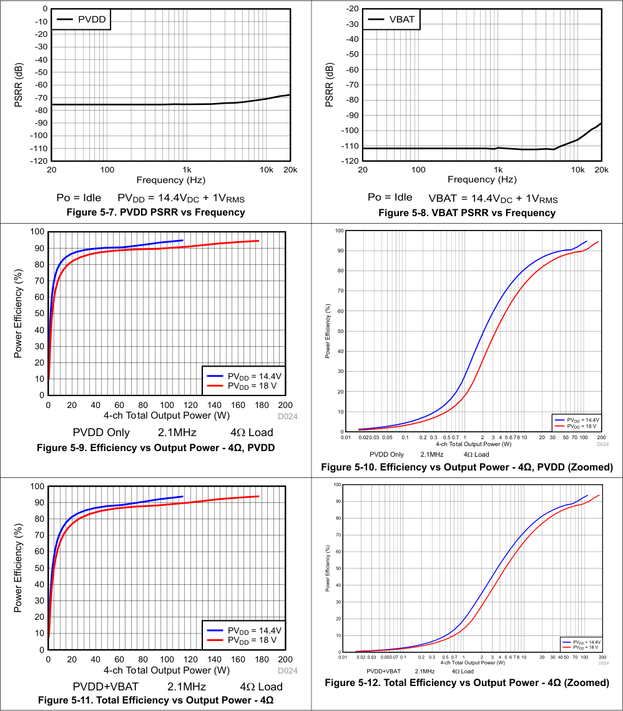

|0 -10 PVDD -20 -30 -40 (dB) -50 -60 PSRR -70 -80 -90 -100 -110 -120 20 100 1k 10k 20k Frequency (Hz) Po = Idle PV = 14.4V + 1V DD DC RMS Figure 5-7. PVDD PSRR vs Frequency|-20 VBAT -30 -40 -50 -60 (dB) -70 PSRR -80 -90 -100 -110 -120 20 100 1k 10k 20k Frequency (Hz) Po = Idle VBAT = 14.4V + 1V DC RMS Figure 5-8. VBAT PSRR vs Frequency|
|---|---|
|100 90 80 (%) 70 Efficiency 60 50 40 Power 30 20 10 PVDD = 14.4V PVDD = 18 V 0 0 20 40 60 80 100 120 140 160 180 200 4-ch Total Output Power (W) D024 PVDD Only 2.1MHz 4Load Figure 5-9. Efficiency vs Output Power - 4Ω, PVDD|100 90 80 70 (%) 60 Efficiency 50 Power 40 30 20 10 PVDD = 14.4V PVDD = 18 V 0 0.01 0.020.03 0.05 0.1 0.2 0.3 0.5 0.7 1 2 3 4 5 6 78 10 20 30 50 70 100 200 4-ch Total Output Power (W) D024 PVDD Only 2.1MHz 4Load Figure 5-10. Efficiency vs Output Power - 4Ω, PVDD (Zoomed)|
|100 90 80 (%) 70 Efficiency 60 50 40 Power 30 20 10 PVDD = 14.4V PVDD = 18 V 0 0 20 40 60 80 100 120 140 160 180 200 4-ch Total Output Power (W) D024 PVDD+VBAT 2.1MHz 4Load Figure 5-11. Total Efficiency vs Output Power - 4Ω|Figure 5-12. Total Efficiency vs Output Power - 4Ω (Zoomed)|
<!-- VERBATIM_TABLE_END -->

<!-- VERBATIM_TABLE_START -->
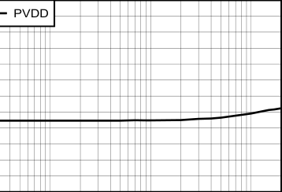

|PVDD|Col2|Col3|Col4|Col5|Col6|Col7|Col8|Col9|Col10|Col11|Col12|Col13|
|---|---|---|---|---|---|---|---|---|---|---|---|---|
||||||||||||||
||||||||||||||
||||||||||||||
||||||||||||||
||||||||||||||
||||||||||||||
||||||||||||||
||||||||||||||
||||||||||||||
||||||||||||||
||||||||||||||
||||||||||||||
<!-- VERBATIM_TABLE_END -->

<!-- VERBATIM_TABLE_START -->
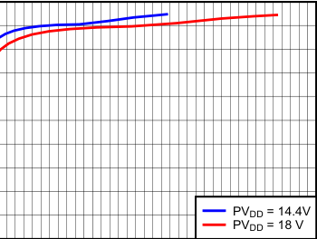

|Col1|Col2|Col3|Col4|Col5|Col6|Col7|Col8|Col9|Col10|Col11|Col12|Col13|Col14|Col15|Col16|Col17|Col18|Col19|
|---|---|---|---|---|---|---|---|---|---|---|---|---|---|---|---|---|---|---|
||||||||||||||||||||
||||||||||||||||||||
||||||||||||||||||||
||||||||||||||||||||
||||||||||||||||||||
||||||||||||||||||||
||||||||||||||||||||
|||||||||||||P|V||= 1|4.|4V||
|||||||||||||P|D VD|D D|= 1|8|V||
||||||||||||||||||||
<!-- VERBATIM_TABLE_END -->

<!-- VERBATIM_TABLE_START -->
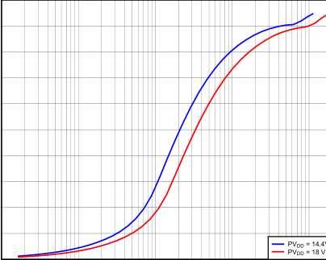

|Col1|Col2|Col3|Col4|Col5|
|---|---|---|---|---|
||||||
||||||
||||||
||||||
||||||
||||||
||||||
||||||
||||P P|VDD = 14.4 VDD = 18 V|
<!-- VERBATIM_TABLE_END -->

www.ti.com
TAS6754-Q1
SLOSE88A – DECEMBER 2024 – REVISED MARCH 2025
Copyright © 2025 Texas Instruments Incorporated
Submit Document Feedback
11
Product Folder Links: TAS6754-Q1

5.6 Typical Characteristics (continued)
Test conditions (unless otherwise noted): TC = 25°C, PVDD = 14.4V, VBAT = 14.4V, DVDD = 1.8V, RL = 4Ω, Pout = 1W/ch, 
ƒout = 1kHz, Fsw = 2.048MHz, AES17 Filter, reconstruction filter as described in Parameter Measurement Information, default 
I2C settings + start-up script, see application diagram

<!-- VERBATIM_TABLE_START -->
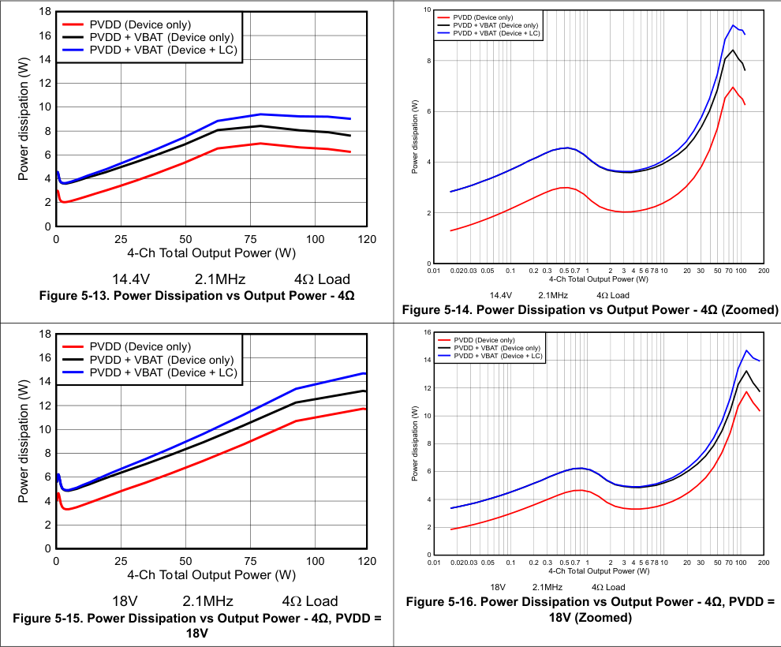

|18 PVDD (Device only) 16 PVDD + VBAT (Device only) PVDD + VBAT (Device + LC) 14 (W) 12 dissipation 10 8 6 Power 4 2 0 0 25 50 75 100 120 4-Ch Total Output Power (W) 14.4V 2.1MHz 4Load Figure 5-13. Power Dissipation vs Output Power - 4Ω|10 PVDD (Device only) PVDD + VBAT (Device only) PVDD + VBAT (Device + LC) 8 (W) 6 dissipation Power 4 2 0 0.01 0.020.03 0.05 0.1 0.2 0.3 0.5 0.7 1 2 3 4 5 6 78 10 20 30 50 70 100 200 4-Ch Total Output Power (W) 14.4V 2.1MHz 4Load Figure 5-14. Power Dissipation vs Output Power - 4Ω (Zoomed)|
|---|---|
|18 PVDD (Device only) 16 PVDD + VBAT (Device only) PVDD + VBAT (Device + LC) 14 (W) 12 dissipation 10 8 6 Power 4 2 0 0 25 50 75 100 120 4-Ch Total Output Power (W) 18V 2.1MHz 4Load Figure 5-15. Power Dissipation vs Output Power - 4Ω, PVDD = 18V|16 PVDD (Device only) PVDD + VBAT (Device only) 14 PVDD + VBAT (Device + LC) 12 (W) 10 dissipation 8 Power 6 4 2 0 0.01 0.020.03 0.05 0.1 0.2 0.3 0.5 0.7 1 2 3 4 5 6 78 10 20 30 50 70 100 200 4-Ch Total Output Power (W) 18V 2.1MHz 4Load Figure 5-16. Power Dissipation vs Output Power - 4Ω, PVDD = 18V (Zoomed)|
<!-- VERBATIM_TABLE_END -->

<!-- VERBATIM_TABLE_START -->
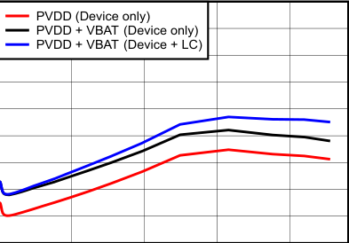

|PVDD|(Device only|)|Col4|Col5|Col6|
|---|---|---|---|---|---|
|PVDD PVDD|+ VBAT (De + VBAT (De|vice only) vice + LC)||||
|||||||
|||||||
|||||||
|||||||
|||||||
|||||||
|||||||
<!-- VERBATIM_TABLE_END -->

<!-- VERBATIM_TABLE_START -->
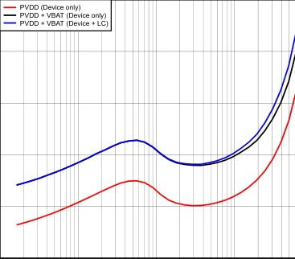

|P P P|VDD VDD VDD|(Device only) + VBAT (Devic + VBAT (Devic|e only) e + LC)|Col5|Col6|Col7|Col8|Col9|Col10|Col11|
|---|---|---|---|---|---|---|---|---|---|---|
||||||||||||
||||||||||||
||||||||||||
||||||||||||
||||||||||||
<!-- VERBATIM_TABLE_END -->

<!-- VERBATIM_TABLE_START -->
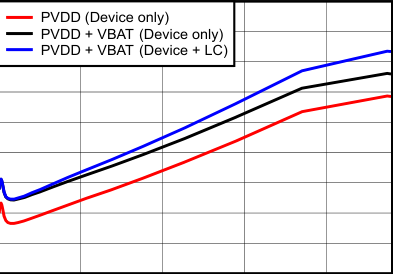

|PVDD|(Device only|)|Col4|Col5|Col6|
|---|---|---|---|---|---|
|PVDD PVDD|+ VBAT (De + VBAT (De|vice only) vice + LC)||||
|||||||
|||||||
|||||||
|||||||
|||||||
|||||||
|||||||
<!-- VERBATIM_TABLE_END -->

<!-- VERBATIM_TABLE_START -->
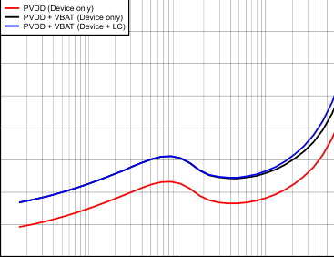

|P P P|VD VD VD|D (Device only) D + VBAT (Devi D + VBAT (Devi|ce only) ce + LC)|Col5|Col6|Col7|Col8|Col9|Col10|Col11|
|---|---|---|---|---|---|---|---|---|---|---|
||||||||||||
||||||||||||
||||||||||||
||||||||||||
||||||||||||
||||||||||||
||||||||||||
<!-- VERBATIM_TABLE_END -->

TAS6754-Q1
SLOSE88A – DECEMBER 2024 – REVISED MARCH 2025
www.ti.com
12
Submit Document Feedback
Copyright © 2025 Texas Instruments Incorporated
Product Folder Links: TAS6754-Q1

5.6 Typical Characteristics (continued)
Test conditions (unless otherwise noted): TC = 25°C, PVDD = 14.4V, VBAT = 14.4V, DVDD = 1.8V, RL = 4Ω, Pout = 1W/ch, 
ƒout = 1kHz, Fsw = 2.048MHz, AES17 Filter, reconstruction filter as described in Parameter Measurement Information, default 
I2C settings + start-up script, see application diagram

<!-- VERBATIM_TABLE_START -->
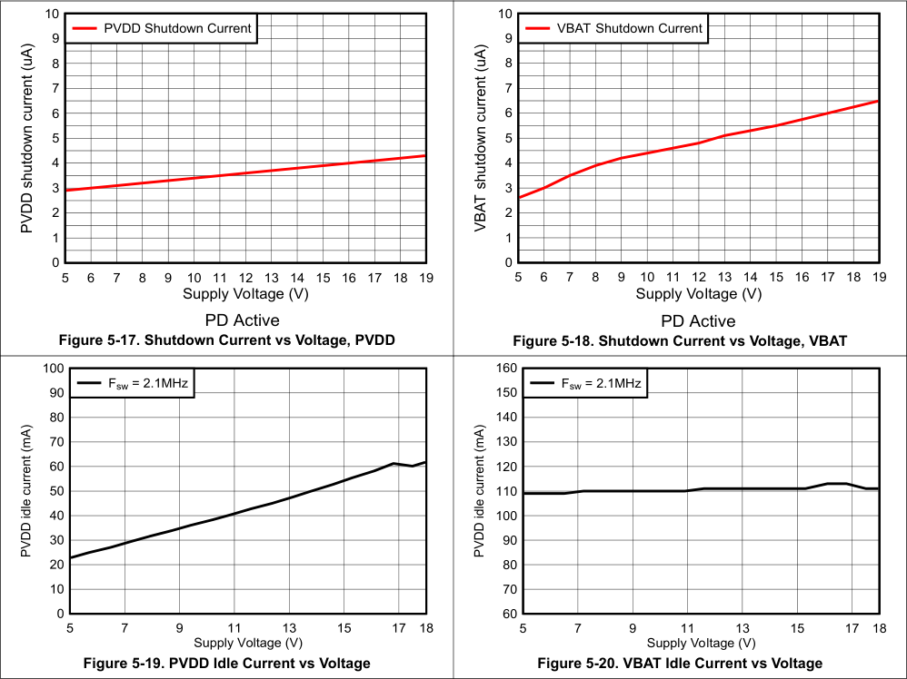

|10 PVDD Shutdown Current 9 (uA) 8 current 7 6 shutdown 5 4 3 PVDD 2 1 0 5 6 7 8 9 10 11 12 13 14 15 16 17 18 19 Supply Voltage (V) PD Active Figure 5-17. Shutdown Current vs Voltage, PVDD|10 VBAT Shutdown Current 9 (uA) 8 current 7 6 shutdown 5 4 3 VBAT 2 1 0 5 6 7 8 9 10 11 12 13 14 15 16 17 18 19 Supply Voltage (V) PD Active Figure 5-18. Shutdown Current vs Voltage, VBAT|
|---|---|
|Figure 5-19. PVDD Idle Current vs Voltage|160 Fsw = 2.1MHz 150 140 (mA) 130 120 current 110 idle 100 PVDD 90 80 70 60 5 7 9 11 13 15 17 18 Supply Voltage (V) Figure 5-20. VBAT Idle Current vs Voltage|
<!-- VERBATIM_TABLE_END -->

<!-- VERBATIM_TABLE_START -->

|Col1|Col2|Col3|Col4|Col5|Col6|Col7|Col8|Col9|Col10|Col11|
|---|---|---|---|---|---|---|---|---|---|---|
|PVDD|Shutdow|n Cu|rrent||||||||
||||||||||||
||||||||||||
||||||||||||
||||||||||||
||||||||||||
||||||||||||
||||||||||||
||||||||||||
||||||||||||
||||||||||||
||||||||||||
||||||||||||
||||||||||||
||||||||||||
||||||||||||
||||||||||||
||||||||||||
||||||||||||
<!-- VERBATIM_TABLE_END -->

<!-- VERBATIM_TABLE_START -->
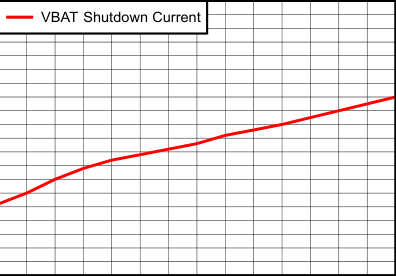

|Col1|Col2|Col3|Col4|Col5|Col6|Col7|Col8|Col9|Col10|Col11|Col12|Col13|Col14|Col15|
|---|---|---|---|---|---|---|---|---|---|---|---|---|---|---|
||V|BAT|Shut|dow|n Cu|rren|t||||||||
||||||||||||||||
||||||||||||||||
||||||||||||||||
||||||||||||||||
||||||||||||||||
||||||||||||||||
||||||||||||||||
||||||||||||||||
||||||||||||||||
||||||||||||||||
||||||||||||||||
||||||||||||||||
||||||||||||||||
||||||||||||||||
||||||||||||||||
||||||||||||||||
||||||||||||||||
||||||||||||||||
<!-- VERBATIM_TABLE_END -->

<!-- VERBATIM_TABLE_START -->
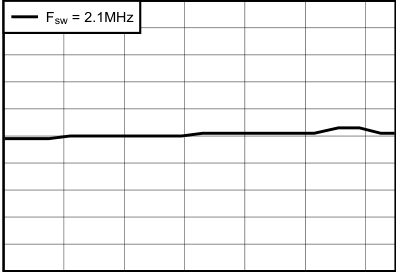

|F|= 2.1MH|z|Col4|Col5|Col6|Col7|Col8|
|---|---|---|---|---|---|---|---|
|sw||||||||
|||||||||
|||||||||
|||||||||
|||||||||
|||||||||
|||||||||
|||||||||
|||||||||
<!-- VERBATIM_TABLE_END -->

www.ti.com
TAS6754-Q1
SLOSE88A – DECEMBER 2024 – REVISED MARCH 2025
Copyright © 2025 Texas Instruments Incorporated
Submit Document Feedback
13
Product Folder Links: TAS6754-Q1

