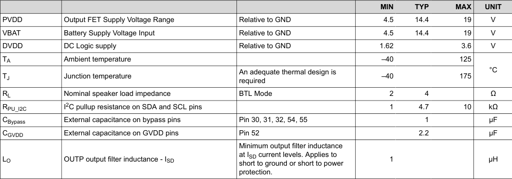
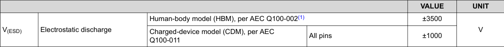
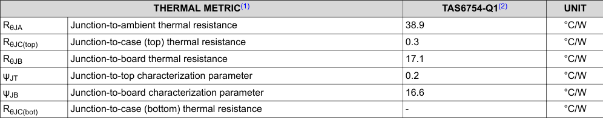

# 5.4 Thermal Information

## 5.2 Recommended Operating Conditions

- Supply voltage ranges (minimum, typical, and maximum values)
- Operating temperature range
- Input/output voltage levels
- Other critical operating parameters necessary for proper device functionality

The table provides the electrical boundaries within which the device is guaranteed to operate correctly according to specification.

<!-- VERBATIM_TABLE_START -->

|Col1|Col2|Col3|MIN|TYP|MAX|UNIT|
|---|---|---|---|---|---|---|
|PVDD|Output FET Supply Voltage Range|Relative to GND|4.5 14.4 19|||V|
|VBAT|Battery Supply Voltage Input|Relative to GND|4.5 14.4 19|||V|
|DVDD|DC Logic supply|Relative to GND|1.62 3.6|||V|
|TA|Ambient temperature||–40 125|||°C|
|TJ|Junction temperature|An adequate thermal design is required|–40 175||||
|RL|Nominal speaker load impedance|BTL Mode|2 4|||Ω|
|RPU_I2C|I2C pullup resistance on SDA and SCL pins||1 4.7 10|||kΩ|
|CBypass|External capacitance on bypass pins|Pin 30, 31, 32, 54, 55|1|||µF|
|CGVDD|External capacitance on GVDD pins|Pin 52|2.2|||µF|
|LO|OUTP output filter inductance - ISD|Minimum output filter inductance at ISD current levels. Applies to short to ground or short to power protection.|1|||µH|
<!-- VERBATIM_TABLE_END -->

---

## 5.3 ESD Ratings

- ESD test models (e.g., Human Body Model (HBM), Charged Device Model (CDM))
- ESD withstand voltage levels for different pin configurations
- Test conditions and standards compliance

The ESD ratings indicate the device's robustness against electrostatic discharge events during handling and assembly.

<!-- VERBATIM_TABLE_START -->

|5.3 ESD Ratings|Col2|Col3|Col4|Col5|Col6|
|---|---|---|---|---|---|
|||||VALUE|UNIT|
|V(ESD)|Electrostatic discharge|Human-body model (HBM), per AEC Q100-002(1)||±3500|V|
|||Charged-device model (CDM), per AEC Q100-011|All pins|±1000||
<!-- VERBATIM_TABLE_END -->

(1) AEC Q100-002 indicates that HBM stressing shall be in accordance with the ANSI/ESDA/JEDEC JS-001 specification.

---

## 5.4 Thermal Information

- Thermal resistance values (θJA, θJC, θJB) in °C/W
- Package thermal performance metrics
- Test board and mounting conditions
- Heat dissipation characteristics

These thermal metrics are essential for proper thermal design and ensuring the device operates within safe junction temperature limits during application use.

<!-- VERBATIM_TABLE_START -->

|5.4 Thermal Information|Col2|Col3|Col4|
|---|---|---|---|
|THERMAL METRIC(1)||TAS6754-Q1(2)|UNIT|
|R θJA|Junction-to-ambient thermal resistance|38.9|°C/W|
|R θJC(top)|Junction-to-case (top) thermal resistance|0.3|°C/W|
|R θJB|Junction-to-board thermal resistance|17.1|°C/W|
|ψ JT|Junction-to-top characterization parameter|0.2|°C/W|
|ψ JB|Junction-to-board characterization parameter|16.6|°C/W|
|R θJC(bot)|Junction-to-case (bottom) thermal resistance|-|°C/W|
<!-- VERBATIM_TABLE_END -->

(1) For more information about traditional and new thermal metrics, see the Semiconductor and IC Package Thermal Metrics application report.

(2) JEDEC Standard, 4-Layer PCB.

---

**Document Information:**
- Device: TAS6754-Q1
- Document: SLOSE88A – DECEMBER 2024 – REVISED MARCH 2025
- Copyright © 2025 Texas Instruments Incorporated