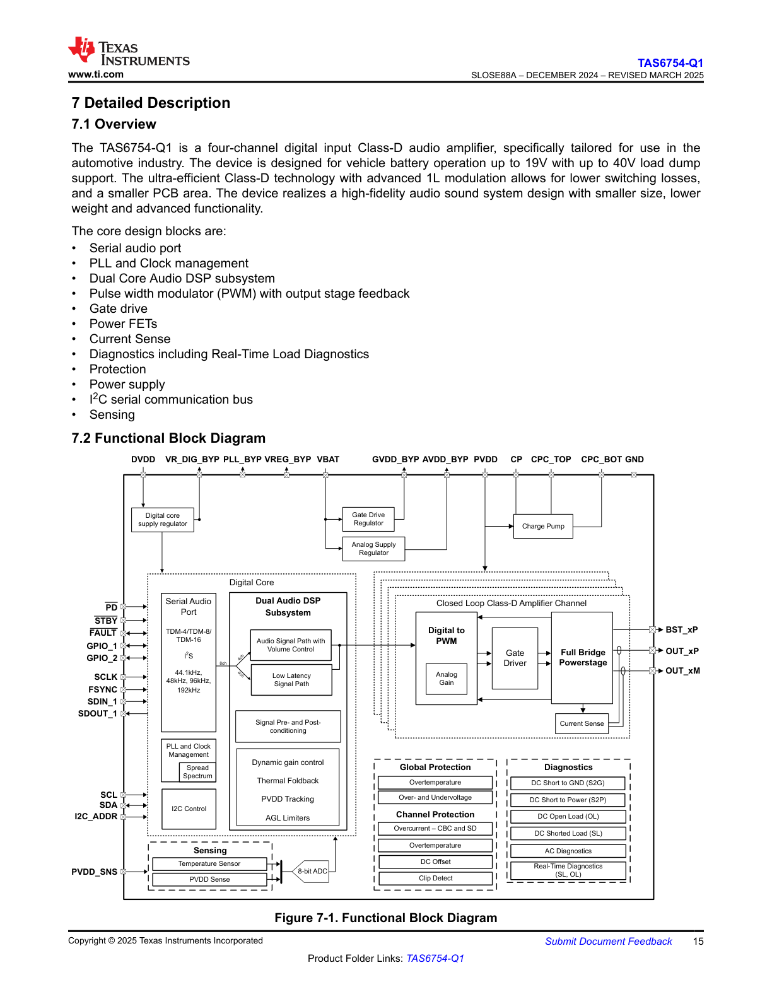

# 7.1 Overview

**Figure 7-1: System Architecture Diagram**

The diagram illustrates the overall system architecture with the following key components and connections:

* **Main Processing Block (Center)**: The central processor/controller unit that coordinates all system operations
* **Memory Subsystem (Top)**: Connected to the main processor via a high-speed bus interface, showing the memory hierarchy
* **Input/Output Interfaces (Left and Right)**: Multiple I/O channels providing external connectivity
  * Left side shows serial communication interfaces
  * Right side shows parallel data interfaces
* **Peripheral Controllers (Bottom)**: Various peripheral control blocks connected through a shared bus architecture
* **Clock and Control Signals**: Distribution network shown connecting all major functional blocks
* **Data Flow**: Bidirectional arrows indicate data paths between components, with wider arrows representing higher bandwidth connections

The architecture demonstrates a typical embedded system design with centralized processing, distributed I/O, and hierarchical memory organization. All components are interconnected through a common system bus infrastructure that enables efficient data transfer and control signaling.