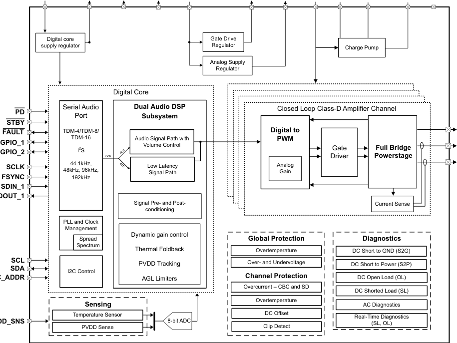
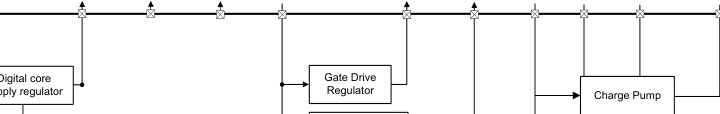
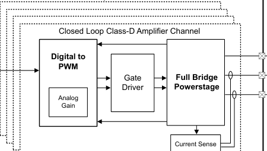

# 7.2 Functional Block Diagram

<!-- VERBATIM_TABLE_START -->

|PVDD GND DVDD VREG_BYP GVDD_BYP VBAT AVDD_BYP VR_DIG_BYP PLL_BYP CP CPC_TOP CPC_BOT|Col2|
|---|---|
|Digital core Gate Drive supply regulator Regulator Charge Pump Analog Supply Regulator Digital Core Serial Audio Dual Audio DSP Closed Loop Class-D Amplifier Channel PD Port Subsystem STBY FAULT TDM-4/TDM-8/ Digital to TDM-16 Audio Signal Path with PWM GPIO_1 GPIO_2 I2S Volume Control Gate Full Bridge 4ch 8ch Driver Powerstage SCLK 44.1kHz, Low Latency Analog 4ch 48kHz, 96kHz, Signal Path Gain FSYNC 192kHz SDIN_1 OUT_1 Signal Pre- and Post- Current Sense conditioning PLL and Clock Management Dynamic gain control Spread Global Protection Diagnostics Spectrum Thermal Foldback Overtemperature DC Short to GND (S2G) SCL PVDD Tracking Over- and Undervoltage DC Short to Power (S2P) SDA I2C Control _ADDR AGL Limiters Channel Protection DC Open Load (OL) Overcurrent – CBC and SD DC Shorted Load (SL) Overtemperature Sensing AC Diagnostics Temperature Sensor DC Offset Real-Time Diagnostics D_SNS PVDD Sense 8-bit ADC Clip Detect (SL, OL)||
||Digital core Gate Drive supply regulator Regulator Charge Pump Analog Supply Regulator Digital Core Serial Audio Dual Audio DSP Closed Loop Class-D Amplifier Channel Port Subsystem TDM-4/TDM-8/ Digital to TDM-16 Audio Signal Path with PWM I2S Volume Control Gate Full Bridge 4ch 8ch Driver Powerstage 44.1kHz, Low Latency Analog 4ch 48kHz, 96kHz, Signal Path Gain 192kHz Signal Pre- and Post- Current Sense conditioning PLL and Clock Management Dynamic gain control Spread Global Protection Diagnostics Spectrum Thermal Foldback Overtemperature DC Short to GND (S2G) PVDD Tracking Over- and Undervoltage DC Short to Power (S2P) I2C Control AGL Limiters Channel Protection DC Open Load (OL) Overcurrent – CBC and SD DC Shorted Load (SL) Overtemperature Sensing AC Diagnostics Temperature Sensor DC Offset Real-Time Diagnostics PVDD Sense 8-bit ADC Clip Detect (SL, OL)|
|||
|||
|FAULT GPIO_1 GPIO_2 SCLK FSYNC SDIN_1 OUT_1 SCL SDA _ADDR D_SNS||
|||
|||
|||
|||
<!-- VERBATIM_TABLE_END -->

<!-- VERBATIM_TABLE_START -->

|Col1|Col2|Col3|Col4|Col5|Col6|Col7|Col8|Col9|Col10|
|---|---|---|---|---|---|---|---|---|---|
|||||||||||
|||||||||Charge Pump||
<!-- VERBATIM_TABLE_END -->

<!-- VERBATIM_TABLE_START -->

|Closed Loop Class-D Amplifier Channel Digital to PWM Gate Full Bridge Driver Powerstage Analog Gain|Col2|Col3|Col4|Col5|Col6|Col7|Col8|Col9|Col10|
|---|---|---|---|---|---|---|---|---|---|
||Closed Loop Class-D Amplifier Channel Digital to PWM Gate Full Bridge Driver Powerstage Analog Gain|||||||||
|||Closed Loop Class-D Amplifier Channel Digital to PWM Gate Full Bridge Driver Powerstage Analog Gain||||||||
||||Closed Loop Class-D Amplifier Channel Digital to PWM Gate Full Bridge Driver Powerstage Analog Gain|||||||
|||||Digital to PWM Analog Gain||Full Bridge Powerstage||||
||||||Gate Driver|||||
|||||||||||
|||||||||||
|||||||||||
|||||||Current Sense||||
<!-- VERBATIM_TABLE_END -->

**Figure 7-1. Functional Block Diagram**

The functional block diagram illustrates the complete system architecture of the TAS6754-Q1 four-channel Class-D audio amplifier. The diagram shows the following major subsystems and signal flow:

## Power Supply and Regulation

At the top of the diagram, the power input pins are shown:
- **PVDD, VBAT** - Main power inputs
- **DVDD, VR_DIG_BYP, PLL_BYP** - Digital supply and bypass pins
- **VREG_BYP** - Voltage regulator bypass
- **GVDD_BYP, AVDD_BYP** - Gate drive and analog supply bypass pins
- **CP, CPC_TOP, CPC_BOT** - Charge pump connections
- **GND** - Ground reference

The power management section includes:
- Digital core supply regulator
- Gate Drive Regulator
- Analog Supply Regulator
- Charge Pump

## Digital Core

The central Digital Core block contains several key subsystems:

### Serial Audio Port
- Interfaces: **TDM-4/TDM-16** protocols
- Input signals: **PD, STBY, FAULT, GPIO_1, GPIO_2, SCI, FSYNC, SDIN, SDOUT_1**
- Clock rates: 44.1kHz, 48kHz, 96kHz, 192kHz

### Dual Audio DSP Subsystem
- **Audio Signal Path with Volume Control**
- **Low Latency Signal Path**
- **Signal Pre- and Post-conditioning**
- **Dynamic gain control**
- **Thermal Foldback**
- **PVDD Tracking**
- **AGL Limiters**

### PLL and Clock Management
- **Spread Spectrum** support
- **I2C Control** interface

### I²C Interface
- **SCL, SDA, I2C_ADDR** - I²C communication bus pins for device configuration and control

## Sensing
- **Temperature Sensor** - Monitors device temperature
- **PVDD Sense** - Monitors power supply voltage via **PVDD_SNS** pin
- Connected to **6-bit ADC** for analog-to-digital conversion

## Closed-Loop Class-D Amplifier Channel

The diagram shows the complete signal chain for each amplifier channel (replicated four times):

1. **Digital to PWM** - Converts digital audio to pulse-width modulated signals
2. **Analog Gain** - Adjustable gain stage
3. **Gate Driver** - Drives the power stage MOSFETs
4. **Full Bridge Powerstage** - Output power transistors
5. **Current Sense** - Monitors output current for feedback and diagnostics

### Output Pins (per channel)
- **BST_xP** - Bootstrap supply for high-side gate driver
- **OUT_xP** - Positive output terminal
- **OUT_xM** - Negative (inverted) output terminal

## Global Protection

The Global Protection block monitors and responds to fault conditions:
- **Overtemperature** - Thermal shutdown protection
- **Over- and Undervoltage** - Supply voltage monitoring
- **Channel Protection**
  - Overcurrent – CBC and SD (Cycle-by-Cycle and Shutdown)
  - Overtemperature
  - DC Offset detection
  - Clip Detect

## Diagnostics

The Diagnostics block provides comprehensive system monitoring:
- **DC Short to GND (S2G)** - Detects short circuit to ground
- **DC Short to Power (S2P)** - Detects short circuit to power supply
- **DC Open Load (OL)** - Detects disconnected load
- **DC Shorted Load (SL)** - Detects shorted load condition
- **AC Diagnostics** - Dynamic load monitoring
- **Real-Time Diagnostics (SL, OL)** - Continuous load fault detection during operation

The diagram uses dashed lines to separate the different functional domains and solid lines to show signal and power connections between blocks.