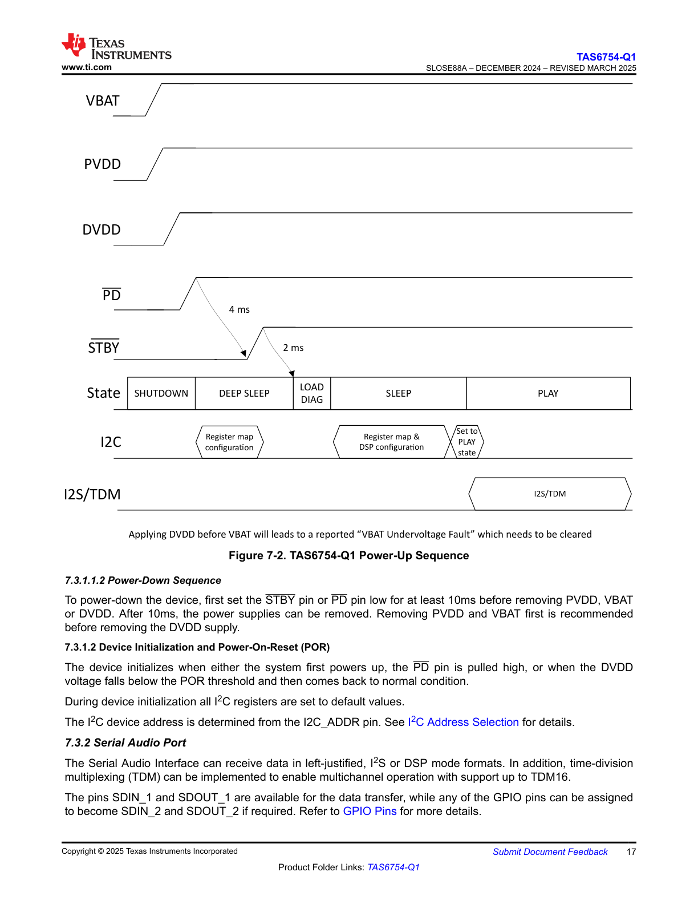

# 7.3.1.2 Device Initialization and Power-On-Reset (POR)

**Figure Description: Device Initialization and Power-On-Reset (POR) Flow Diagram**

This diagram illustrates the complete power-on-reset and device initialization sequence. The flowchart shows the following key stages and decision points:

* **Start Point:** "Power Applied" at the top of the diagram
* **POR Circuitry:** Initial power-on-reset detection and voltage monitoring
* **VDD Rising:** Detection of supply voltage ramping up
* **VDD > VPOR Threshold:** Decision point checking if supply voltage exceeds the POR threshold voltage
* **Internal Reset Active:** Device held in reset state during voltage stabilization
* **OSC Startup:** Oscillator initialization and stabilization period
* **Configuration Load:** Loading of device configuration from non-volatile memory or external pins
* **Self-Test/Calibration:** Internal diagnostics and calibration routines execution
* **Register Initialization:** Setting all control and status registers to their default power-on values
* **Ready State:** Device enters normal operational mode
* **Interrupt/Flag Set:** Optional notification to system that initialization is complete

The flow diagram uses standard flowchart symbols:
- Rounded rectangles for start/end states
- Rectangles for process steps
- Diamonds for decision points
- Arrows indicating the sequence and flow direction

The diagram emphasizes the sequential nature of the initialization process and the critical voltage threshold check that gates the entire initialization sequence.