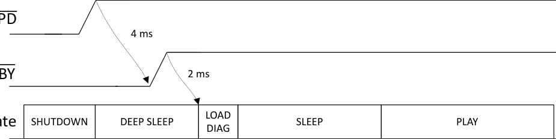

# 7.3.2 Serial Audio Port

The Serial Audio Interface can receive data in left-justified, I2S or DSP mode formats. In addition, time-division multiplexing (TDM) can be implemented to enable multichannel operation with support up to TDM16.

The pins SDIN_1 and SDOUT_1 are available for the data transfer, while any of the GPIO pins can be assigned to become SDIN_2 and SDOUT_2 if required. Refer to GPIO Pins for more details.

---

## Additional Context from Page 17

<!-- VERBATIM_TABLE_START -->

|PD 4 ms BY 2 ms LOAD te SHUTDOWN DEEP SLEEP SLEEP PLAY DIAG|Col2|Col3|Col4|Col5|Col6|
|---|---|---|---|---|---|
||HUTDOWN|DEEP SLEEP|LOAD DIAG|SLEEP|PLAY|
<!-- VERBATIM_TABLE_END -->

**Figure 7-2. TAS6754-Q1 Power-Up Sequence**

This timing diagram illustrates the power-up sequence for the TAS6754-Q1 device, showing the relationships between power supply rails, control pins, device states, and communication interfaces:

* **Power Supply Rails (top to bottom):**
  - **VBAT**: Battery voltage supply, first to be applied
  - **PVDD**: Power supply voltage, applied after VBAT
  - **DVDD**: Digital supply voltage, applied after PVDD

* **Control Pins:**
  - **PD (Power Down)**: Shows rising edge with a 4 ms timing marker
  - **STBY (Standby)**: Shows rising edge with a 2 ms timing marker after PD

* **Device State Progression:**
  The device transitions through multiple states shown as labeled boxes:
  - **SHUTDOWN** → **DEEP SLEEP** → **LOAD DIAG** → **SLEEP** → **PLAY**

* **Communication Interfaces:**
  - **I2C**: Shows two configuration phases:
    - "Register map configuration" during DEEP SLEEP/LOAD DIAG states
    - "Register map & DSP configuration" followed by "Set to PLAY state" during SLEEP state
  - **I2S/TDM**: Active during the PLAY state

* **Important Note:** Applying DVDD before VBAT will lead to a reported "VBAT Undervoltage Fault" which needs to be cleared

### 7.3.1.1.2 Power-Down Sequence

To power-down the device, first set the STBY pin or PD pin low for at least 10ms before removing PVDD, VBAT or DVDD. After 10ms, the power supplies can be removed. Removing PVDD and VBAT first is recommended before removing the DVDD supply.

### 7.3.1.2 Device Initialization and Power-On-Reset (POR)

The device initializes when either the system first powers up, the PD pin is pulled high, or when the DVDD voltage falls below the POR threshold and then comes back to normal condition.

During device initialization all I2C registers are set to default values.

The I2C device address is determined from the I2C_ADDR pin. See I2C Address Selection for details.