# 7.3.2.2 I2S Mode

I2S mode uses the FSYNC pin to define when the data is being transmitted for the left channel and when the data is being transmitted for the right channel. In I2S mode, the MSB of the left channel is valid on the second rising edge of the serial clock (SCLK) after the falling edge of the audio frame clock (FSYNC). Similarly the MSB of the right channel is valid on the second rising edge of SCLK after the rising edge of FSYNC. A channel offset can be configured and is identical for across channels.

## 7.3.2.1 Left-Justified Timing

Left-Justified timing uses the FSYNC pin to define when the data is being transmitted for the left channel or the right channel. The MSB of the left channel is valid on the rising edge of the serial clock (SCLK) following the rising edge of the audio frame clock (FSYNC). Similarly, the MSB of the right channel is valid on the rising edge of SCLK clock following the falling edge of FSYNC. A channel offset can be configured and is identical across all channels.

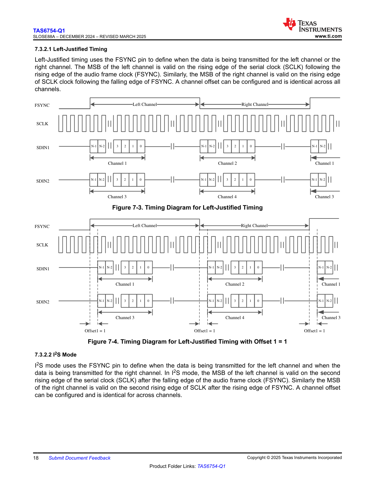

**Figure 7-3. Timing Diagram for Left-Justified Timing**

This timing diagram shows the Left-Justified timing mode with the following key signals:

- **FSYNC**: The frame synchronization signal that delineates the left and right channels. The signal is high during the left channel period and low during the right channel period.
- **SCLK**: The serial clock signal that provides timing for data transmission, showing multiple clock pulses per channel period.
- **SDIN1**: Serial data input 1, showing data transmission for Channel 1 and Channel 2. The data format shows bits labeled as N-1, N-2, followed by bits 3, 2, 1, 0, representing the MSB to LSB transmission.
- **SDIN2**: Serial data input 2, showing data transmission for Channel 3 and Channel 4 with the same bit labeling scheme.

The diagram illustrates that:
- Data transmission begins immediately on the rising edge of SCLK following the FSYNC transition
- Each channel transmits its complete data word before the next channel begins
- Channel 1 data appears during the left channel period on SDIN1
- Channel 2 data appears during the right channel period on SDIN1
- Channel 3 and Channel 4 follow the same pattern on SDIN2

<!-- VERBATIM_TABLE_START -->

|s.|Col2|Col3|Col4|Col5|Col6|
|---|---|---|---|---|---|
||LLeefftt CChhaannnneell|RRiigghhtt CChhaannnneell||||
|||||||
||||RRiigghhtt CChhaannnneell|||
<!-- VERBATIM_TABLE_END -->

<!-- VERBATIM_TABLE_START -->
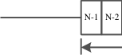

|Col1|N-1|N-2|
|---|---|---|
||||
<!-- VERBATIM_TABLE_END -->

<!-- VERBATIM_TABLE_START -->
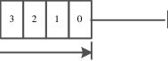

|3|2|1|0|Col5|
|---|---|---|---|---|
||||||
<!-- VERBATIM_TABLE_END -->

<!-- VERBATIM_TABLE_START -->
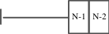

|Col1|N-1|N-2|
|---|---|---|
||||
<!-- VERBATIM_TABLE_END -->

<!-- VERBATIM_TABLE_START -->
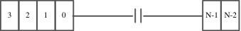

|3|2|1|0|Col5|Col6|N-1 N-2|
|---|---|---|---|---|---|---|
<!-- VERBATIM_TABLE_END -->

<!-- VERBATIM_TABLE_START -->
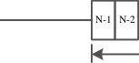

|Col1|N-1|N-2|
|---|---|---|
||||
<!-- VERBATIM_TABLE_END -->

<!-- VERBATIM_TABLE_START -->
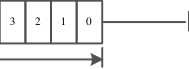

|3|2|1|0|Col5|
|---|---|---|---|---|
||||||
<!-- VERBATIM_TABLE_END -->

<!-- VERBATIM_TABLE_START -->
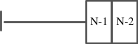

|Col1|N-1|N-2|
|---|---|---|
||||
<!-- VERBATIM_TABLE_END -->

<!-- VERBATIM_TABLE_START -->
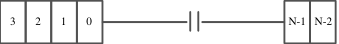

|3|2|1|0|Col5|Col6|N-1 N-2|
|---|---|---|---|---|---|---|
<!-- VERBATIM_TABLE_END -->

**Figure 7-4. Timing Diagram for Left-Justified Timing with Offset 1 = 1**

This timing diagram shows the Left-Justified timing mode with a channel offset of 1 clock cycle:

- **FSYNC**: Frame synchronization signal marking left and right channel boundaries
- **SCLK**: Serial clock with the same clock rate as the standard Left-Justified mode
- **SDIN1** and **SDIN2**: Serial data inputs showing delayed data transmission

The key difference from Figure 7-3 is the introduction of Offset1 = 1:
- There is a one SCLK cycle delay between the FSYNC edge and the start of data transmission
- This offset is indicated by the "Offset1 = 1" annotations shown at three points in the diagram
- The data format (N-1, N-2, 3, 2, 1, 0) remains the same for all channels
- The offset is applied consistently across all channels (Channel 1, 2, 3, and 4)
- This demonstrates the configurable channel offset capability mentioned in the text

<!-- VERBATIM_TABLE_START -->
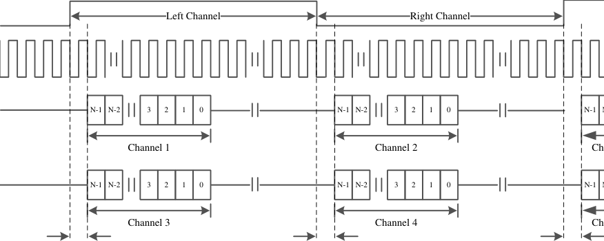

|Col1|Left Channel N-1 N-2 3 2 1 0 Channel 1 N-1 N-2 3 2 1 0 Channel 3|Right Channel|Col4|Col5|Col6|N-1 Ch N-1 Ch|
|---|---|---|---|---|---|---|
||||||||
|||||Right Channel|||
||||N-1 N-2 3 2 1 0 Channel 2 N-1 N-2 3 2 1 0 Channel 4||||
||||||||
||||||||
<!-- VERBATIM_TABLE_END -->

<!-- VERBATIM_TABLE_START -->
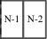

|N-1|N-2|
|---|---|
<!-- VERBATIM_TABLE_END -->

<!-- VERBATIM_TABLE_START -->
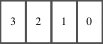

|3|2|1|0|
|---|---|---|---|
<!-- VERBATIM_TABLE_END -->

<!-- VERBATIM_TABLE_START -->
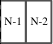

|N-1|N-2|
|---|---|
<!-- VERBATIM_TABLE_END -->

<!-- VERBATIM_TABLE_START -->
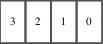

|3|2|1|0|
|---|---|---|---|
<!-- VERBATIM_TABLE_END -->

<!-- VERBATIM_TABLE_START -->
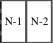

|N-1|N-2|
|---|---|
<!-- VERBATIM_TABLE_END -->

<!-- VERBATIM_TABLE_START -->
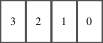

|3|2|1|0|
|---|---|---|---|
<!-- VERBATIM_TABLE_END -->

<!-- VERBATIM_TABLE_START -->
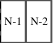

|N-1|N-2|
|---|---|
<!-- VERBATIM_TABLE_END -->

<!-- VERBATIM_TABLE_START -->
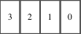

|3|2|1|0|
|---|---|---|---|
<!-- VERBATIM_TABLE_END -->