# 7.3.2.3 DSP Mode

DSP mode uses the FSYNC pin to define the start of the audio data, but not to differentiate between channels. The rising edge of the audio frame clock (FSYNC) starts the data transfer with the left channel data first and is immediately followed by the right channel data. Each data bit is valid on the rising edge of the serial clock (SCLK). A 10-bit channel offset can be configured and is identical across all channels.

**Figure 7-7. Timing Diagram for DSP Mode**

This timing diagram illustrates the DSP mode operation with the following key characteristics:

- **FSYNC Signal**: Shows the frame synchronization pulse that marks the start of audio data transfer. The rising edge initiates data transmission.
- **SCLK Signal**: Displays the serial clock with regular pulses. Data bits are valid on the rising edge of SCLK.
- **SDIN1 Signal**: Shows the serial data input for channels 1 and 2
  - Channel 1 data: Contains bits labeled N-1, N-2, followed by bits 3, 2, 1, 0
  - Channel 2 data: Immediately follows Channel 1, with bits N-1, N-2, then 3, 2, 1, 0
  - After Channel 2 completes, the next FSYNC pulse begins the next frame with Channel 1 data again
- **SDIN2 Signal**: Shows the serial data input for channels 3 and 4
  - Channel 3 data: Contains bits N-1, N-2, followed by bits 3, 2, 1, 0
  - Channel 4 data: Immediately follows Channel 3, with bits N-1, N-2, then 3, 2, 1, 0
  - After Channel 4 completes, the next frame begins with Channel 3 data again

The diagram shows that left channel data is transmitted first, immediately followed by right channel data within the same frame period.

**Figure 7-8. Timing Diagram for DSP Mode with Offset = 1**

This timing diagram shows DSP mode operation with a 1-bit channel offset:

- **FSYNC Signal**: Frame synchronization pulse identical to Figure 7-7
- **SCLK Signal**: Serial clock with regular pulses
- **SDIN1 Signal**: Serial data input for channels 1 and 2 with offset
  - A 1-bit offset delay (indicated by "Offset1 = 1") occurs after the FSYNC rising edge before data transmission begins
  - Channel 1 data: Bits N-1, N-2, followed by 3, 2, 1, 0
  - Channel 2 data: Immediately follows Channel 1, with bits N-1, N-2, then 3, 2, 1, 0
  - The offset is shown with dashed vertical lines marking the delay point
- **SDIN2 Signal**: Serial data input for channels 3 and 4 with offset
  - Same 1-bit offset delay (indicated by "Offset1 = 1") before data begins
  - Channel 3 data: Bits N-1, N-2, followed by 3, 2, 1, 0
  - Channel 4 data: Immediately follows Channel 3, with bits N-1, N-2, then 3, 2, 1, 0

The key difference from Figure 7-7 is the configurable offset that delays the start of data transmission by 1 SCLK cycle after the FSYNC rising edge. This offset is identical across all channels as noted in the description.

---

## Verbatim tables

<!-- VERBATIM_TABLE_START -->

|Col1|N-1|N-2|
|---|---|---|
||||
<!-- VERBATIM_TABLE_END -->

<!-- VERBATIM_TABLE_START -->
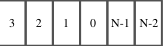

|3|2|1|0|N-1|N-2|
|---|---|---|---|---|---|
<!-- VERBATIM_TABLE_END -->

<!-- VERBATIM_TABLE_START -->
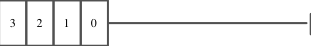

|3|2|1|0|Col5|
|---|---|---|---|---|
||||||
<!-- VERBATIM_TABLE_END -->

<!-- VERBATIM_TABLE_START -->
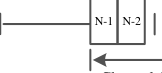

|Col1|N-1 N-2|
|---|---|
|||
<!-- VERBATIM_TABLE_END -->

<!-- VERBATIM_TABLE_START -->

|Col1|Col2|
|---|---|
<!-- VERBATIM_TABLE_END -->

<!-- VERBATIM_TABLE_START -->
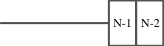

|Col1|N-1|N-2|
|---|---|---|
||||
<!-- VERBATIM_TABLE_END -->

<!-- VERBATIM_TABLE_START -->
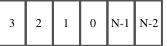

|3|2|1|0|N-1|N-2|
|---|---|---|---|---|---|
<!-- VERBATIM_TABLE_END -->

<!-- VERBATIM_TABLE_START -->

|3|2|1|0|Col5|
|---|---|---|---|---|
||||||
<!-- VERBATIM_TABLE_END -->

<!-- VERBATIM_TABLE_START -->
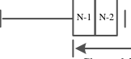

|Col1|N-1 N-2|
|---|---|
|||
<!-- VERBATIM_TABLE_END -->

<!-- VERBATIM_TABLE_START -->

|Col1|Col2|
|---|---|
<!-- VERBATIM_TABLE_END -->

<!-- VERBATIM_TABLE_START -->
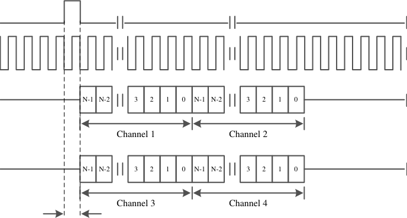

|Col1|Col2|N-1 N-2 3 2 1 0 N-1 N-2 3 2 1 0 Channel 1 Channel 2 N-1 N-2 3 2 1 0 N-1 N-2 3 2 1 0 Channel 3 Channel 4|
|---|---|---|
||||
||||
||||
<!-- VERBATIM_TABLE_END -->

<!-- VERBATIM_TABLE_START -->
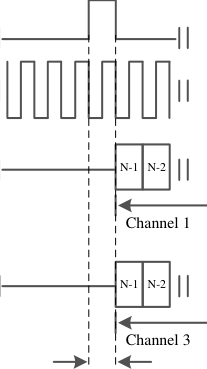

|Col1|N-1 N-2 Channel 1 N-1 N-2 Channel 3|
|---|---|
|||
|||
<!-- VERBATIM_TABLE_END -->

<!-- VERBATIM_TABLE_START -->
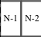

|N-1|N-2|
|---|---|
<!-- VERBATIM_TABLE_END -->

<!-- VERBATIM_TABLE_START -->
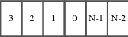

|3|2|1|0|N-1|N-2|
|---|---|---|---|---|---|
<!-- VERBATIM_TABLE_END -->

<!-- VERBATIM_TABLE_START -->
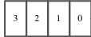

|3|2|1|0|
|---|---|---|---|
<!-- VERBATIM_TABLE_END -->

<!-- VERBATIM_TABLE_START -->
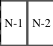

|N-1|N-2|
|---|---|
<!-- VERBATIM_TABLE_END -->

<!-- VERBATIM_TABLE_START -->
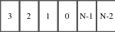

|3|2|1|0|N-1|N-2|
|---|---|---|---|---|---|
<!-- VERBATIM_TABLE_END -->

<!-- VERBATIM_TABLE_START -->
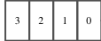

|3|2|1|0|
|---|---|---|---|
<!-- VERBATIM_TABLE_END -->
