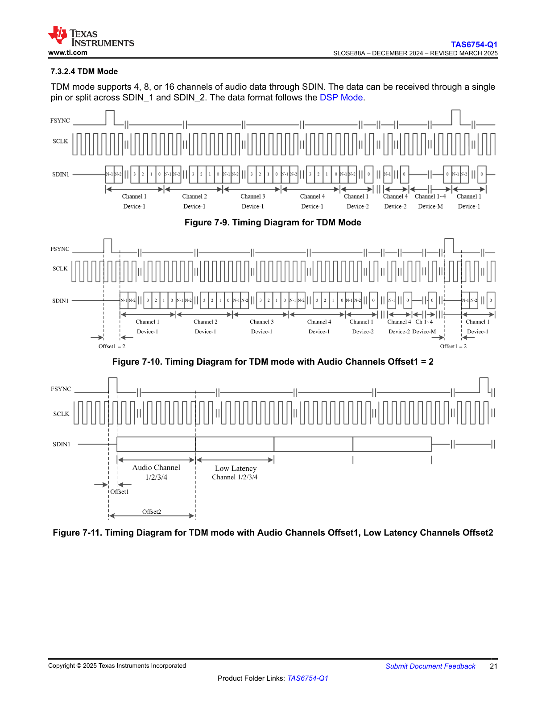
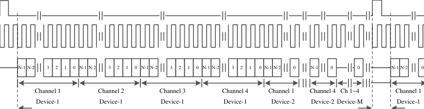
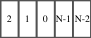
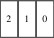
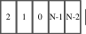
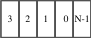

# 7.3.2.4 TDM Mode

TDM mode supports 4, 8, or 16 channels of audio data through SDIN. The data can be received through a single pin or split across SDIN_1 and SDIN_2. The data format follows the DSP Mode.

## Figure 7-9. Timing Diagram for TDM Mode

**Description:**

This diagram illustrates the timing relationships for TDM mode operation with three signal traces:

- **FSYNC (Frame Sync):** Shows the frame synchronization pulses that mark the beginning of each TDM frame. The signal pulses high at regular intervals to indicate the start of a new frame.

- **SCLK (Serial Clock):** Displays the continuous serial clock signal used to clock the data. Multiple SCLK pulses occur within each FSYNC period.

- **SDIN1 (Serial Data Input 1):** Shows the serial data stream containing multiple audio channels. The diagram indicates the following channel and device structure:
  - Channel 1 (Device-1)
  - Channel 2 (Device-1)
  - Channel 3 (Device-1)
  - Channel 4 (Device-1)
  - Channel 1 (Device-2)
  - Channel 4 (Device-2)
  - Channel 1-4 (Device-M)
  - Channel 1 (Device-1) repeating

The data bits are shown as individual slots synchronized to SCLK, with labels indicating which channel and device each time slot represents.

## Figure 7-10. Timing Diagram for TDM mode with Audio Channels Offset1 = 2

**Description:**

This timing diagram demonstrates TDM mode operation with an offset parameter (Offset1 = 2) applied to the audio channels:

- **FSYNC:** Frame synchronization signal marking frame boundaries.

- **SCLK:** Serial clock signal providing bit timing.

- **SDIN1:** Serial data input showing the offset configuration:
  - **Offset1** is indicated at the beginning, showing a delay of 2 clock cycles before the first channel data begins
  - Channel sequence with offset:
    - Channel 1 (Device-1)
    - Channel 2 (Device-1)
    - Channel 3 (Device-1)
    - Channel 4 (Device-1)
    - Channel 1 (Device-2)
    - Channel 4 (Device-2)
    - Channel 1-4 (Device-M)
    - Channel 1 (Device-1)
  - **Offset1 = 2** is marked again at the end of the frame cycle

The offset parameter allows the data transmission to be delayed by a specified number of SCLK cycles after the FSYNC pulse, providing flexibility in system timing requirements.

## Figure 7-11. Timing Diagram for TDM mode with Audio Channels Offset1, Low Latency Channels Offset2

**Description:**

This timing diagram shows TDM mode with two different offset configurations for different channel types:

- **FSYNC:** Frame synchronization signal with extended period between pulses.

- **SCLK:** Serial clock signal providing continuous bit timing.

- **SDIN1:** Serial data input illustrating two distinct sections with different offsets:
  
  **First section (with Offset1):**
  - Audio Channel 1/2/3/4 data block
  - Preceded by Offset1 delay from FSYNC
  
  **Second section (with Offset2):**
  - Low Latency Channel 1/2/3/4 data block
  - Preceded by Offset2 delay
  
The diagram demonstrates how the TDM frame can accommodate both regular audio channels and low-latency channels with independently configurable timing offsets (Offset1 and Offset2). This allows optimization for different latency requirements within the same TDM stream. The vertical dashed lines indicate the timing relationships between the offsets and their respective data blocks.

---

## Verbatim tables

<!-- VERBATIM_TABLE_START -->

|N-1 N-2 3 2 1 0 N-1 N-2 3 2 1 0 N-1 N-2 3 2 1 0 N-1 N-2 3 2 1 0 N-1 N-2 0 N-1 0 0 Channel 1 Channel 2 Channel 3 Channel 4 Channel 1 Channel 4 Ch 1~4 Device-1 Device-1 Device-1 Device-1 Device-2 Device-2 Device-M|N-1 N-2 0 Channel 1 Device-1|
|---|---|
<!-- VERBATIM_TABLE_END -->

<!-- VERBATIM_TABLE_START -->

|2|1 0|N-1 N-2|
|---|---|---|
<!-- VERBATIM_TABLE_END -->

<!-- VERBATIM_TABLE_START -->

|2|1 0|
|---|---|
<!-- VERBATIM_TABLE_END -->

<!-- VERBATIM_TABLE_START -->

|2|1 0|N-1 N-2|
|---|---|---|
<!-- VERBATIM_TABLE_END -->

<!-- VERBATIM_TABLE_START -->

|3|2|1 0|N-1|
|---|---|---|---|
<!-- VERBATIM_TABLE_END -->
