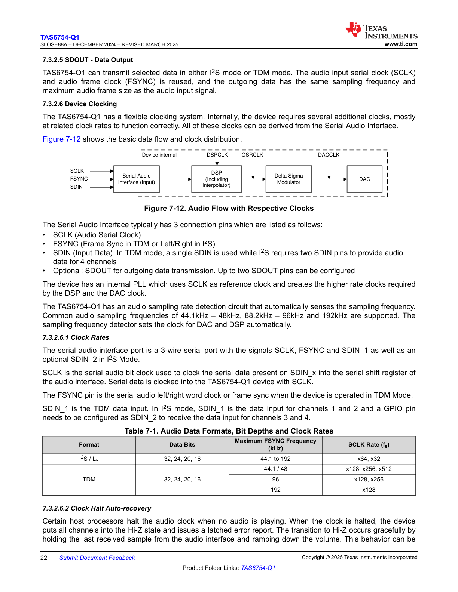

# 7.3.2.6.1 Clock Rates

**Description of Figure:**

This image appears to be a page header or section marker for section 7.3.2.6.1 titled "Clock Rates". The page contains minimal visible technical content in the extracted text, suggesting the substantive content may not have been fully captured in the OCR extraction, or the page primarily serves as a section divider/header page in the original document.

*Note: The extracted text for this page contains only page markers and no substantive technical content, tables, or code blocks.*