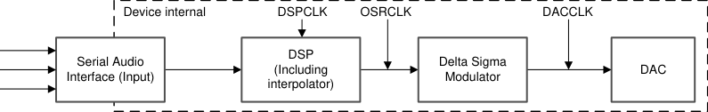
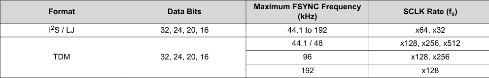

# 7.3.2.6.2 Clock Halt Auto-recovery

Certain host processors halt the audio clock when no audio is playing. When the clock is halted, the device puts all channels into the Hi-Z state and issues a latched error report. The transition to Hi-Z occurs gracefully by holding the last received sample from the audio interface and ramping down the volume. This behavior can be

---

## 7.3.2.5 SDOUT - Data Output

TAS6754-Q1 can transmit selected data in either I²S mode or TDM mode. The audio input serial clock (SCLK) and audio frame clock (FSYNC) is reused, and the outgoing data has the same sampling frequency and maximum audio frame size as the audio input signal.

## 7.3.2.6 Device Clocking

The TAS6754-Q1 has a flexible clocking system. Internally, the device requires several additional clocks, mostly at related clock rates to function correctly. All of these clocks can be derived from the Serial Audio Interface.

Figure 7-12 shows the basic data flow and clock distribution.

**Figure 7-12. Audio Flow with Respective Clocks**

This block diagram illustrates the audio signal flow and clock distribution within the TAS6754-Q1 device:

- **Inputs (left side):**
  - SCLK (Audio Serial Clock)
  - FSYNC (Frame Sync)
  - SDIN (Serial Data Input)

- **Signal Processing Chain (left to right):**
  1. **Serial Audio Interface (Input)** - Receives the three input signals
  2. **DSP (Including interpolator)** - Digital signal processing block, operates at DSPCLK
  3. **Delta Sigma Modulator** - Converts digital signal to modulated form, operates at OSRCLK
  4. **DAC** - Digital-to-Analog Converter, operates at DACCLK

- **Clock domains (shown above blocks):**
  - Device internal clocks: DSPCLK, OSRCLK, and DACCLK
  - All internal clocks are derived from the input SCLK

- The dashed box encompasses all device-internal processing stages, showing the flow from serial audio input through DSP processing to the final DAC output.

The Serial Audio Interface typically has 3 connection pins which are listed as follows:

- SCLK (Audio Serial Clock)
- FSYNC (Frame Sync in TDM or Left/Right in I²S)
- SDIN (Input Data). In TDM mode, a single SDIN is used while I²S requires two SDIN pins to provide audio data for 4 channels
- Optional: SDOUT for outgoing data transmission. Up to two SDOUT pins can be configured

The device has an internal PLL which uses SCLK as reference clock and creates the higher rate clocks required by the DSP and the DAC clock.

The TAS6754-Q1 has an audio sampling rate detection circuit that automatically senses the sampling frequency. Common audio sampling frequencies of 44.1kHz – 48kHz, 88.2kHz – 96kHz and 192kHz are supported. The sampling frequency detector sets the clock for DAC and DSP automatically.

### 7.3.2.6.1 Clock Rates

The serial audio interface port is a 3-wire serial port with the signals SCLK, FSYNC and SDIN_1 as well as an optional SDIN_2 in I²S Mode.

SCLK is the serial audio bit clock used to clock the serial data present on SDIN_x into the serial shift register of the audio interface. Serial data is clocked into the TAS6754-Q1 device with SCLK.

The FSYNC pin is the serial audio left/right word clock or frame sync when the device is operated in TDM Mode.

SDIN_1 is the TDM data input. In I²S mode, SDIN_1 is the data input for channels 1 and 2 and a GPIO pin needs to be configured as SDIN_2 to receive the data input for channels 3 and 4.

**Table 7-1. Audio Data Formats, Bit Depths and Clock Rates**

| Format | Data Bits | Maximum FSYNC Frequency (kHz) | SCLK Rate (fs) |
|--------|-----------|-------------------------------|----------------|
| I²S / LJ | 32, 24, 20, 16 | 44.1 to 192 | x64, x32 |
|  |  | 44.1 / 48 | x128, x256, x512 |
| TDM | 32, 24, 20, 16 | 96 | x128, x256 |
|  |  | 192 | x128 |

---

## Verbatim tables

<!-- VERBATIM_TABLE_START -->

|Serial Interface|Device internal DSPCLK OSRCLK DACCLK DSP Audio Delta Sigma (Including DAC (Input) Modulator interpolator)|
|---|---|
<!-- VERBATIM_TABLE_END -->

<!-- VERBATIM_TABLE_START -->

|Serial Interface|Audio (Input)|
|---|---|
<!-- VERBATIM_TABLE_END -->

<!-- VERBATIM_TABLE_START -->

|Format|Data Bits|Maximum FSYNC Frequency (kHz)|SCLK Rate (f ) s|
|---|---|---|---|
|I2S / LJ|32, 24, 20, 16|44.1 to 192|x64, x32|
|TDM|32, 24, 20, 16|44.1 / 48|x128, x256, x512|
|||96|x128, x256|
|||192|x128|
<!-- VERBATIM_TABLE_END -->
