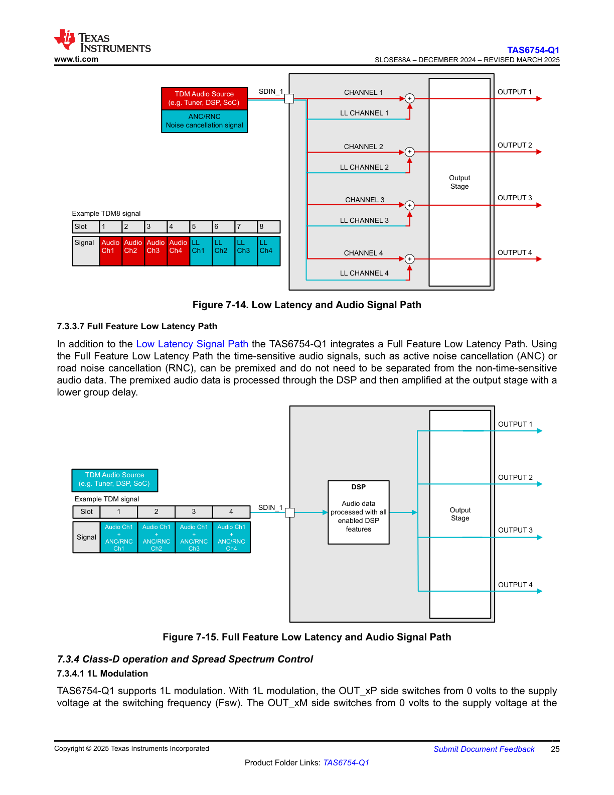
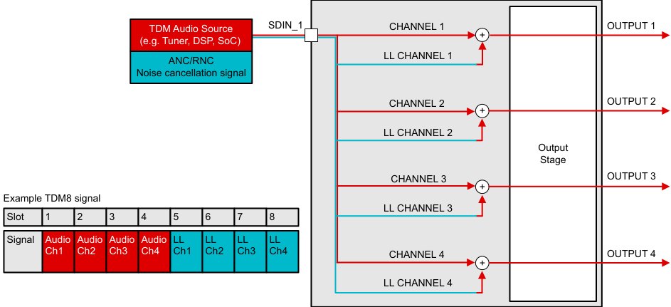
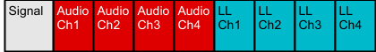
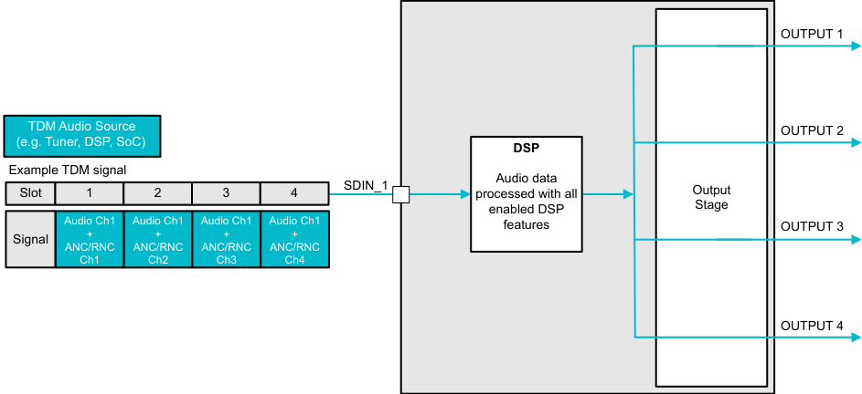
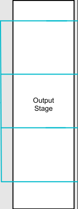
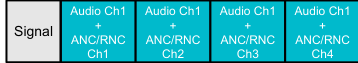

# 7.3.4.1 1L Modulation

---

---

---

---

**Figure 7-14. Low Latency and Audio Signal Path**

This diagram illustrates the Low Latency and Audio Signal Path architecture of the TAS6754-Q1:

**Input Source:**
- TDM Audio Source (e.g., Tuner, DSP, SoC) provides the main audio input
- ANC/RNC Noise cancellation signal provides time-sensitive audio

**TDM8 Signal Structure:**
The example TDM8 signal table shows:
- 8 slots numbered 1-8
- Signal allocation: Audio Ch1, Audio Ch2, Audio Ch3, Audio Ch4, LL Ch1, LL Ch2, LL Ch3, LL Ch4
- LL channels are designated for Low Latency paths

**Signal Path:**
- SDIN_1 input carries the TDM signal
- CHANNEL 1 and LL CHANNEL 1 are summed (mixer) → OUTPUT 1
- CHANNEL 2 and LL CHANNEL 2 are summed (mixer) → OUTPUT 2
- CHANNEL 3 and LL CHANNEL 3 are summed (mixer) → OUTPUT 3
- CHANNEL 4 and LL CHANNEL 4 are summed (mixer) → OUTPUT 4

**Output Stage:**
All mixed signals pass through a common Output Stage block that drives the four outputs (OUTPUT 1 through OUTPUT 4).

The architecture allows time-sensitive signals (LL channels) to be mixed with standard audio channels before amplification, enabling low-latency processing for applications like active noise cancellation.

---

## 7.3.3.7 Full Feature Low Latency Path

In addition to the Low Latency Signal Path the TAS6754-Q1 integrates a Full Feature Low Latency Path. Using the Full Feature Low Latency Path the time-sensitive audio signals, such as active noise cancellation (ANC) or road noise cancellation (RNC), can be premixed and do not need to be separated from the non-time-sensitive audio data. The premixed audio data is processed through the DSP and then amplified at the output stage with a lower group delay.

---

---

---

---

---

**Figure 7-15. Full Feature Low Latency and Audio Signal Path**

*(Note: This figure is referenced in the text but appears to be included in the same diagram image as Figure 7-14, showing the alternative Full Feature Low Latency path architecture)*

The Full Feature Low Latency path shows:

**Input Source:**
- TDM Audio Source (e.g., Tuner, DSP, SoC)

**TDM Signal Structure:**
The example TDM signal table shows:
- 4 slots numbered 1-4
- Signal allocation: Audio Ch1 + ANC/RNC Ch1, Audio Ch1 + ANC/RNC Ch2, Audio Ch1 + ANC/RNC Ch3, Audio Ch1 + ANC/RNC Ch4
- Audio and ANC/RNC signals are premixed in the TDM slots

**Signal Processing:**
- SDIN_1 input carries the premixed TDM signal
- DSP block processes "Audio data processed with all enabled DSP features"
- Output Stage amplifies the processed signals

**Outputs:**
- OUTPUT 1
- OUTPUT 2
- OUTPUT 3
- OUTPUT 4

This architecture allows time-sensitive ANC/RNC signals to be premixed with standard audio before DSP processing, providing full DSP feature access while maintaining lower group delay.

---

## 7.3.4 Class-D operation and Spread Spectrum Control

### 7.3.4.1 1L Modulation

TAS6754-Q1 supports 1L modulation. With 1L modulation, the OUT_xP side switches from 0 volts to the supply voltage at the switching frequency (Fsw). The OUT_xM side switches from 0 volts to the supply voltage at the

---

## Verbatim tables

<!-- VERBATIM_TABLE_START -->

|TDM Audio Source SDIN_1 (e.g. Tuner, DSP, SoC) ANC/RNC Noise cancellation signal Example TDM8 signal Slot 1 2 3 4 5 6 7 8 Signal Audio Audio Audio Audio LL LL LL LL Ch1 Ch2 Ch3 Ch4 Ch1 Ch2 Ch3 Ch4|CHANNEL 1 + LL CHANNEL 1 CHANNEL 2 + LL CHANNEL 2 Output Stage CHANNEL 3 + LL CHANNEL 3 CHANNEL 4 + LL CHANNEL 4|OUTPUT 1 OUTPUT 2 OUTPUT 3 OUTPUT 4|
|---|---|---|
<!-- VERBATIM_TABLE_END -->

<!-- VERBATIM_TABLE_START -->

|Col1|Col2|
|---|---|
|||
|Output Stage||
|||
|||
<!-- VERBATIM_TABLE_END -->

<!-- VERBATIM_TABLE_START -->

|Slot|1|2|3|4|5|6|7|8|
|---|---|---|---|---|---|---|---|---|
<!-- VERBATIM_TABLE_END -->

<!-- VERBATIM_TABLE_START -->

|Signal|Audio Ch1|Audio Ch2|Audio Ch3|Audio Ch4|LL Ch1|LL Ch2|LL Ch3|LL Ch4|
|---|---|---|---|---|---|---|---|---|
<!-- VERBATIM_TABLE_END -->

<!-- VERBATIM_TABLE_START -->

|TDM Audio Source (e.g. Tuner, DSP, SoC) Example TDM signal SDIN_1 Slot 1 2 3 4 Audio Ch1 Audio Ch1 Audio Ch1 Audio Ch1 Signal + + + + ANC/RNC ANC/RNC ANC/RNC ANC/RNC Ch1 Ch2 Ch3 Ch4|DSP Audio data processed with all Output enabled DSP Stage features|OUTPUT 1 OUTPUT 2 OUTPUT 3 OUTPUT 4|
|---|---|---|
<!-- VERBATIM_TABLE_END -->

<!-- VERBATIM_TABLE_START -->

|Col1|Col2|Col3|
|---|---|---|
||||
||Output Stage||
||||
||||
<!-- VERBATIM_TABLE_END -->

<!-- VERBATIM_TABLE_START -->

|Slot|1|2|3|4|
|---|---|---|---|---|
<!-- VERBATIM_TABLE_END -->

<!-- VERBATIM_TABLE_START -->

|Signa|Audio Ch1 l + ANC/RNC Ch1|Audio Ch1 + ANC/RNC Ch2|Audio Ch1 + ANC/RNC Ch3|Audio Ch1 + ANC/RNC Ch4|
|---|---|---|---|---|
<!-- VERBATIM_TABLE_END -->
