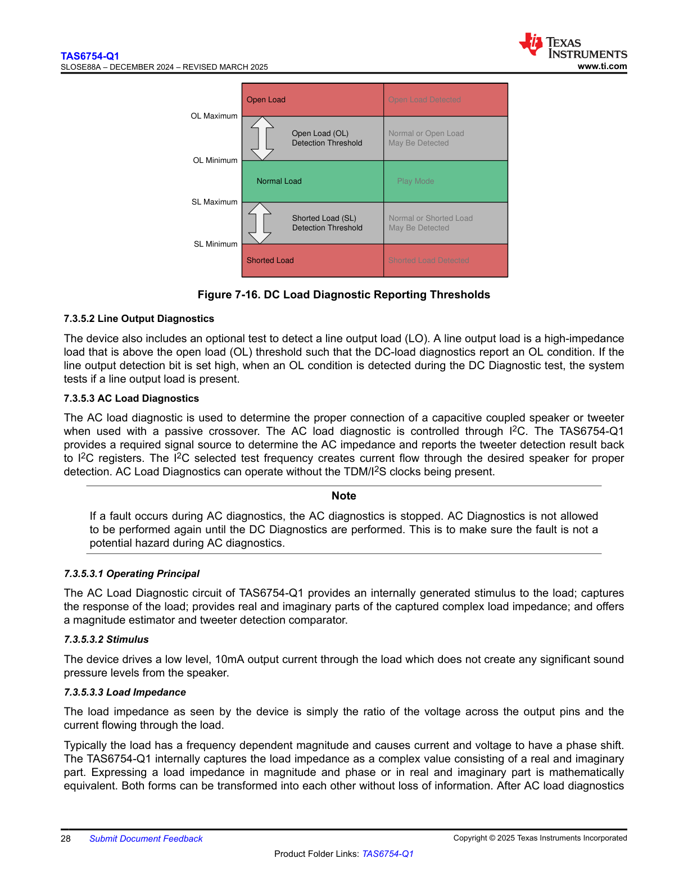
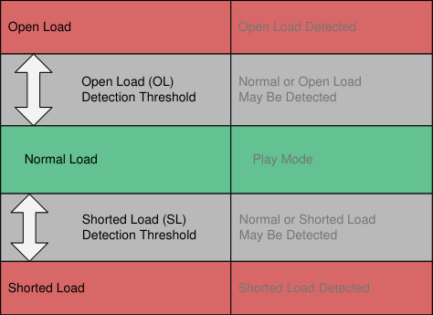

# 7.3.5.3.3 Load Impedance

The load impedance as seen by the device is simply the ratio of the voltage across the output pins and the current flowing through the load.

Typically the load has a frequency dependent magnitude and causes current and voltage to have a phase shift. The TAS6754-Q1 internally captures the load impedance as a complex value consisting of a real and imaginary part. Expressing a load impedance in magnitude and phase or in real and imaginary part is mathematically equivalent. Both forms can be transformed into each other without loss of information. After AC load diagnostics

---

## Related Sections

### 7.3.5.2 Line Output Diagnostics

The device also includes an optional test to detect a line output load (LO). A line output load is a high-impedance load that is above the open load (OL) threshold such that the DC-load diagnostics report an OL condition. If the line output detection bit is set high, when an OL condition is detected during the DC Diagnostic test, the system tests if a line output load is present.

### 7.3.5.3 AC Load Diagnostics

The AC load diagnostic is used to determine the proper connection of a capacitive coupled speaker or tweeter when used with a passive crossover. The AC load diagnostic is controlled through I2C. The TAS6754-Q1 provides a required signal source to determine the AC impedance and reports the tweeter detection result back to I2C registers. The I2C selected test frequency creates current flow through the desired speaker for proper detection. AC Load Diagnostics can operate without the TDM/I2S clocks being present.

**Note**

If a fault occurs during AC diagnostics, the AC diagnostics is stopped. AC Diagnostics is not allowed to be performed again until the DC Diagnostics are performed. This is to make sure the fault is not a potential hazard during AC diagnostics.

#### 7.3.5.3.1 Operating Principal

The AC Load Diagnostic circuit of TAS6754-Q1 provides an internally generated stimulus to the load; captures the response of the load; provides real and imaginary parts of the captured complex load impedance; and offers a magnitude estimator and tweeter detection comparator.

#### 7.3.5.3.2 Stimulus

The device drives a low level, 10mA output current through the load which does not create any significant sound pressure levels from the speaker.

---

## DC Load Diagnostic Reporting Thresholds

**Figure 7-16. DC Load Diagnostic Reporting Thresholds**

This diagram illustrates the threshold bands for DC load diagnostics on the TAS6754-Q1:

* **Open Load (OL) Detection:**
  * **Above OL Maximum:** Open Load condition - Open Load Detected (shown in red)
  * **Between OL Maximum and OL Minimum:** Open Load (OL) Detection Threshold - Normal or Open Load May Be Detected (shown in gray/white transition zone)
  
* **Normal Load Region:**
  * **Between OL Minimum and SL Maximum:** Normal Load - Play Mode (shown in green)
  
* **Shorted Load (SL) Detection:**
  * **Between SL Maximum and SL Minimum:** Shorted Load (SL) Detection Threshold - Normal or Shorted Load May Be Detected (shown in gray/white transition zone)
  * **Below SL Minimum:** Shorted Load - Shorted Load Detected (shown in red)

The diagram uses vertical arrows to indicate the threshold boundaries between different detection zones, with clear color coding (red for fault conditions, green for normal operation, and transitional zones for detection thresholds).

<!-- VERBATIM_TABLE_START -->

|Open Load|Open Load Detected|
|---|---|
|Open Load (OL) Detection Threshold|Normal or Open Load May Be Detected|
|Normal Load|Play Mode|
|Shorted Load (SL) Detection Threshold|Normal or Shorted Load May Be Detected|
|Shorted Load|Shorted Load Detected|
<!-- VERBATIM_TABLE_END -->