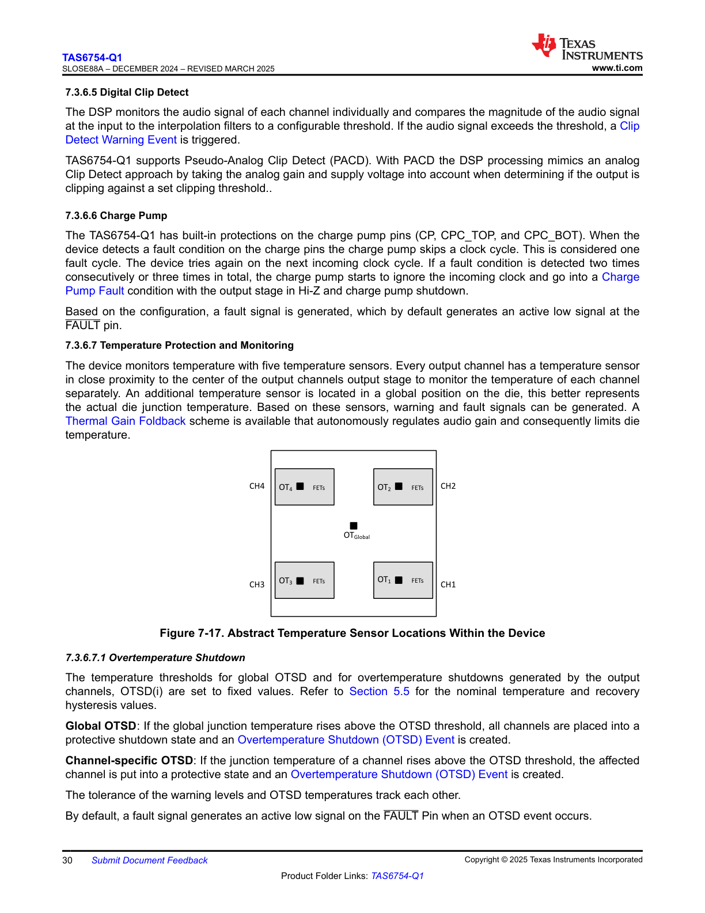

# 7.3.6.5 Digital Clip Detect

**Detailed Description of Digital Clip Detect Block Diagram:**

The diagram illustrates the Digital Clip Detect functionality with the following key components and signal flow:

* **Input Signal Path:**
  - The digital audio signal enters from the left side of the diagram
  - Signal flows through a "Digital Clip Detect" block

* **Threshold Comparison:**
  - The clip detect block compares the input signal against a programmable threshold
  - When the signal level exceeds the threshold, a clip condition is detected

* **Counter and Detection Logic:**
  - A counter tracks the number of consecutive samples that exceed the threshold
  - The counter increments for each sample above the threshold
  - The counter resets when samples fall below the threshold

* **Output Indicators:**
  - A "Clip Detect Flag" output indicates when a clip condition has been detected
  - The flag is set when the counter reaches a programmable limit
  - This flag can be used to trigger interrupts or status reporting

* **Programmable Parameters:**
  - Clip threshold level (adjustable)
  - Number of consecutive samples required to trigger clip detection (adjustable)

* **Signal Flow:**
  - The processed signal continues through the audio path
  - The clip detection operates in parallel without affecting the audio signal itself

This digital clip detection mechanism provides a configurable way to monitor signal levels and detect potential clipping conditions in the digital audio path, allowing the system to take appropriate action when signal levels approach or exceed acceptable limits.