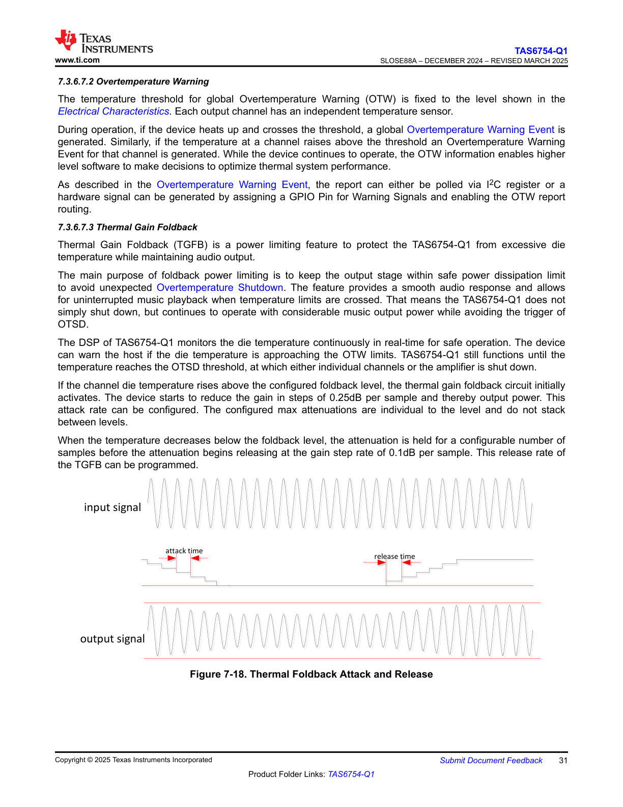

# 7.3.6.7.3 Thermal Gain Foldback

Thermal Gain Foldback (TGFB) is a power limiting feature to protect the TAS6754-Q1 from excessive die temperature while maintaining audio output.

The main purpose of foldback power limiting is to keep the output stage within safe power dissipation limit to avoid unexpected Overtemperature Shutdown. The feature provides a smooth audio response and allows for uninterrupted music playback when temperature limits are crossed. That means the TAS6754-Q1 does not simply shut down, but continues to operate with considerable music output power while avoiding the trigger of OTSD.

The DSP of TAS6754-Q1 monitors the die temperature continuously in real-time for safe operation. The device can warn the host if the die temperature is approaching the OTW limits. TAS6754-Q1 still functions until the temperature reaches the OTSD threshold, at which either individual channels or the amplifier is shut down.

If the channel die temperature rises above the configured foldback level, the thermal gain foldback circuit initially activates. The device starts to reduce the gain in steps of 0.25dB per sample and thereby output power. This attack rate can be configured. The configured max attenuations are individual to the level and do not stack between levels.

When the temperature decreases below the foldback level, the attenuation is held for a configurable number of samples before the attenuation begins releasing at the gain step rate of 0.1dB per sample. This release rate of the TGFB can be programmed.

**Figure 7-18. Thermal Foldback Attack and Release**

This diagram illustrates the behavior of the Thermal Gain Foldback feature during operation:

- **Input Signal (Top)**: Shows a continuous sinusoidal waveform representing the audio input signal at constant amplitude.

- **Output Signal (Bottom)**: Shows the corresponding output waveform that is affected by the TGFB mechanism. The output amplitude follows the input but is modulated by the gain control.

- **Middle Trace (Gain Control)**: Shows the attenuation profile applied to the signal:
  - **Attack Time**: When temperature rises above the foldback threshold, the gain is reduced in discrete steps (stepped down pattern shown on the left side, marked with red "attack time" indicator). The gain decreases at 0.25dB per sample (configurable rate).
  - **Hold Period**: After the temperature decreases below the foldback level, the attenuation is held constant for a configurable number of samples (flat portion in the middle).
  - **Release Time**: After the hold period, the gain is gradually restored in steps (stepped up pattern shown on the right side, marked with red "release time" indicator). The gain increases at 0.1dB per sample (programmable rate).

The diagram demonstrates how the output signal amplitude is smoothly reduced during thermal stress and then gradually restored, allowing continuous audio playback while protecting the device from overtemperature shutdown.