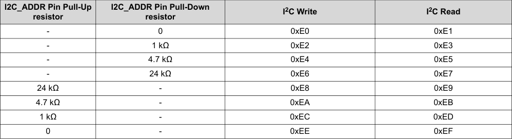

# 7.5 Programming

## 7.5.1 I2C Serial Communication Bus

The device communicates with the system processor through the I2C serial communication bus as an I2C target-only device and supports 100kHz and 400kHz data transfer rates for random and sequential write and read operation. The processor can poll the device through I2C to determine the operating status, configure settings, or run diagnostics.

The TAS6754-Q1 register map and DSP memory span multiple pages and books. The user changes from page to page before writing individual registers or DSP memory. Changing from page to page is accomplished via register 0 on each page. This register value selects the page address, from 0 to 255. All registers listed in the TAS6754-Q1 Data sheet belong to Page 0.

For a complete list and description of all I2C controls, see the Register Maps section.

## 7.5.2 I2C Address Selection

TAS6754-Q1 supports eight I2C addresses, thus up to eight devices can be used together in a system with no additional bus switching hardware.

The pull-up or pull-down resistor connected between the device I2C_ADDR pin and the DVDD-rail (pull-up) or GND (pull-down) determines the I2C address during power up. The I2C address latches after a POR event and is locked until the next POR event.

### Table 7-3. I2C Addresses

The table shows the I2C address configuration based on pull-up or pull-down resistor values connected to the I2C_ADDR pin:

- **I2C_ADDR Pin Pull-Up resistor** (left column): Options include 24 kΩ, 4.7 kΩ, 1 kΩ, or 0 (short to DVDD)
- **I2C_ADDR Pin Pull-Down resistor** (second column): Options include 0 (short to GND), 1 kΩ, 4.7 kΩ, or 24 kΩ
- **I2C Write** (third column): Shows write addresses from 0xE0 to 0xEE (even addresses)
- **I2C Read** (fourth column): Shows read addresses from 0xE1 to 0xEF (odd addresses)

The eight possible configurations allow up to eight devices to be addressed independently on the same I2C bus.

<!-- VERBATIM_TABLE_START -->

|Col1|Table|7-3. I2C Addresses|Col4|
|---|---|---|---|
|I2C_ADDR Pin Pull-Up resistor|I2C_ADDR Pin Pull-Down resistor|I2C Write|I2C Read|
|-|0|0xE0|0xE1|
|-|1 kΩ|0xE2|0xE3|
|-|4.7 kΩ|0xE4|0xE5|
|-|24 kΩ|0xE6|0xE7|
|24 kΩ|-|0xE8|0xE9|
|4.7 kΩ|-|0xEA|0xEB|
|1 kΩ|-|0xEC|0xED|
|0|-|0xEE|0xEF|
<!-- VERBATIM_TABLE_END -->

## 7.5.3 I2C Bus Protocol

The I2C bus uses two signals, SDA (data) and SCL (clock), to communicate between integrated circuits in a system. Data is transferred on the bus serially, one bit at a time. The address and data are transferred in byte (8-bit) format with the most-significant bit (MSB) transferred first. In addition, each byte transferred on the bus is acknowledged by the receiving device with an acknowledge bit. Each transfer operation begins with the controller device driving a start condition on the bus and ends with the controller device driving a stop condition on the bus. The bus uses transitions on the data terminal (SDA) while the clock is HIGH to indicate a start and stop conditions. A HIGH-to-LOW transition on SDA indicates a start, and a LOW-to-HIGH transition indicates a stop. Normal data bit transitions must occur within the low time of the clock period. The controller generates the 7-bit target address and the read/write (R/W) bit to open communication with another device and then wait for an acknowledge condition. The device holds SDA LOW during the acknowledge-clock period to indicate an acknowledgment. When this occurs, the controller transmits the next byte of the sequence. Each device is addressed by a unique 7-bit target address plus a R/W bit (1 byte). All compatible devices share the same