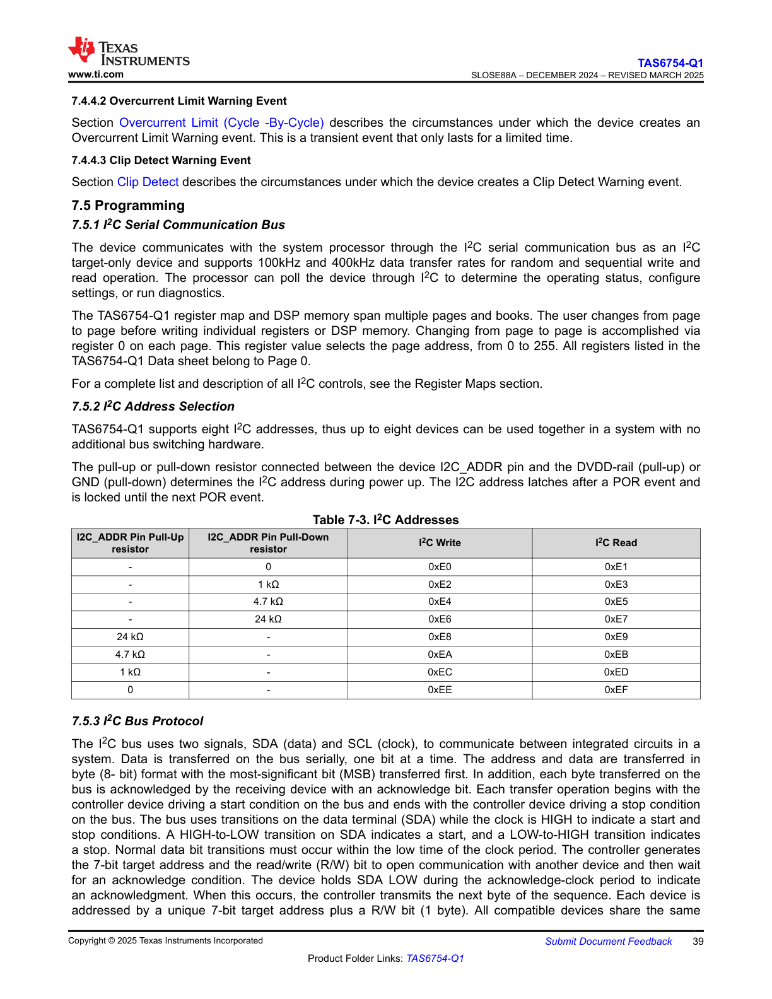

# 7.5.2 I2C Address Selection

## Diagram Description

The diagram illustrates the I2C address selection mechanism for the device. It shows:

**Components and Structure:**
* **Address Pins (A2, A1, A0):** Three address selection pins on the left side of the diagram that allow hardware configuration of the I2C slave address
* **Pull-up/Pull-down Configuration:** Each address pin (A2, A1, A0) can be connected to:
  - VDD (logic high) via pull-up
  - GND (logic low) via pull-down
  - Left floating (which typically defaults to a specific state)
* **Address Decoder Block:** Central logic block that reads the state of the address pins
* **Base Address:** The device uses a base I2C address that is modified by the states of A2, A1, and A0
* **Resulting I2C Address:** The final 7-bit I2C slave address is shown on the right side, formatted as a binary pattern where the three LSBs correspond to the A2, A1, A0 pin states

**Signal Flow:**
* The address pins are sampled by the internal address decoder
* The decoder combines the base address with the pin states to generate the final device address
* This allows up to 8 different devices of the same type to coexist on the same I2C bus by setting different combinations of A2, A1, A0

**Key Technical Details:**
* The diagram shows the hardware-configurable addressing scheme
* Each pin combination (000 through 111) results in a unique I2C address
* This enables multiple identical devices to operate on a single I2C bus without address conflicts