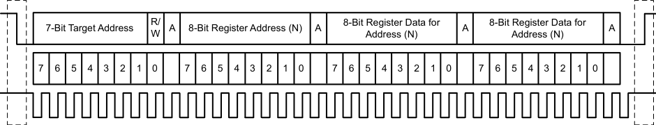
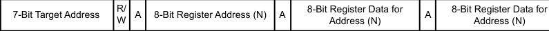
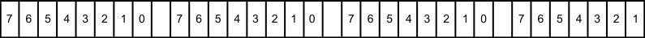
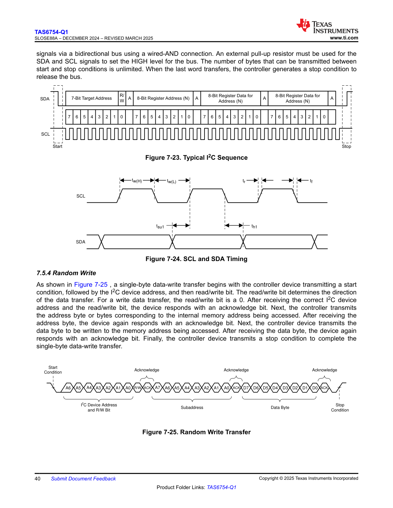

# 7.5.4 Random Write

signals via a bidirectional bus using a wired-AND connection. An external pull-up resistor must be used for the SDA and SCL signals to set the HIGH level for the bus. The number of bytes that can be transmitted between start and stop conditions is unlimited. When the last word transfers, the controller generates a stop condition to release the bus.

<!-- VERBATIM_TABLE_START -->

|Col1|Col2|R/ 8-Bit Register Data for 8-Bit Register Data for 7-Bit Target Address A 8-Bit Register Address (N) A A A W Address (N) Address (N)|Col4|
|---|---|---|---|
|||||
|||7 6 5 4 3 2 1 0 7 6 5 4 3 2 1 0 7 6 5 4 3 2 1 0 7 6 5 4 3 2 1 0||
|||||
<!-- VERBATIM_TABLE_END -->

<!-- VERBATIM_TABLE_START -->

|7-Bit Target Address|R/ W|A|8-Bit Register Address (N)|A|8-Bit Register Data for Address (N)|A|8-Bit Register Data for Address (N)|
|---|---|---|---|---|---|---|---|
<!-- VERBATIM_TABLE_END -->

<!-- VERBATIM_TABLE_START -->

|7|6|5|4|3|2|1|0|Col9|7|6|5|4|3|2|1|0|Col18|7|6|5|4|3|2|1|0|Col27|7|6|5|4|3|2 1|
|---|---|---|---|---|---|---|---|---|---|---|---|---|---|---|---|---|---|---|---|---|---|---|---|---|---|---|---|---|---|---|---|---|
<!-- VERBATIM_TABLE_END -->

**Figure 7-23. Typical I²C Sequence**

This timing diagram shows a typical I²C communication sequence with the following elements:
- **SDA line**: Shows the data transmission including a 7-bit target address, R/W bit (Read/Write), 8-bit register address (N) with acknowledge (A), 8-bit register data for address (N) with acknowledge, and 8-bit register data for address (N) with final acknowledge
- **SCL line**: Shows the clock signal with regular pulses throughout the transaction
- The sequence begins with a Start condition and ends with a Stop condition
- Each byte transmission is followed by an acknowledge bit (A)
- Bit positions are labeled from 7 down to 0 for each byte segment

**Figure 7-24. SCL and SDA Timing**

This timing diagram illustrates the detailed timing parameters for I²C signals:
- **SCL (Serial Clock)**: Shows clock pulses with timing parameters
  - tw(H): Clock pulse width high
  - tw(L): Clock pulse width low
- **SDA (Serial Data)**: Shows data line transitions relative to clock
  - tsu1: Data setup time (time data must be stable before clock goes high)
  - th1: Data hold time (time data remains stable after clock goes low)
  - tr: Rise time
  - tf: Fall time

As shown in Figure 7-25, a single-byte data-write transfer begins with the controller device transmitting a start condition, followed by the I²C device address, and then read/write bit. The read/write bit determines the direction of the data transfer. For a write data transfer, the read/write bit is a 0. After receiving the correct I²C device address and the read/write bit, the device responds with an acknowledge bit. Next, the controller transmits the address byte or bytes corresponding to the internal memory address being accessed. After receiving the address byte, the device again responds with an acknowledge bit. Next, the controller device transmits the data byte to be written to the memory address being accessed. After receiving the data byte, the device again responds with an acknowledge bit. Finally, the controller device transmits a stop condition to complete the single-byte data-write transfer.

**Figure 7-25. Random Write Transfer**

This diagram shows the bit-level structure of a random write transfer sequence:

1. **Start Condition**: Initiates the I²C transaction
2. **I²C Device Address and R/W Bit**: 8 bits total
   - Bits A7-A1: Device address bits
   - Bit A0: Read/Write bit (R/W) - set to 0 for write operation
   - Followed by Acknowledge (ACK)
3. **Subaddress**: 8 bits (A7-A0)
   - Represents the internal register/memory address to be accessed
   - Followed by Acknowledge (ACK)
4. **Data Byte**: 8 bits (D7-D0)
   - The actual data to be written to the specified address
   - Followed by Acknowledge (ACK)
5. **Stop Condition**: Completes the transaction and releases the bus

Each segment shows individual bits labeled with their position (7 down to 0), and acknowledge bits separate each major section of the transfer.