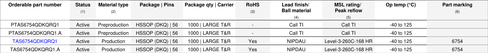
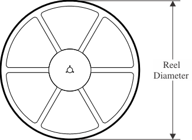
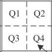
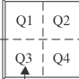
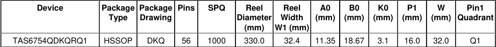
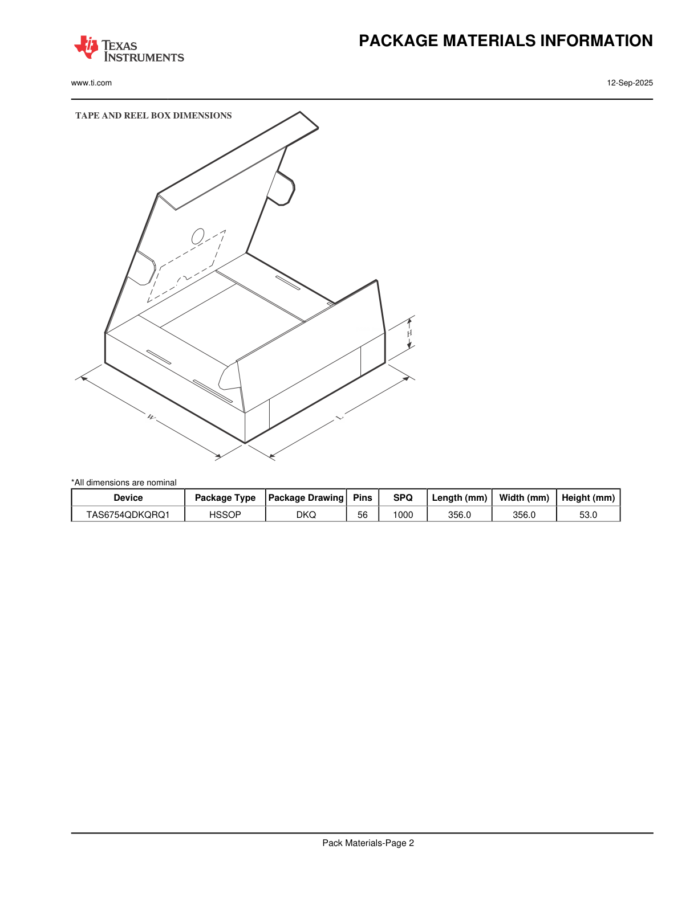
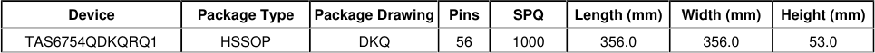
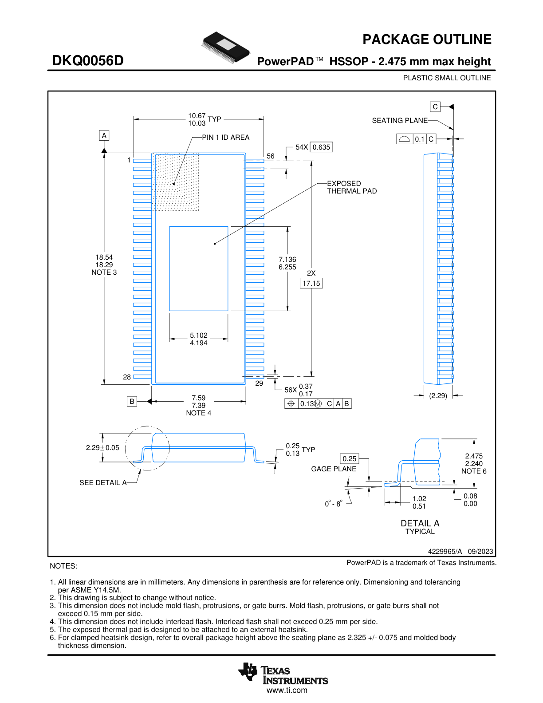
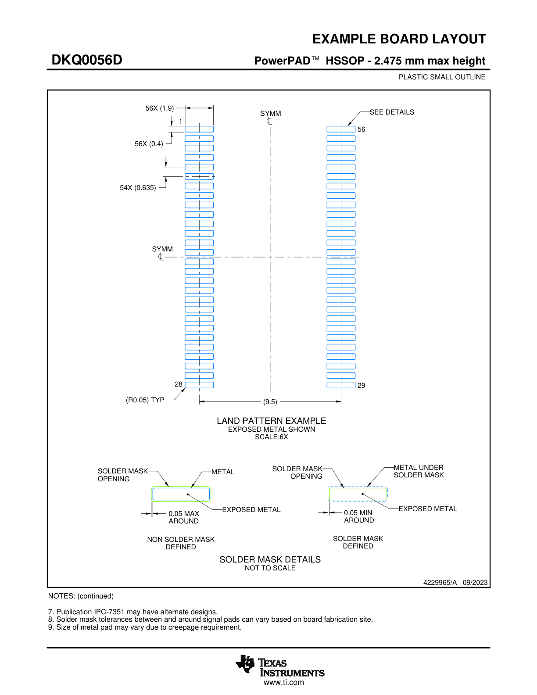
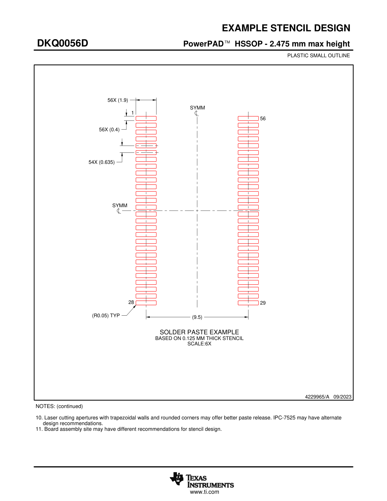

# 11 Mechanical, Packaging, and Orderable Information

The following pages include mechanical, packaging, and orderable information. This information is the most current data available for the designated devices. This data is subject to change without notice and revision of this document. For browser-based versions of this data sheet, refer to the left-hand navigation.

---

## Package Option Addendum

<!-- VERBATIM_TABLE_START -->

|Orderable part number|Status (1)|Material type (2)|Package | Pins|Package qty | Carrier|RoHS (3)|Lead finish/ Ball material (4)|MSL rating/ Peak reflow (5)|Op temp (°C)|Part marking (6)|
|---|---|---|---|---|---|---|---|---|---|
|PTAS6754QDKQRQ1|Active|Preproduction|HSSOP (DKQ) | 56|1000 | LARGE T&R|-|Call TI|Call TI|-40 to 125||
|PTAS6754QDKQRQ1.A|Active|Preproduction|HSSOP (DKQ) | 56|1000 | LARGE T&R|-|Call TI|Call TI|-40 to 125||
|TAS6754QDKQRQ1|Active|Production|HSSOP (DKQ) | 56|1000 | LARGE T&R|Yes|NIPDAU|Level-3-260C-168 HR|-40 to 125|6754|
|TAS6754QDKQRQ1.A|Active|Production|HSSOP (DKQ) | 56|1000 | LARGE T&R|Yes|NIPDAU|Level-3-260C-168 HR|-40 to 125|6754|
<!-- VERBATIM_TABLE_END -->

**Notes:**

(1) **Status:** For more details on status, see our product life cycle.

(2) **Material type:** When designated, preproduction parts are prototypes/experimental devices, and are not yet approved or released for full production. Testing and final process, including without limitation quality assurance, reliability performance testing, and/or process qualification, may not yet be complete, and this item is subject to further changes or possible discontinuation. If available for ordering, purchases will be subject to an additional waiver at checkout, and are intended for early internal evaluation purposes only. These items are sold without warranties of any kind.

(3) **RoHS values:** Yes, No, RoHS Exempt. See the TI RoHS Statement for additional information and value definition.

(4) **Lead finish/Ball material:** Parts may have multiple material finish options. Finish options are separated by a vertical ruled line. Lead finish/Ball material values may wrap to two lines if the finish value exceeds the maximum column width.

(5) **MSL rating/Peak reflow:** The moisture sensitivity level ratings and peak solder (reflow) temperatures. In the event that a part has multiple moisture sensitivity ratings, only the lowest level per JEDEC standards is shown. Refer to the shipping label for the actual reflow temperature that will be used to mount the part to the printed circuit board.

(6) **Part marking:** There may be an additional marking, which relates to the logo, the lot trace code information, or the environmental category of the part.

Multiple part markings will be inside parentheses. Only one part marking contained in parentheses and separated by a "~" will appear on a part. If a line is indented then it is a continuation of the previous line and the two combined represent the entire part marking for that device.

**Important Information and Disclaimer:** The information provided on this page represents TI's knowledge and belief as of the date that it is provided. TI bases its knowledge and belief on information provided by third parties, and makes no representation or warranty as to the accuracy of such information. Efforts are underway to better integrate information from third parties. TI has taken and continues to take reasonable steps to provide representative and accurate information but may not have conducted destructive testing or chemical analysis on incoming materials and chemicals. TI and TI suppliers consider certain information to be proprietary, and thus CAS numbers and other limited information may not be available for release.

In no event shall TI's liability arising out of such information exceed the total purchase price of the TI part(s) at issue in this document sold by TI to Customer on an annual basis.

---

## Package Materials Information

### Tape and Reel Information

<!-- VERBATIM_TABLE_START -->

|REEL DIMENSIONS|Col2|Col3|
|---|---|---|
|Re Diam|||
||Re Diam|el eter|
||||
<!-- VERBATIM_TABLE_END -->

<!-- VERBATIM_TABLE_START -->

|Col1|Col2|P1|Col4|Col5|Col6|Col7|Col8|
|---|---|---|---|---|---|---|---|
|||||||B0||
|||||||||
|||||||||
||||||||W|
|||||||||
|||||||||
||||A0|||||
<!-- VERBATIM_TABLE_END -->

<!-- VERBATIM_TABLE_START -->

|Col1|B|
|---|---|
<!-- VERBATIM_TABLE_END -->

<!-- VERBATIM_TABLE_START -->

|Col1|A0 Cavity|
|---|---|
|A0|Dimension designed to accommodate the component width|
|B0|Dimension designed to accommodate the component length|
|K0|Dimension designed to accommodate the component thickness|
|W|Overall width of the carrier tape|
|P1|Pitch between successive cavity centers|
<!-- VERBATIM_TABLE_END -->

#### Reel Dimensions

<!-- VERBATIM_TABLE_START -->

|Q1|Q2|
|---|---|
|Q3|Q4|
<!-- VERBATIM_TABLE_END -->

#### Tape Dimensions

<!-- VERBATIM_TABLE_START -->

|Q1|Q2|
|---|---|
|Q3|Q4|
<!-- VERBATIM_TABLE_END -->

#### Quadrant Assignments for Pin 1 Orientation in Tape

<!-- VERBATIM_TABLE_START -->

|Device|Package Type|Package Drawing|Pins|SPQ|Reel Diameter (mm)|Reel Width W1 (mm)|A0 (mm)|B0 (mm)|K0 (mm)|P1 (mm)|W (mm)|Pin1 Quadrant|
|---|---|---|---|---|---|---|---|---|---|---|---|---|
|TAS6754QDKQRQ1|HSSOP|DKQ|56|1000|330.0|32.4|11.35|18.67|3.1|16.0|32.0|Q1|
<!-- VERBATIM_TABLE_END -->

The diagram shows:
- Reel Width (W1)
- Pocket Quadrants layout
- Sprocket Holes positioning

*All dimensions are nominal

---

### Tape and Reel Box Dimensions

This diagram illustrates the packaging box for tape and reel components, showing a 3D isometric view of the box with labeled dimensions:
- **W** (Width in mm)
- **L** (Length in mm)  
- **H** (Height in mm)

<!-- VERBATIM_TABLE_START -->

|Device|Package Type|Package Drawing|Pins|SPQ|Length (mm)|Width (mm)|Height (mm)|
|---|---|---|---|---|---|---|---|
|TAS6754QDKQRQ1|HSSOP|DKQ|56|1000|356.0|356.0|53.0|
<!-- VERBATIM_TABLE_END -->

*All dimensions are nominal

---

## Package Outline

### DKQ0056D - PowerPAD™ HSSOP - 2.475 mm max height

**PLASTIC SMALL OUTLINE**

<!-- VERBATIM_TABLE_START -->

|Col1|0.1|
|---|---|
<!-- VERBATIM_TABLE_END -->

<!-- VERBATIM_TABLE_START -->

|3 C|A|B|
|---|---|---|
<!-- VERBATIM_TABLE_END -->

This technical drawing shows the PowerPAD™ HSSOP package outline (DKQ0056D) with detailed mechanical specifications:

**Key Package Features:**
- **56-pin configuration** (pins 1-28 on one side, pins 29-56 on the other)
- **Exposed thermal pad** in the center for enhanced heat dissipation
- **Pin 1 ID area** marked for orientation

**Critical Dimensions (in millimeters):**
- Overall package width (A): 18.54 / 18.29 (NOTE 3)
- Overall package length (B): 7.59 / 7.39 (NOTE 4)
- Package height above seating plane (C): 10.67 / 10.03 TYP
- Pin pitch: 54X 0.635 mm
- Pin width: 56X 0.37 / 0.17 mm
- Exposed thermal pad dimensions: 7.136 / 6.255 mm × 5.102 / 4.194 mm
- Thermal pad offset: 2X 17.15 mm
- Lead protrusion: 56X 0.37 / 0.17 mm, controlled by gage plane position 0.13 TYP
- Molded body thickness: 2.475 / 2.240 mm (NOTE 6)
- Thermal pad height: (2.29) / 2.29 ± 0.05 mm
- Body standoff: 0.25 mm
- Coplanarity: 0.08 mm max
- Pin coplanarity tolerance: 0° - 8°
- Detail A shows gage plane offset: 1.02 / 0.51 mm and 0.08 / 0.00 mm

**Drawing Reference:** 4229965/A   09/2023

**NOTES:**

1. All linear dimensions are in millimeters. Any dimensions in parenthesis are for reference only. Dimensioning and tolerancing per ASME Y14.5M.
2. This drawing is subject to change without notice.
3. This dimension does not include mold flash, protrusions, or gate burrs. Mold flash, protrusions, or gate burrs shall not exceed 0.15 mm per side.
4. This dimension does not include interlead flash. Interlead flash shall not exceed 0.25 mm per side.
5. The exposed thermal pad is designed to be attached to an external heatsink.
6. For clamped heatsink design, refer to overall package height above the seating plane as 2.325 +/- 0.075 and molded body thickness dimension.

PowerPAD is a trademark of Texas Instruments.

---

## Example Board Layout

### DKQ0056D - PowerPAD™ HSSOP - 2.475 mm max height

**PLASTIC SMALL OUTLINE**

This PCB land pattern drawing shows the recommended footprint for the DKQ0056D package:

**Land Pattern Features:**
- **Symmetrical design** (marked SYMM on both axes)
- **56 signal pads** arranged on both sides (pins 1-28, 29-56)
- **Central exposed metal pad** for thermal management
- Pin numbering: Pin 1 (top left), Pin 28 (bottom left), Pin 29 (bottom right), Pin 56 (top right)

**Key Dimensions (in millimeters):**
- Pad dimensions: 56X (1.9) length × 56X (0.4) width
- Pad pitch: 54X (0.635) mm
- Pad corner radius: (R0.05) TYP
- Central exposed metal pad: (9.5) mm
- Maximum gap around exposed pad: 0.05 MAX AROUND
- Minimum gap around exposed pad: 0.05 MIN AROUND

**Solder Mask Details:**
Two solder mask options are illustrated (NOT TO SCALE):
- **Non Solder Mask Defined:** Solder mask opening larger than metal pad, with exposed metal visible
- **Solder Mask Defined:** Solder mask opening aligned with metal pad edge, with metal under solder mask

**Scale:** 6X

**Drawing Reference:** 4229965/A   09/2023

**NOTES: (continued)**

7. Publication IPC-7351 may have alternate designs.
8. Solder mask tolerances between and around signal pads can vary based on board fabrication site.
9. Size of metal pad may vary due to creepage requirement.

---

## Example Stencil Design

### DKQ0056D - PowerPAD™ HSSOP - 2.475 mm max height

**PLASTIC SMALL OUTLINE**

This solder paste stencil design drawing provides the recommended aperture pattern for the DKQ0056D package:

**Stencil Pattern Features:**
- **Symmetrical design** (marked SYMM on both axes)
- **56 apertures** for signal pins (pins 1-28, 29-56)
- **Central aperture** for the exposed thermal pad
- Based on **0.125 MM thick stencil**

**Key Dimensions (in millimeters):**
- Aperture dimensions: 56X (1.9) length × 56X (0.4) width
- Aperture pitch: 54X (0.635) mm
- Aperture corner radius: (R0.05) TYP
- Central thermal pad aperture: (9.5) mm

**Scale:** 6X

**Drawing Reference:** 4229965/A   09/2023

**NOTES: (continued)**

10. Laser cutting apertures with trapezoidal walls and rounded corners may offer better paste release. IPC-7525 may have alternate design recommendations.
11. Board assembly site may have different recommendations for stencil design.

PowerPAD™ is a trademark of Texas Instruments.

---

## Important Notice and Disclaimer

TI PROVIDES TECHNICAL AND RELIABILITY DATA (INCLUDING DATASHEETS), DESIGN RESOURCES (INCLUDING REFERENCE DESIGNS), APPLICATION OR OTHER DESIGN ADVICE, WEB TOOLS, SAFETY INFORMATION, AND OTHER RESOURCES "AS IS" AND WITH ALL FAULTS, AND DISCLAIMS ALL WARRANTIES, EXPRESS AND IMPLIED, INCLUDING WITHOUT LIMITATION ANY IMPLIED WARRANTIES OF MERCHANTABILITY, FITNESS FOR A PARTICULAR PURPOSE OR NON-INFRINGEMENT OF THIRD PARTY INTELLECTUAL PROPERTY RIGHTS.

These resources are intended for skilled developers designing with TI products. You are solely responsible for (1) selecting the appropriate TI products for your application, (2) designing, validating and testing your application, and (3) ensuring your application meets applicable standards, and any other safety, security, regulatory or other requirements.

These resources are subject to change without notice. TI grants you permission to use these resources only for development of an application that uses the TI products described in the resource. Other reproduction and display of these resources is prohibited. No license is granted to any other TI intellectual property right or to any third party intellectual property right. TI disclaims responsibility for, and you fully indemnify TI and its representatives against any claims, damages, costs, losses, and liabilities arising out of your use of these resources.

TI's products are provided subject to TI's Terms of Sale, TI's General Quality Guidelines, or other applicable terms available either on ti.com or provided in conjunction with such TI products. TI's provision of these resources does not expand or otherwise alter TI's applicable warranties or warranty disclaimers for TI products. Unless TI explicitly designates a product as custom or customer-specified, TI products are standard, catalog, general purpose devices.

TI objects to and rejects any additional or different terms you may propose.

---

**IMPORTANT NOTICE**

Copyright © 2025, Texas Instruments Incorporated

Last updated 10/2025